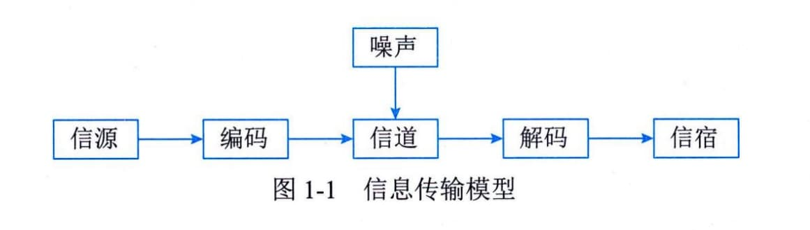

### 1.1.1 信息基础
信息是物质、能量及其属性的标示的集合，是确定性的增加。它以物质介质为载体，传递和反映世界各种事物存在方式、运动状态等的表征。信息不是物质，也不是能量，它以一种普遍形式，表达物质运动规律，在客观世界中大量存在、产生和传递。
#### **1．信息的定义**
1948年，数学家香农（Claude
E．Shannon）在题为《通信的数学理论》的论文中指出："信息是用来消除随机不定性的东西"。创造一切宇宙万物的最基本单位是信息。香农还给出了信息的定量描述，并确定了信息量的单位为比特（bit）。1比特的信息量，在变异度为2的最简单情况下，就是能消除非此即彼的不确定性所需要的信息量。这里的"变异度"是指事物的变化状态空间为2，例如大和小、高和低、快和慢等。
同时，香农将热力学中的熵引入了信息论。在热力学中，熵是系统无序程度的度量，而信息与熵正好相反，信息是系统有序程度的度量，表现为负熵，计算公式如下：
$$H = - \sum_{i = 1}^{n}{}p(x_{i})\log_{2}p(x_{i})$$
式中，$x_{i}$代表n个状态中的第i个状态，$P(x_{i})$代表出现第i个状态的概率，H代表用以消除系统不确定性所需的信息量，即以比特为单位的负熵。信息的目的是用来"消除不确定的因素"。信息由意义和符号组成，指以声音、语言、文字、图像、动画、气味等方式所表示的实际内容。信息是抽象于物质的映射集合。
#### **2．信息的特征**
香农关于信息的定义揭示了信息的本质，同时，人们通过深入研究，发现信息还具有很多其他的特征，主要包括客观性、普遍性、无限性、动态性、相对性、依附性、变换性、传递性、层次性、系统性和转化性等。
 - （1）客观性。信息是客观事物在人脑中的反映，而反映的对象则有主观和客观的区别，因此，信息可分为主观信息（例如：决策、指令和计划等）和客观信息（例如：国际形势、经济发展和一年四季等）。主观信息必然要转化成客观信息，例如，决策和计划等主观信息要转化成实际行动。因此，信息具有客观性。
 - （2）普遍性。物质决定精神，物质的普遍性决定了信息的普遍存在。
 - （3）无限性。客观世界是无限的，反映客观世界的信息自然也是无限的。无限性可分为两个层次：一是无限的事物产生无限的信息，即信息的总量是无限的；二是每个具体事物或有限个事物的集合所能产生的信息也可以是无限的。
 - （4）动态性。信息是随着时间的变化而变化的。
 - （5）相对性。不同的认识主体从同一事物中获取的信息及信息量可能是不同的。
 - （6）依附性。信息的依附性可以从两个方面来理解：一方面，信息是客观世界的反映，任何信息必然由客观事物所产生，不存在无源的信息；另一方面，任何信息都要依附于一定的载体而存在，需要有物质的承载者，信息不能完全脱离物质而独立存在。
 - （7）变换性。信息通过处理可以实现变换或转换，使其形式和内容发生变化，以适应特定的需要。
 - （8）传递性。信息在时间上的传递就是存储，在空间上的传递就是转移或扩散。
 - （9）层次性。客观世界是分层次的，反映它的信息也是分层次的。
 - （10）系统性。信息可以表示为一种集合，不同类别的信息可以形成不同的整体。因此，可以形成与现实世界相对应的信息系统。
 - （11）转化性。信息的产生不能没有物质，信息的传递不能没有能量，但有效地使用信息，可以将信息转化为物质或能量。
#### **3．信息的质量**
由于获取信息满足了人们消除不确定性的需求，因此信息具有价值，而价值的大小决定于信息的质量，这就要求信息满足一定的质量属性，主要包括精确性、完整性、可靠性、及时性、经济性、可验证性和安全性等。
 - （1）精确性。精确性指对事物状态描述的精准程度。
 - （2）完整性。完整性指对事物状态描述的全面程度，完整信息应包括所有重要事实。
 - （3）可靠性。可靠性指信息的来源、采集方法、传输过程是可以信任的，符合预期。
 - （4）及时性。及时性指获得信息的时刻与事件发生时刻的间隔长短。昨天的天气信息不论怎样精确、完整，对指导明天的穿衣并无帮助，从这个角度出发，这个信息的价值为零。
 - （5）经济性。经济性指信息获取、传输带来的成本在可以接受的范围之内。
 - （6）可验证性。可验证性指信息的主要质量属性可以被证实或者证伪的程度。
 - （7）安全性。安全性指在信息的生命周期中，信息可以被非授权访问的可能性，可能性越低，安全性越高。
信息应用的场合不同，其侧重面也不一样。例如，对于金融信息而言，其最重要的特性是安全性；而对于经济与社会信息而言，其最重要的特性是及时性。
#### **4．信息的传输模型**
信息是有价值的一种客观存在，信息只有流动起来，才能体现其价值。信息的传输通过信息传输技术（通常指通信、网络等）来实现，信息的传输模型如图1-1所示。

信息传输通常包括信源、信宿、信道、编码器、译码器和噪声等。
 - （1）信源。信源产生信息的实体，信息产生后，由这个实体向外传播。
 - （2）信宿。信宿是信息的归宿或接收者。
 - （3）信道。信道是传送信息的通道，如TCP／IP网络。信道可以从逻辑上理解为抽象信道，也可以是具有物理意义的实际传送通道。TCP／IP网络是逻辑上的概念，这个网络的物理通道可以是光纤、同轴电缆、双绞线、移动通信网络，甚至是卫星或者微波。
 - （4）编码器。编码器在信息论中泛指所有变换信号的设备，实际上就是终端机的发送部分。它包括从信源到信道的所有设备，如量化器、压缩编码器和调制器等，使信源输出的信号转换成适于信道传送的信号。从信息安全的角度出发，编码器还可以包括加密解密设备。
 - （5）译码器。译码器是编码器的逆变换设备，把信道上送来的信号（原始信息与噪声的叠加）转换成信宿能接收的信号，可包括解调器、译码器和数模转换器等。
 - （6）噪声。噪声可以理解为干扰，干扰可以来自于信息系统分层结构的任何一层，当噪声携带的信息达到一定程度的时候，在信道中传输的信息可能被噪声掩盖导致传输失败。
当信源和信宿已给定，信道也已选定后，决定信息系统性能的关键就在于编码器和译码器。设计一个信息系统时，除了选择信道和设计其附属设施外，主要工作也就是设计编码和译码器。一般情况下，信息系统的主要性能指标是有效性和可靠性。有效性就是在系统中传送尽可能多的信息；而可靠性是要求信宿收到的信息尽可能地与信源发出的信息一致，或者说失真尽可能小。为了提高可靠性，可以在信息编码时增加冗余编码，犹如"重要的话说三遍"，恰当的冗余编码可以在信息受到噪声侵扰时被恢复，而过量的冗余编码将降低信道的有效性和信息传输速率。概括起来，信息系统的基本规律应包括信息的度量、信源特性和信源编码、信道特性和信道编码、检测理论、估计理论以及密码学。