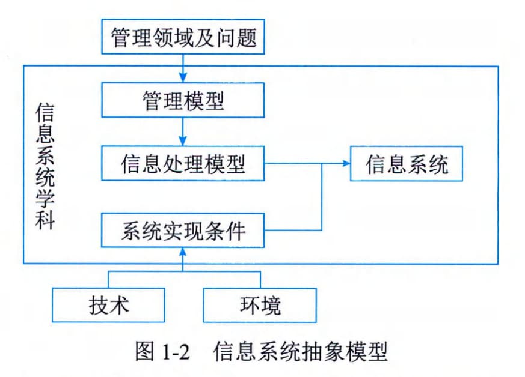
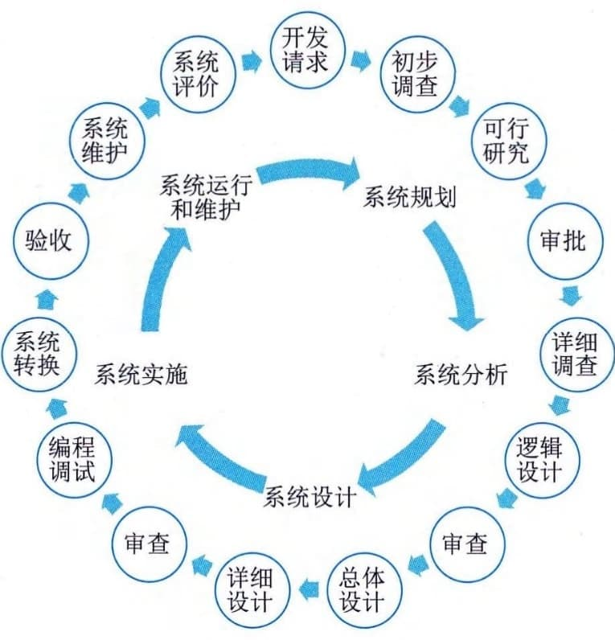
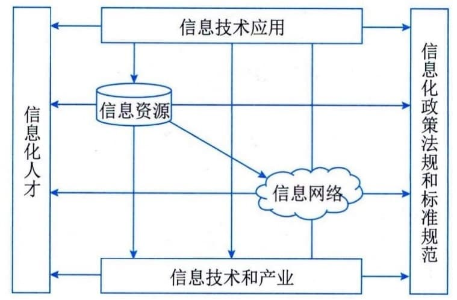

### 1.1.2 信息系统基础
信息系统是由相互联系、相互依赖、相互作用的事物或过程组成的具有整体功能和综合行为的统一体。在经济与社会活动中，经常使用"系统"的概念，例如，经济领域中的业务系统和金融系统，自然界中的水利系统和生态系统等。从数学角度来看，系统是一个集合，是由许多相互作用、相互依存的事物（集合元素）为了达到某个目标组成的集合。
#### **1．系统及其特性**
研究系统的一般理论和方法，称为系统论。系统是系统论的主要研究对象，而要研究系统，首先应该认识系统的特性。系统的总体特性是系统整体上的属性，系统的这些特性通常是很难提前预测的，只有当所有子系统和元素被整合形成完全的系统之后才能表现出来。目的性、整体性、层次性、稳定性、突变性、自组织性、相似性、相关性和环境适应性是系统的主要特性。
 - （1）目的性。定义一个系统、组成一个系统或者抽象出一个系统，都有明确的目标或者目的，目标性决定了系统的功能。
 - （2）整体性。系统是一个整体，元素是为了达到一定的目的，按照一定的原则，有序地排列起来组成系统，从而产生系统的特定功能。
 - （3）层次性。系统是由多个元素组成的，系统和元素是相对的概念。元素是相对于它所处的系统而言的，系统是从它包含元素的角度来看的，如果研究问题的角度变一变，系统就会变成更高一级系统的元素，也称为子系统。
 - （4）稳定性。系统的稳定性是指受规则的约束，系统的内部结构和秩序应是可以预见的，系统的状态以及演化路径有限并能被预测，系统的功能发生作用导致的后果也是可以预估的。稳定性强的系统使得系统在受到外部作用的同时，内部结构和秩序仍然能够保持。
 - （5）突变性。突变性是指系统通过失稳从一种状态进入另一种状态的一种剧烈变化的过程，它是系统质变的一种基本形式。
 - （6）自组织性。开放系统在系统内外因素的作用下自发组织起来，使系统从无序到有序，从低级有序到高级有序。
 - （7）相似性。系统具有同构和同态的性质，体现在系统结构、存在方式和演化过程具有共同性。系统具有相似性的根本原因在于世界的物质系统性。
 - （8）相关性。元素是可分的和相互联系的，组成系统的元素必须有明确的边界，可以与其他元素区分开来。另外，元素之间是相互联系的，不是哲学上所说的那种普遍联系，而是实实在在的、具体的联系。
 - （9）环境适应性。系统总处在一定环境中，并与环境发生相互作用。系统和环境之间总是在发生着一定的物质和能量交换。
#### **2．信息系统及其特性**
简单地说，信息系统就是通过对输入的数据进行加工处理，产生信息的系统。面向管理和支持生产是信息系统的显著特点，以计算机为基础的信息系统可以定义为：结合管理理论和方法，应用信息技术解决管理问题，提高生产效率，为生产或信息化过程以及管理和决策提供支撑的系统。信息系统是管理模型、信息处理模型和系统实现条件的结合，其抽象模型如图1-2所示。
图1-2 信息系统抽象模型
管理模型是指系统服务对象领域的专门知识，以及分析和处理该领域问题的模型，也称为对象的处理模型；信息处理模型指系统处理信息的结构和方法。管理模型中的理论和分析方法，在信息处理模型中转化为信息获取、存储、传输、加工和使用的规则；系统实现条件是指可供应用的计算机技术和通信技术、从事对象领域工作的人员，以及对这些资源的控制与融合。
广义的信息系统可以是手工的，也可以是电子化的。电子化信息系统的组成部件包括硬件、软件、数据库、网络、存储设备、感知设备、外设、人员以及把数据处理成信息的规程等。从用途类型来划分，信息系统一般包括电子商务系统、事务处理系统、管理信息系统、生产制造系统、电子政务系统、决策支持系统等。对于信息系统而言，信息系统的开发性、脆弱性和健壮性等特性会表现得比较突出。
 - （1）开放性。系统的开放性是指系统的可访问性。这个特性决定了系统可以被外部环境识别，外部环境或者其他系统可以按照预定的方法，使用系统的功能或者影响系统的行为。系统的开放性体现在系统有清晰描述并被准确识别和理解的接口层。
 - （2）脆弱性。这个特性与系统的稳定性相对应，即系统可能存在着丧失结构、功能、秩序6的特性，这个特性往往是隐蔽的且不易被外界感知的。脆弱的系统一旦被侵入，整体性会被破坏，甚至面临崩溃和系统瓦解。
 - （3）健壮性。当系统面临干扰、输入错误和入侵等因素时，系统可能会出现非预期的状态而丧失原有功能、出现错误甚至表现出破坏功能。系统具有能够抵御出现非预期状态的特性称为健壮性，也称鲁棒性（robustness）。一般来说，具有高可用性的信息系统，会采取冗余技术、容错技术、身份识别技术和可靠性技术等来抵御系统出现非预期的状态并保持系统的稳定性。
#### **3．信息系统生命周期**
信息系统是面向现实世界人类生产和生活中的具体应用的，是为了提高人类活动的质量、效率而存在的。信息系统的目的、性能、内部结构和秩序、外部接口、部件组成等由人来规划，它的产生、建设、运行和完善构成一个循环的过程，这个过程遵循一定的规律。另外，信息系统建设周期长、投资大、风险大，比一般技术工程有更大的难度和复杂性，其在使用过程中，随着生存环境的变化，要不断维护和修改，当它不再适应的时候就要被淘汰，由新系统代替老系统。为了工程化的需要，有必要把这些过程划分为具有典型特点的阶段，每个阶段有不同的目标和工作方法，阶段中的任务也由不同类型的人员来负责。这个过程称为信息系统的生命周期。
软件在信息系统中属于较复杂的部件，可以借用软件的生命周期来表示信息系统的生命周期。软件的生命周期通常包括：可行性分析与项目开发计划、需求分析、概要设计、详细设计、编码、测试和维护等阶段。
信息系统的生命周期可以简化为：系统规划（可行性分析与项目开发计划），系统分析（需求分析），系统设计（概要设计、详细设计），系统实施（编码、测试），系统运行和维护等阶段，如图1-3所示。

图1-3 信息系统全生命周期示意图
1）系统规划阶段
系统规划阶段的任务是对组织的环境、目标及现行系统的状况进行初步调查，根据组织目标和发展战略，确定信息系统的发展战略，对建设新系统的需求做出分析和预测，同时考虑建设新系统所受的各种约束，研究建设新系统的必要性和可能性。根据需要与可能，给出报建系统的备选方案。对这些方案进行可行性研究，写出可行性研究报告。可行性研究报告审议通过后，将新系统建设方案及实施计划编写成系统设计任务书。
2）系统分析阶段
系统分析阶段的任务是根据系统设计任务书所确定的范围，对现行系统进行详细调查，描述现行系统的业务流程，指出现行系统的局限性和不足之处，确定新系统的基本目标和逻辑功能要求，即提出新系统的逻辑模型。
系统分析阶段又称为逻辑设计阶段。这个阶段是整个系统建设的关键阶段，也是信息系统建设与一般工程项目的重要区别所在。系统分析阶段的工作成果体现在系统说明书中，这是系统建设的必备文件。它既是和用户确认需求的基础，也是下一个阶段的工作依据。因此，系统说明书既要通俗又要准确。用户通过系统说明书可以了解未来系统的功能，判断是不是所要求的系统。系统说明书一旦讨论通过，就是系统设计的依据，也是将来验收系统的依据。
3）系统设计阶段
简单地说，系统分析阶段的任务是回答系统"做什么"的问题，而系统设计阶段要回答的问题是"怎么做"。该阶段的任务是根据系统说明书中规定的功能要求，考虑实际条件，具体设计实现逻辑模型的技术方案，也就是设计新系统的物理模型。这个阶段又称为物理设计阶段，可分为总体设计（概要设计）和详细设计两个子阶段。这个阶段的技术文档是系统设计说明书。
4）系统实施阶段
系统实施阶段是将设计的系统付诸实施的阶段。这一阶段的任务包括计算机等设备的购置、安装和调试、程序的编写和调试、人员培训、数据文件转换、系统调试与转换等。这个阶段的特点是几个互相联系、互相制约的任务同时展开，必须精心安排、合理组织。系统实施是按实施计划分阶段完成的，每个阶段应写出实施进展报告。系统测试之后写出系统测试分析报告。
5）系统运行和维护阶段
系统投入运行后，需要经常进行维护和评价，记录系统运行的情况，根据一定的规则对系统进行必要的修改，评价系统的工作质量和经济效益。另外，为了便于论述针对信息系统的项目管理，信息系统的生命周期还可以简化为立项（系统规划）、开发（系统分析、系统设计、系统实施）、运维及消亡四个阶段，在开发阶段不仅包括系统分析、系统设计、系统实施，还包括系统验收等工作。如果从项目管理的角度来看，项目的生命周期又划分为启动、计划、执行和收尾四个典型阶段。
#### **1.1.3 信息化基础**
信息化是一个过程，与工业化、现代化一样，是一个动态变化的过程。信息化是指培养、发展以计算机为主的智能化工具为代表的新生产力，并使之造福于社会的历史过程。与智能化工具相适应的生产力，称为信息化生产力。信息化是以现代通信、网络、数据库技术为基础，将所研究对象各要素汇总至数据库，供特定人群生活、工作、学习、辅助决策等，是和人类息息相关的各种行为相结合的一种技术，使用该技术可以极大地提高行为的效率，并且降低成本，为推动人类社会进步提供技术支持。
#### **1．信息化内涵**
信息化在不同的语境中有不同的含义。信息化用作名词时，通常指信息技术应用，特别是促成应用对象或领域（比如政府、企业或社会）发生转变的过程。例如，"企业信息化"不仅指在企业中应用信息技术，更重要的是通过深入应用信息技术，促进企业的业务模式、组织架构乃至经营战略发生革新或转变。信息化用作形容词时，常指对象或领域因信息技术的深入应用所达成的新形态或状态。例如，"信息化社会"指信息技术应用到一定程度后达成的社会形态，它只有充分应用信息技术才能达成。综上所述，信息化是推动经济社会发展与转型的一个历史性过程。在这个过程中，综合利用各种信息技术，支撑改善人类的各项政治、经济和社会活动，并把贯穿于这些活动中的各种数据有效、可靠地进行管理，经过符合业务需求的数据处理，形成信息资源，通过信息资源的整合与融合，促进信息交流和知识共享，形成新的经济和社会形态，推动各方面的高质量发展。
信息化的核心是要通过全体社会成员的共同努力，在经济和社会各个领域充分应用基于信息技术的先进社会生产工具（表现为各种信息系统或软硬件产品），提高信息时代的社会生产力，并推动生产关系和上层建筑的改革（表现为法律、法规、制度、规范、标准和组织结构等），使国家的综合实力、社会的文明程度和人民的生活质量全面提升。信息化的内涵主要包括：
 - · 信息网络体系：包括信息资源、各种信息系统和公用通信网络平台等。
 - · 信息产业基础：包括信息科学技术研究与开发、信息装备制造和信息咨询服务等。
 - · 社会运行环境：包括现代工农业、管理体制、政策法律、规章制度、文化教育和道德观念等生产关系与上层建筑。
 - · 效用积累过程：包括劳动者素质、国家现代化水平和人民生活质量的不断提高，精神文明和物质文明建设的不断进步等。
信息化的基本内涵给人们的启示是：信息化的主体是全体社会成员，包括政府、企业、事业、团体和个人。信息化的时域是一个长期的过程，它的空域是政治、经济、文化、军事和社会的一切领域；它的手段是基于现代信息技术的先进社会生产工具；它的途径是创建信息时代的社会生产力，推动社会生产关系及社会上层建筑的改革；它的目标是使国家的综合实力、社会的文明素质和人民的生活质量得到全面提升。我国大规模开展信息化工作已经30多年，已成为保障国家安全、支撑政府行政职能、维护社会和谐稳定、促进民生经济发展等各大战略层面的重要支柱。
#### **2．信息化体系**
信息化代表了一种信息技术被高度应用，信息资源被高度共享，从而使得人的智能潜力以及社会物质资源潜力被充分发挥，个人行为、组织决策和社会运行趋于合理化的理想状态。
1997年召开的首届全国信息化工作会议，将信息化和国家信息化定义为："信息化是指培育、发展以智能化工具为代表的新的生产力并使之造福于社会的历史过程。国家信息化就是在国家统一规划和组织下，在农业、工业、科学技术、国防及社会生活各个方面应用信息技术，深入开发、广泛利用信息资源，加速实现国家现代化进程。"国家信息化体系包括信息技术应用、信息资源、信息网络、信息技术和产业、信息化人才、信息化政策法规和标准规范6个要素，这6个要素的关系构成了一个有机的整体，如图1-4所示。

图1-4 国家信息化体系
 - （1）信息资源。信息资源的开发和利用是国家信息化的核心任务，是国家信息化建设取得实效的关键，是衡量国家信息化水平的一个重要标志。
 - （2）信息网络。信息网络是信息资源开发和利用的基础设施，包括电信网、广播电视网和计算机网络。这三种网络有各自的形成过程、服务对象和发展模式，它们的功能有所交叉，又互为补充。
 - （3）信息技术应用。信息技术应用是指把信息技术广泛应用于经济和社会各个领域，它直接反映了效率、效果和效益。信息技术应用是信息化体系六要素中的龙头，是国家信息化建设的主阵地，集中体现了国家信息化建设的需求和效益。
 - （4）信息技术和产业。信息产业是信息化的物质基础，包括微电子、计算机、电信等产品和技术的开发、生产、销售，以及软件、信息系统开发和电子商务等。从根本上来说，国家信息化只有在相关产品和技术方面拥有雄厚的自主知识产权，才能提高综合国力。
 - （5）信息化人才。人才是信息化的成功之本，而合理的人才结构更是信息化人才的核心和关键。合理的信息化人才结构要求不仅要有各个层次的信息化技术人才，还要有精干的信息化管理人才，营销人才，法律、法规和情报人才。
 - （6）信息化政策法规和标准规范。信息化政策和法规、标准、规范用于规范和协调信息化体系各要素之间的关系，是国家信息化快速、有序、健康和持续发展的保障。
#### **3．信息化趋势**
信息化是信息产业发展与信息技术在经济与社会各方面扩散的基础上，不断运用信息技术改造传统的经济、社会结构，通往如前所述的理想状态的一段持续的过程。随着数字化、网络
化、智能化的持续深化，信息化成为重塑国家竞争优势的重要力量。信息化跟各行业、领域、业务现代化在更广范围、更深程度、更高水平上实现融合发展，新一代信息技术向各领域加速渗透，促进数字化转型步伐加快，并驱动经济与社会的高质量发展。
1）组织信息化趋势
随着计算机技术、网络技术和通信技术的发展和应用，组织信息化已成为业务价值实现、可持续化发展和提高经济与社会竞争力的重要保障。组织应该采取积极的应对措施，推动其信息化的建设进程。品牌2.0理论指出，信息化建设是品牌母体树冠部分的支持网络，庞大的品牌识别系统必须对应强大的信息化建设体系。如果信息化建设不能满足品牌识别系统的要求，品牌识别系统也将受到伤害，会自动调低到现有的信息化建设体系可以支撑的大小，这是品牌母体的自我调整过程。根据这个原理我们可以解释一种现象：为什么有的品牌进行了很好的品牌识别系统设计，初看起来是一个极具竞争力和发展前景的品牌，但却不能持久，并马上出现了负品牌效应。
各行业领域组织的信息化是国家经济与社会信息化的基础，指组织在产品的设计、开发、生产、管理、经营等多个环节中广泛利用信息技术，并大力培养信息人才，完善信息服务，加速建设组织信息系统。组织的信息化建设体现了组织在通信、网站、电子商务方面的投入情况，在客户和服务对象资源管理、质量管理体系方面的建设成就等。信息化建设日渐成为组织影响力、生产、销售、服务等各环节的核心支撑，并随着信息技术在组织中应用的不断深入，其价值显得越来越重要，未来甚至许多组织必须依托信息化建设才能生存。
组织信息化除驱动和加速组织转型升级和生产力建设外，还呈现出产品信息化、产业信息化、社会生活信息化和国民经济信息化等趋势和方向。产品信息化包含两层含义：①产品中各类信息比重日益增大、物质比重日益降低，其物质产品的特征向信息产品的特征迈进；②越来越多的产品中嵌入了智能化元器件，使产品具有越来越强的信息处理功能。产业信息化指农业、工业、服务业等传统产业广泛利用信息技术，大力开发和利用信息资源，建立各种类型的产业互联网平台和网络，实现产业内各种资源、要素的优化与重组，从而实现产业的升级。社会生活信息化指包括市场、科技、教育、军事、政务、日常生活等在内的整个社会体系采用先进的信息技术，建立各种互联网平台和网络，大力拓展人们日常生活的信息内容，丰富人们的精神生活，拓展人们的活动时空等。国民经济信息化指在经济大系统内实现统一的信息大流动，使金融、贸易、投资、计划、营销等组成一个信息大系统，生产、流通、分配、消费等经济的四个环节通过信息进一步连成一个整体。国民经济信息化是世界各国急需实现的目标。
2）国家信息化趋势
党中央、国务院一直高度重视信息化工作。2016年7月中共中央办公厅、国务院办公厅颁布的《国家信息化发展战略纲要》强调国家信息化发展战略总目标是建设网络强国，分"三步走"：第一步到2020年，核心关键技术部分领域达到国际先进水平，信息产业国际竞争力大幅提升，信息化成为驱动现代化建设的先导力量；第二步到2025年，建成国际领先的移动通信网络，根本改变核心关键技术受制于人的局面，实现技术先进、产业发达、应用领先、网络安全坚不可摧的战略目标，涌现一批具有强大国际竞争力的大型跨国网信企业；第三步到21世纪
中叶，信息化全面支撑富强民主文明和谐的社会主义现代化国家建设，网络强国地位日益巩固，在引领全球信息化发展方面有更大作为。当前，我国全面部署了"构建产业数字化转型发展体系"重大任务，明确我国信息化进入加快数字化发展、建设数字中国的新阶段。
#### **4．国家信息化规划**
《"十四五"国家信息化规划》明确了：建设泛在智联的数字基础设施体系，建立高效利用的数据要素资源体系，构建释放数字生产力的创新发展体系，培育先进安全的数字产业体系，构建产业数字化转型发展体系，构筑共建共治共享的数字社会治理体系，打造协同高效的数字政府服务体系，构建普惠便捷的数字民生保障体系，拓展互利共赢的数字领域国际合作体系和建立健全规范有序的数字化发展治理体系等重大任务。今后一段时间，我国信息化的发展重点主要聚焦在数据治理、密码区块链技术、信息互联互通、智能网联和网络安全等方面。
1）数据治理
深化数据资源调查，推进数据标准规范体系建设，制定数据采集、存储、加工、流通、交易、衍生产品等标准规范，提高数据质量和规范性。建立和完善数据管理国家标准体系和数据治理能力评估体系。聚焦数据管理、共享开放、数据应用、授权许可、安全和隐私保护、风险管控等方面，探索多主体协同治理机制。
2）密码区块链技术
着力推进密码学、共识机制、智能合约等核心技术研究，支持建设安全可控、可持续发展的底层技术平台和区块链开源社区。构建区块链标准规范体系，加强区块链技术测试和评估，制定关键基础领域区块链行业应用标准规范。开展区块链创新应用试点，聚焦金融科技、供应链服务、政务服务、商业科技等领域开展应用示范。
3）信息互联互通
打造市场化、法治化、国际化营商环境，深化电子证照、电子合同、电子发票、电子会计凭证等在政务服务、财税金融、社会管理、民生服务等重要领域的有序有效应用。推进涉企政务事项的全程网上办理，大力推进公共资源全流程电子化交易，构建覆盖全国、透明规范、互联互通、智慧监管的公共资源交易体系。
4）智能网联
遴选打造国家级车联网先导区，加快智能网联汽车道路基础设施建设和5G-V2X车联网示范网络建设，提升车载智能设备、路侧通信设备、道路基础设施和智能管控设施的"人、车、路、云、网"协同能力，实现L3级以上高级自动驾驶应用。
5）网络安全
全面加强网络安全保障体系和能力建设，深化关口前移、防患于未然的安全理念，压实网络安全责任，加强网络安全信息统筹机制建设，形成多方共建的网络安全防线。开发网络安全技术及相关产品，提升网络安全自主防御能力。全面加强网络安全保障体系和能力建设。加强网络安全核心技术联合攻关，开展高级威胁防护、态势感知、监测预警等关键技术研究，建立安全可控的网络安全软硬件防护体系。强化5G、工业互联网、大数据中心、车联网等安全保12
障。完善网络安全监测、通报预警、应急响应与处置机制，提升网络安全态势感知、事件分析以及快速恢复能力。
结合国家信息化发展趋势，国家各部委将加速推进各领域信息化进程，尤其是数据赋能、5G等新兴技术应用、数字化转型等多方面的建设。例如，国家发展和改革委员会明确了相关信息化的发展目标和方向。即政务信息化建设总体迈入以数据赋能、协同治理、智慧决策、优质服务为主要特征的融慧治理新阶段，跨部门、跨地区、跨层级的技术融合、数据融合、业务融合成为政务信息化创新的主要路径，逐步形成平台化协同、在线化服务、数据化决策、智能化监管的新型数字政府治理模式，经济调节、市场监管、社会治理、公共服务和生态环境等领域的数字治理能力显著提升，网络安全保障能力进一步增强，有力支撑国家治理体系和治理能力现代化。
