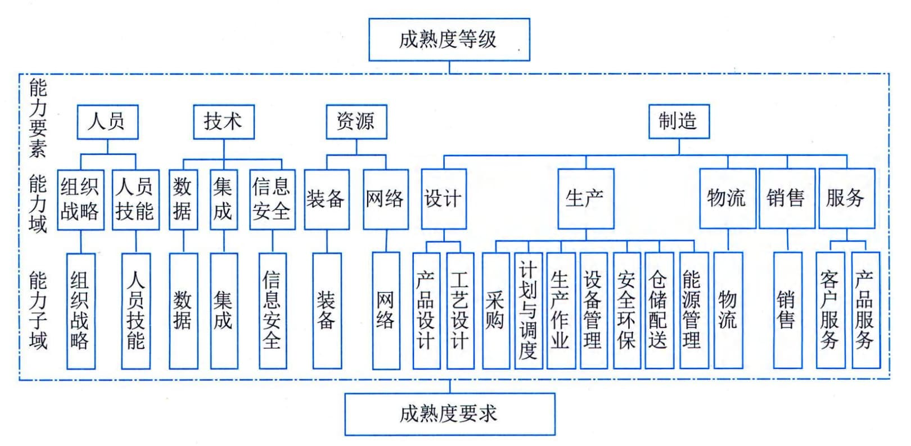
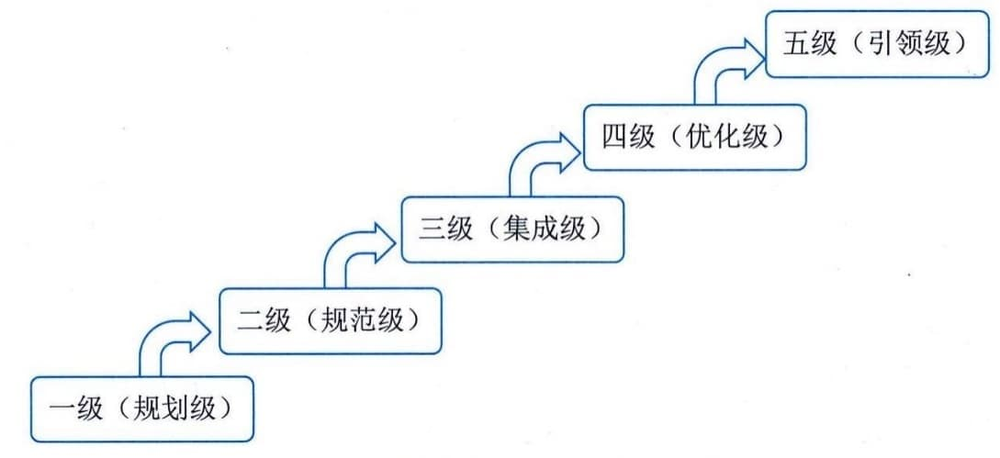

### 1.3.2 工业现代化
"坚持自主可控、安全高效，推进产业基础高级化、产业链现代化，保持制造业比重基本稳定，增强制造业竞争优势，推动制造业高质量发展"是工业发展的重要战略。"深入实施智能制
造和绿色制造工程，发展服务型制造新模式，推动制造业高端化智能化绿色化"是我国推动制造业优化升级的重点方向。
#### **1．两化融合**
两化融合是信息化和工业化的高层次的深度结合，是指以信息化带动工业化、以工业化促进信息化，走新型工业化道路；两化融合的核心就是信息化支撑，追求可持续发展模式。信息化和工业化深度融合是信息化和工业化两个历史进程的交汇与创新，是中国特色新型工业化道路的集中体现，是新发展阶段制造业数字化、网络化、智能化发展的必由之路，是数字经济时代建设制造强国、网络强国和数字中国的结合点。信息化和工业化的融合既加速了工业化进程，也拉动了信息技术的进步。信息世界与物理世界的深度融合是未来世界发展的总趋势，两化深度融合顺应这一趋势，正在全面加速数字化转型，推动制造业企业形态、生产方式、业务模式和就业方式的根本性变革，信息化与工业化主要在技术、产品、业务、产业四个方面进行融合。也就是说，两化融合包括技术融合、产品融合、业务融合和产业衍生四个方面。
 - （1）技术融合。技术融合是指工业技术与信息技术的融合，产生新的技术，推动技术创新。例如，汽车制造技术和电子技术融合产生的汽车电子技术；工业和计算机控制技术融合产生的工业控制技术。
 - （2）产品融合。产品融合是指电子信息技术或产品渗透到产品中，增加产品的技术含量。例如，普通机床加上数控系统之后就变成了数控机床；传统家电采用了智能化技术之后就变成了智能家电；普通飞机模型增加控制芯片之后就成了遥控飞机。信息技术含量的提高使产品的附加值大大提高。
 - （3）业务融合。业务融合是指信息技术应用到企业研发设计、生产制造、经营管理、市场营销等各个环节，推动企业业务创新和管理升级。例如，计算机管理方式改变了传统手工台账，极大地提高了管理效率；信息技术应用提高了生产自动化、智能化程度，生产效率大大提高；网络营销成为一种新的市场营销方式，受众大量增加，营销成本大大降低。
 - （4）产业衍生。产业衍生是指两化融合可以催生出的新产业，形成一些新兴业态，如工业电子、工业软件、工业信息服务业。工业电子包括机械电子、汽车电子、船舶电子、航空电子等；工业软件包括工业设计软件、工业控制软件等；工业信息服务业包括工业企业B2B电子商务、工业原材料或产成品大宗交易、工业企业信息化咨询等。
#### **2．智能制造**
智能制造（Intelligent
Manufacturing，IM）是基于新一代信息通信技术与先进制造技术深度融合，贯穿于设计、生产、管理、服务等制造活动的各个环节，具有自感知、自学习、自决策、自执行、自适应等功能的新型生产方式。智能制造是一项重要的国家战略，也是各个国家推动新一代工业革命的关注焦点。
智能制造是一种由智能机器和人类专家共同组成的人机一体化智能系统，它在制造过程中能进行智能活动，诸如分析、推理、判断、构思和决策等。通过人与智能机器的合作共事，去扩大、延伸和部分地取代人类专家在制造过程中的脑力劳动。它把制造自动化的概念更新，扩展到柔性化、智能化和高度集成化。智能制造的建设是一项持续性的系统工程，涵盖企业的方方面面。《智能制造能力成熟度模型》（GB／T
39116）明确了智能制造能力建设服务覆盖的能力要素、能力域和能力子域，如图1-5所示。

图1-5 智能制造能力成熟度模型
能力要素提出了智能制造能力成熟度等级提升的关键方面，包括人员、技术、资源和制造。人员包括组织战略、人员技能2个能力域。技术包括数据、集成和信息安全3个能力域。资源包括装备、网络2个能力域。制造包括设计、生产、物流、销售和服务5个能力域。设计包括产品设计和工艺设计2个能力子域；生产包括采购、计划与调度、生产作业、设备管理、仓储配送、安全环保、能源管理7个能力子域；物流包括物流1个能力子域；销售包括销售1个能力子域；服务包括客户服务和产品服务2个能力子域。
《智能制造能力成熟度模型》（GB／T
39116）还规定了企业智能制造能力在不同阶段应达到的水平。成熟度等级分为五个等级，自低向高分别是一级（规划级）、二级（规范级）、三级（集成级）、四级（优化级）和五级（引领级）。较高的成熟度等级涵盖了低成熟度等级的要求，如图1-6所示。

图1-6 智能制造能力成熟度等级
 - ·一级（规划级）。企业应开始对实施智能制造的基础和条件进行规划，能够对核心业务活动（设计、生产、物流、销售、服务）进行流程化管理。
 - ·二级（规范级）。企业应采用自动化技术、信息技术手段对核心装备和业务活动等进行改造和规范，实现单一业务活动的数据共享。
 - ·三级（集成级）。企业应对装备、系统等开展集成，实现跨业务活动间的数据共享。
 - ·四级（优化级）。企业应对人员、资源、制造等进行数据挖掘，形成知识、模型等，实现对核心业务活动的精准预测和优化。
 - ·五级（引领级）。企业应基于模型持续驱动业务活动的优化和创新，实现产业链协同并衍生新的制造模式和商业模式。
