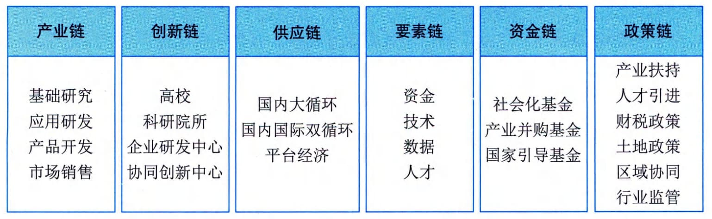

### 1.4.1 数字经济
数字经济是继农业经济、工业经济之后的更高级经济形态。从本质上看，数字经济是一种新的技术经济范式，它建立在信息与通信技术的重大突破的基础上，以数字技术与实体经济融
合驱动的产业梯次转型和经济创新发展的主引擎，在基础设施、生产要素、产业结构和治理结构上表现出与农业经济、工业经济显著不同的新特点。
#### **1．新技术经济范式**
1962年库恩在其代表作《科学革命的结构》中首先对"范式"（Paradigm）进行了定义，库恩认为："范式是指那些公认的科学成就，在一段时间里为实践共同体提供典型的问题和解答"。1982年，技术创新经济学家多西将这个概念引入技术创新之中，并提出了技术范式（Technology
Paradigm）的概念，将技术范式定义为解决所选择的技术经济问题的一种模式，而这些解决问题的办法立足于自然科学的原理。从这个定义出发，云计算、人工智能、大数据等技术在与社会经济活动的融合重构中，经过技术与经济的相互促进，形成了一些相对稳定的经济新结构和新形态，如平台经济、分享经济、算法经济、服务经济、协同经济等。进而，先一步形成的经济形态触发社会其他领域的连锁变革，最终实现整个经济领域的技术经济范式转换。数字经济的技术经济范式的结构主要包括驱动力、新结构、价值创造和经济增长。
 - （1）驱动力。数字经济发展的驱动力机制解释了数字经济为什么会产生以及数字经济为何能持续发展。大量研究文献证实，由新一代信息技术革命而形成的智能技术群被普遍认为是数字经济发生和发展的基本驱动力。智能技术群是包括云计算、大数据、人工智能、区块链、物联网、5G、VR／AR等众多技术的集群，并通过不同的细分技术组合驱动经济活动发生变革。多种技术的组合形成乘数效应，并在不断融合重组中创造出新的技术组件，形成新的合力。智能技术群与经济活动融合，通过复杂经济学所描绘的经济与技术互动过程，最终展现出重构旧经济并形成新经济的强大力量，从而为数字经济发展提供了源源不断的驱动力。
 - （2）新结构。每一次技术经济范式转换都会带来全新的经济形态和经济结构。数字经济建立在智能技术群所独有的数字化、网络化、智能化等特征的基础上，具有前所未有的新特征，如基于网络连接而产生的网络效应和用户规模经济；基于全方位数字化而使得数据成为生产要素；由智能化技术应用而产生的自治化、无人化运行特征；数字世界和实体世界融合重构了产用关系，并在经济产出方面呈现出正递增效应。
 - （3）价值创造。新范式代替旧范式的本质是价值观的转换。数字经济的本质是技术经济范式转换，数字经济必然要创造出全新的价值，进而改变人们的价值观念。通过技术经济范式转换，数字经济与社会要素的互动进一步构成社会技术系统，从而把影响渗透到整个社会领域。2020年突如其来的疫情对经济和社会结构造成了前所未有的冲击，在疫情的推动下，数字经济将加速影响和改变宏微观经济结构、组织形态和运行模式，并全方位推动全社会生产关系的再重建。疫情新常态下，数字技术对经济发展和政府治理模式加速重构，数字技术与工业、教育、医疗等行业领域深度融合，并延伸出全新的应用场景。同时，数据已经成为新型生产关系里最具潜力的生产要素，不断推动技术、价值、模式的新发展，加快驱动产业、社会、治理的新变革，全面助力全社会生产关系的再重建。
 - （4）经济增长。新技术驱动新经济，新经济创造新价值，新价值驱动经济增长，前述三个元素构建出数字经济的基本逻辑。但经济增长并非单纯是数字经济拉动的结果，而且也是数字经济持续发展的引擎，因而也是数字经济范式结构的构成元素。随着数字经济的持续推进，在增长预期的推动下，构成经济进一步增长的投资和消费也就更加活跃，更多的新经济形态不断出现，更多的新价值不断创造，从而形成一个正反馈的闭环，最终实现持续的经济增长。
#### **2．主要内容构成**
《数字经济及其核心产业统计分类（2021）》从"数字产业化"和"产业数字化"两个方面，确定了数字经济的基本范围，将其分为数字产品制造业、数字产品服务业、数字技术应用业、数字要素驱动业、数字化效率提升业等5大类。其中，前4大类为数字产业化部分，对应于《国民经济行业分类》中的26个大类、68个中类、126个小类，是数字经济发展的基础。第5大类产业数字化部分，对应于《国民经济行业分类》中的91个大类、431个中类、1256个小类，体现了数字技术将进一步与国民经济各行业进行深度渗透和广泛融合。
1）数字产业化
数字产业化是指为产业数字化发展提供数字技术、产品、服务、基础设施和解决方案，以及完全依赖于数字技术、数据要素的各类经济活动，包括电子信息制造业、电信业、软件、信息技术、互联网行业等。数字产业化也成为了数字经济基础部分。《中华人民共和国国民经济和社会发展第十四个五年规划和2035年远景目标纲要》提出了强调加快推动数字产业化，培育壮大人工智能、大数据、区块链、云计算、网络安全等新兴数字产业，提升通信设备、核心电子元器件、关键软件等产业水平。构建基于5G的应用场景和产业生态，在智能交通、智慧物流、智慧能源、智慧医疗等重点领域开展试点示范。鼓励企业开放搜索、电商、社交等数据，发展第三方大数据服务产业。促进共享经济、平台经济健康发展。
数字产业化发展重点包括：
 - ·云计算。加快云操作系统迭代升级，推动超大规模分布式存储、弹性计算、数据虚拟隔离等技术创新，提高云安全水平。以混合云为重点，培育行业解决方案、系统集成、运维管理等云服务产业。
 - ·大数据。推动大数据采集、清洗、存储、挖掘、分析、可视化算法等技术创新，培育数据采集、标注、存储、传输、管理、应用等全生命周期产业体系，完善大数据标准体系。
 - ·物联网。推动传感器、网络切片、高精度定位等技术创新，协同发展云服务与边缘计算服务，培育车联网、医疗物联网、家居物联网产业。
 - ·工业互联网。打造自主可控的标识解析体系、标准体系、安全管理体系，加强工业软件研发应用，培育形成具有国际影响力的工业互联网平台，推进"工业互联网＋智能制造"产业生态建设。
 - ·区块链。推动智能合约、共识算法、加密算法、分布式系统等区块链技术创新，以联盟链为重点发展区块链服务平台和金融科技、供应链管理、政务服务等领域应用方案，完善监管机制。
 - ·人工智能。建设重点行业人工智能数据集，发展算法推理训练场景，推进智能医疗装备、智能运载工具、智能识别系统等智能产品设计与制造，推动通用化和行业性人工智能开放平台建设。·虚拟现实和增强现实。推动三维图形生成、动态环境建模、实时动作捕捉、快速渲染处理等技术创新，发展虚拟现实整机、感知交互、内容采集制作等设备和开发工具软件、行业解决方案。
2）产业数字化
产业数字化是指在新一代数字科技支撑和引领下，以数据为关键要素，以价值释放为核心，以数据赋能为主线，对产业链上下游的全要素数字化升级、转型和再造的过程。产业数字化作为实现数字经济和传统经济深度融合发展的重要途径是新时代背景下使用数字经济发展的必由之路和战略抉择。《中华人民共和国国民经济和社会发展第十四个五年规划和2035年远景目标纲要》明确提出了推进产业数字化转型，实施"上云用数赋智"行动，推动数据赋能全产业链协同转型。
产业数字化发展对经济和社会各项发展都具有重要意义。从微观看，数字化助力传统企业蝶变，再造企业质量效率新优势。传统企业迫切需要新的增长机会与发展模式；快速迭代及进阶的数字科技为传统企业转型升级带来新希望；传统产业成为数字科技应用创新的重要场景。从中观看，数字化促进产业提质增效，重塑产业分工协作新格局。提升产品生产制造过程的自动化和智能化水平；降低产品研发和制造成本，实现精准化营销、个性化服务；重塑产业流程和决策机制。从宏观看，孕育新业态新模式，加速新旧动能转换新引擎。
数字科技广泛应用和消费需求变革催生出共享经济、平台经济等新业态新模式；促进形成新一代信息技术、高端装备、机器人等新兴产业，加速数字产业化形成。产业数字化具有的典型特征包括：
 - · 以数字科技变革生产工具；
 - · 以数据资源为关键生产要素；
 - · 以数字内容重构产品结构；
 - · 以信息网络为市场配置纽带；
 - · 以服务平台为产业生态载体；
 - · 以数字善治为发展机制条件。
通过产业数字化全面推动数字时代产业体系的质量变革、效率变革、动力变革，推动新旧动能转换和高质量发展。产业数字化的理解需要兼顾社会与市场两个维度，以更加全面的视角理解其内涵本质。从社会维度看，产业数字化是建立在生产工具与生产要素变革基础上的一种社会行为；从市场维度看，产业数字化是以信息网络为市场配置纽带、以服务平台为产业生态载体的资源优化过程。数字善治是社会及市场两个维度有机融合的具体体现，其既是产业数字化发展的机制条件，也是驱动产业数字化发展的重要动力机制。
在数字经济背景下，企业逐步进入数据驱动时代。随着企业对数字技术的不断利用，各类主体在组织生产、业务重构、经营管理等方面的数字化程度日益完善，数据将成为企业各类信息汇集的载体。未来以数据驱动的业务形式将成为主流，全渠道的数据盘活将成为企业的核心竞争力。因此，数据资产有效盘活与运营，将成为数字经济时代下企业的核心竞争力。企业应加深对数据的利用水平和治理水平，通过数据积累与运营，打通企业内部不同层级、不同系统之间的数据壁垒，盘活数据资产价值，实现对内支撑业务应用和管理决策；对外加强数据服务能力输出，从而提升数据潜在价值向实际业务价值的转化率，使得企业在提升市场竞争力同时也强化了运营能力，以此获得业务的高速增长。
在国家战略层面，数字化转型已经成为支撑未来经济发展的核心驱动力。随着数字经济的蓬勃发展，产业数字化转型将形成以产业链为中心，促进产业链与创新链、供应链、要素链、资金链、政策链等相互融合发展的新场景，如图1-8所示。"六链融合"也将成为未来产业数字化转型的主要发展模式，基于此将彻底释放国家数字经济发展的新动能。在战略层面，要以产业链为转型基础，通过与供应链的稳定协同、与创新链的对接融合、与资金链的良性循环、与政策链的相互支撑、与要素链的互联互动，实现六链条的联动呼应，促使各链条内的数据效应、经济活力竞相迸发。在实施层面，要始终推进以科学技术为核心，发挥产业互联网效应，实现以大数据为主线、以人工智能为驱动的"数据链"穿插联动，进而释放国家层的多链协同下的数字效能。"六链融合"通过创新、政策、生产要素等赋能产业链，推动产业的升级转换，加快建设实体经济、科技创新、现代金融、人力资源协同发展的产业体系，最终开辟数字化转型的新路径。

图1-8"六链融合"推动产业数字化协同发展
3）数字化治理
数字化治理通常指依托互联网、大数据、人工智能等技术和应用，创新社会治理方法手段，优化社会治理模式，推进社会治理的科学化、精细化、高效化，助力社会治理现代化。数字化治理是数字经济的组成部分之一，包括但不限于多元治理，以"数字技术＋治理"为典型特征的技管结合，以及数字化公共服务等。
数字化治理的核心特征是全社会的数据互通、数字化的全面协同与跨部门的流程再造，形成"用数据说话、用数据决策、用数据管理、用数据创新"的治理机制。作为数字时代的全新治理范式，数字化治理至少包含3个方面的内涵：
 - ·对数据的治理。对数据的治理即将治理对象扩大到涵盖数据要素。作为新兴生产要素和关键的治理资源，数据要素成为大国竞争的主要领域，对数据的治理成为制定数字经济规则的重要内容，数据要素的所有权、使用权、监管权，以及信息保护和数据安全等都需要全新治理体系。
 - ·运用数字技术进行治理。运用数字技术进行治理即运用数字与智能技术优化治理技术体系，进而提升治理能力。大数据、人工智能等新一代数字技术，可以为国家治理进行全方位的"数字赋能"，改进治理技术、治理手段和治理模式，实现复杂治理问题的超大范围协同、精准"滴灌"、双向触达和超时空预判。
 - ·对数字融合空间进行治理。随着越来越多的经济社会活动搬到线上，治理场域也拓展到数字空间。未来会有越来越多的经济社会活动发生在线上，数字融合空间会以全新的方式创造经济价值、塑造社会关系，这需要适应数字融合世界的治理体系，对数字融合空间的新生事物进行有效治理。
4）数据价值化
价值化的数据是数字经济发展的关键生产要素，加快推进数据价值化进程是发展数字经济的本质要求。近年来，数据可存储与可重用呈现爆发增长、海量集聚的特点，是实体经济数字化、网络化、智能化发展的基础性战略资源。数据价值化包括但不限于数据采集、数据标准、数据确权、数据标注、数据定价、数据交易、数据流转、数据保护等。
数据价值化是指以数据资源化为起点，经历数据资产化、数据资本化阶段，实现数据价值化的经济过程。上述三个要素构成数据价值化的"三化"框架，即数据资源化、数据资产化、数据资本化。
 - ·数据资源化是使无序、混乱的原始数据成为有序、有使用价值的数据资源。数据资源化阶段包括通过数据采集、整理、聚合、分析等，形成可采、可见、标准、互通、可信的高质量数据资源。数据资源化是激发数据价值的基础，其本质是提升数据质量，形成数据使用价值的过程。
 - ·数据资产化是数据通过流通交易给使用者或者所有者带来的经济利益的过程。数据资产化是实现数据价值的核心，其本质是形成数据交换价值，初步实现数据价值的过程。
 - ·数据资本化主要包括两种方式，即数据信贷融资与数据证券化。数据资本化是拓展数据价值的途径，其本质是实现数据要素社会化配置。
