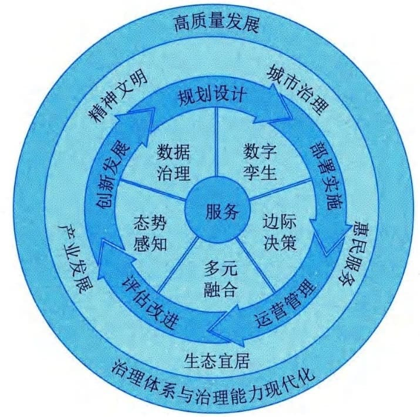
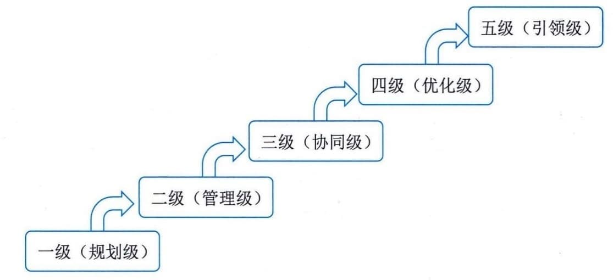

### 1.4.3 数字社会
在新一轮科技革命推动下，人类正在加速迈向数字社会。新科技革命成果不断融入生产生活，改变传统的生产生活方式，改变人们的行为方式、社会交往方式、社会组织方式和社会运行方式，深刻影响人们的思想观念和思维方式，不断创造新的产业形态、商业模式、就业形态，推动我国现代化不断向纵深发展。
#### **1．数字民生**
随着互联网、物联网、大数据、区块链和人工智能交汇融合、集群互动形成一种呈指数级增长的信息技术体系，使得传统生产方式优化升级，在触发经济发展结构变革的同时，正以一种前所未有的势头向政治、文化、生活等民生领域延伸，将"人"与"公共服务"通过数字化的方式全面连接，将大幅提升社会整体服务效率和水平，实现数字民生。
《中华人民共和国国民经济和社会发展第十四个五年规划和2[035]{.underline}年远景目标纲要》提出"聚焦教育、医疗、养老、抚幼、就业、文体、助残等重点领域，推动数字化服务普惠应用，持续提升群众获得感。推进学校、医院、养老院等公共服务机构资源数字化，加大开放共享和应用力度。推进线上线下公共服务共同发展、深度融合，积极发展在线课堂、互联网医院、智慧图书馆等，支持高水平公共服务机构对接基层、边远和欠发达地区，扩大优质公共服务资源辐射覆盖范围。加强智慧法院建设。鼓励社会力量参与＇互联网＋公共服务＇，创新提供服务模式和产品"。《"十四五"国家信息化规划》提出"构建普惠便捷的数字民生保障体系，坚持把实现好、维护好、发展好最广大人民根本利益作为发展的出发点和落脚点，着力以信息技术健全基本公共服务体系，改善人民生活品质，让人民群众共享信息化发展成果"。
我国在数字教育、数字医疗、数字就业、数字文旅等领域持续高速发展，涵盖内容既有"软件"层面的体制机制建设，又有"硬件"层面的平台系统建设。数字民生建设重点通常强调普惠、赋能和利民。
 - （1）普惠。充分开发利用信息技术体系，扩大民生保障覆盖范围，助力普惠型民生建设，解决民生资源配置不均衡等问题。
 - （2）赋能。信息技术体系与民生的深度融合赋予了民生建设新动能，促进民生保障实效指数式增长，如"互联网＋教育""互联网＋养老""互联网＋交通"等。
 - （3）利民。信息技术体系创新拓展了公共服务场景，推动数字技术全面融入社会交往和日常生活新趋势，使民生服务日趋智慧化、便利化和人性化。
无论是打造宜居城市，还是建设美丽乡村，都离不开基于大数据的民生需求洞察，拓展民生服务渠道。数字民生体现出的正是以数字思维破解民生难题，以信息技术赋能民生治理的新时代，也是对科技助力人民幸福美好生活追求的生动诠释。
#### **2．智慧城市**
智慧城市是运用信息通信技术，有效整合各类城市管理系统，实现城市各系统间信息资源共享和业务协同，推动城市管理和服务智慧化，提升城市运行管理和公共服务水平，提高城市居民幸福感和满意度，实现可持续发展的一种创新型城市。智慧城市从概念提出到落地实践，历经长期建设与发展，我国智慧城市建设数量持续增长。从在建智慧城市的分布来看，我国已初步形成京津冀、长三角、粤港澳、中西部四大智慧城市群。智慧城市作为一种新型城市发展形态和治理模式已被社会群体广泛认可和接受，新型智慧城市建设持续推动着城市的高质量发展，主要体现在：
 - · 智慧城市建设更加注重以人民为中心；
 - · 新技术持续赋能智慧城市的建设与发展；
 - · 城市治理现代化是智慧城市建设的必然要求；
 - · 智慧城市群区域一体化协同发展新格局逐步形成；
 - · 共建、共治、共享生态模式助力智慧城市高质量发展。
2020年随着新冠疫情的蔓延，越来越多的国家开始意识到智慧城市建设的重要性，城市管理者可以借助先进的信息技术来应对危机。20[20]{.underline}年经济合作与发展组织（OECD）发布的《城市政策响应》报告中强调，数字化应用在疫情应急防控中起到关键作用，这促使许多城市将疫情防控系统长久地纳入到智慧城市应用场景中，用以监控和警惕公共卫生风险。同时，由于疫情变化仍具有不确定性，市政服务、医疗、办公、教育等模式的变革正在加速数字化转型。
1）基本原理
智慧城市的建设与发展遵循一定的基本原理。随着智慧城市的持续迭代升级，智慧城市已经从信息化建设与信息技术产品应用阶段，演进到了信息化与城市现代化深度融合阶段，其基本原理也在发生变化。当前，随着新一代信息技术的发展与成熟应用，智慧城市关注焦点从使用信息化应用提高工作效率，转为通过数字关系计算提高决策效能；从局部信息技术应用，转为广泛互联互通环境下的综合应用创新；从强调管理体系和规范性，转为突出主动服务与精准施策等。
随着智慧城市步入新的发展阶段，以及以数字产业化和产业数字化为主旋律的数字经济高速发展，智慧城市基本原理表现为：①强调"人民城市为人民"，以面向政府、企业、市民等主体提供智慧化的服务为主要模式；②重点强化数据治理、数字孪生、边际决策、多元融合和态势感知五个核心能力要素建设；③更加注重规划设计、部署实施、运营管理、评估改进和创新发展在内的智慧城市全生命周期管理；④目标旨在推动城市治理、民生服务、生态宜居、产业经济、精神文明五位一体的高质量发展；⑤持续推动城市治理体系与治理能力现代化水平提升，如图1-9所示。

图1-9 智慧城市参考基本原理图
该原理确立的智慧城市核心能力要素，揭示了当前及未来一段时期智慧城市发展的重心在于信息技术与社会发展的深度融合。智慧城市的五个核心能力要素密切关联且相互影响，但不可互为替代，均是开展新一阶段智慧城市整体、局部乃至具体项目建设、运行需要关注的核心能力要素。核心能力要素解释包括：
 - ·数据治理。数据治理指围绕数据这一新的生产要素进行能力构建，包括数据责权利管控、全生命周期管理及其开发利用等。
 - ·数字孪生。数字孪生指围绕现实世界与信息世界的互动融合进行能力构建，包括社会孪生、城市孪生和设备孪生等，将推动城市空间摆脱物理约束，进入数字空间。
 - ·边际决策。边际决策指基于决策算法和信息应用等进行能力构建，强化执行端的决策能力，从而达到快速反应、高效决策的效果，满足对社会发展的敏捷需求。
 - · 多元融合。多元融合强调社会关系和社会活动的动态性及其融合的高效性等，实现服务
可编排和快速集成，从而满足各项社会发展的创新需求。
 - ·态势感知。态势感知指围绕对社会状态的本质反映及模拟预测等进行能力构建，洞察可变因素与不可见因素对社会发展的影响，从而提升生活质量。
根据智慧城市参考基本原理，智慧城市建设与发展内容主要面向城市治理、惠民服务、生态宜居、产业发展等相关城市场景构建服务能力，为政府、企业、市民等提供服务。服务场景的构建，不仅仅需要技术与平台、基础设施等方面的共性技术支撑能力构建和数据要素支撑，也需要安全保障体系、运营体系的建设，同时还离不开产业环境、信息环境等环境的支撑。
2）成熟度等级
智慧城市的建设与发展过程是一个逐渐迈向更高成熟状态的长期渐进过程，是基础设施信息资源、网络安全、体制机制、惠民服务、城市治理等各方面能力的持续提升过程。结合成熟度理论和方法，可以构建智慧城市成熟度，实现从动态评价的角度来对城市智慧化的发展阶段进行衡量。依托科学发展规律，可将智慧城市发展成熟度划分为规划级、管理级、协同级、优化级、引领级5个等级，如图1-10所示。

图1-10 智慧城市成熟度等级参考模型
 - ·一级（规划级）。规划级应围绕智慧城市的发展进行策划，明确相关职责分工和工作机制等，初步开展数据采集和应用，确保相关活动有序开展。
 - ·二级（管理级）。管理级应明确智慧城市发展战略、原则、目标和实施计划等，推进城市基础设施的智能化改造，多领域实现信息系统单项应用，对智慧城市全生命周期实施管理。
 - ·三级（协同级）。协同级应管控智慧城市各项发展目标，实施多业务、多层级、跨领域应用系统的集成，持续推进信息资源的共享与交换，推动惠民服务、城市治理、生态宜居、产业发展等的融合创新，实现跨领域的协同改进。
 - ·四级（优化级）。优化级应聚焦智慧城市与城市经济社会发展深度融合，基于数据与知识模型实施城市经济、社会精准化治理，推动数据要素的价值挖掘和开发利用，推进城市竞争力持续提升。
 - ·五级（引领级）。引领级应构建智慧城市敏捷发展能力，实现城市物理空间、社会空间、信息空间的融合演进和共生共治，引领城市集群治理联动，形成高质量发展共同体。
#### **3．数字乡村**
数字乡村是伴随网络化、信息化和数字化在农业农村经济社会发展中的应用，以及农民现代信息技能的提高而内生的农业农村现代化发展和转型进程，既是乡村振兴的战略方向，也是建设数字中国的重要内容。2019年中共中央办公厅、国务院办公厅印发《数字乡村发展战略纲要》指出：立足新时代国情农情，要将数字乡村作为数字中国建设的重要方面，加快信息化发展，整体带动和提升农业农村现代化发展。进一步解放和发展数字化生产力，注重构建以知识更新、技术创新、数据驱动为一体的乡村经济发展政策体系，注重建立层级更高、结构更优、可持续性更好的乡村现代化经济体系，注重建立灵敏高效的现代乡村社会治理体系，开启城乡融合发展和现代化建设新局面。
《数字乡村发展战略纲要》明确了到2035年，数字乡村建设取得长足进展。城乡"数字鸿沟"大幅缩小，农民数字化素养显著提升。农业农村现代化基本实现，城乡基本公共服务均等化基本实现，乡村治理体系和治理能力现代化基本实现，生态宜居的美丽乡村基本实现。到21世纪中叶，全面建成数字乡村，助力乡村全面振兴，全面实现农业强、农村美、农民富。《数字乡村发展战略纲要》明确了十项重点任务。
 - （1）加快乡村信息基础设施建设。主要包括大幅提升乡村网络设施水平、完善信息终端和服务供给、加快乡村基础设施数字化转型。
 - （2）发展农村数字经济。主要包括夯实数字农业基础、推进农业数字化转型、创新农村流通服务体系、积极发展乡村新业态。
 - （3）强化农业农村科技创新供给。主要包括推动农业装备智能化、优化农业科技信息服务。
 - （4）建设智慧绿色乡村。主要包括推广农业绿色生产方式、提升乡村生态保护信息化水平、倡导乡村绿色生活方式。
 - （5）繁荣发展乡村网络文化。主要包括加强农村网络文化阵地建设、加强乡村网络文化引导。
 - （6）推进乡村治理能力现代化。主要包括推动"互联网＋党建"、提升乡村治理能力。
 - （7）深化信息惠民服务。主要包括深入推动乡村教育信息化、完善民生保障信息服务。
 - （8）激发乡村振兴内生动力。主要包括支持新型农业经营主体和服务主体发展、大力培育新型职业农民、激活农村要素资源。
 - （9）推动网络扶贫向纵深发展。主要包括助力打赢脱贫攻坚战、巩固和提升网络扶贫成效。
 - （10）统筹推动城乡信息化融合发展。主要包括统筹发展数字乡村与智慧城市、分类推进数字乡村建设、加强信息资源整合共享与利用。
#### **4．数字生活**
数字生活是依托互联网和一系列数字科技技术应用为基础的一种生活方式，可以方便快捷地带给人们更好的生活体验和工作便利。数字生活主要体现在生活工具数字化、生活内容数字化和生活方式数字化等方面。
 - （1）生活工具数字化。数字化生活时代，现代信息技术和产品成为极其重要的生活工具，人们将像享受空气、阳光、水一样享受数字化生活工具带来的舒适和便捷。根据摩尔定律和梅特卡夫定律，随着技术的不断创新与广泛扩散，其应用成本将显著下降，而其价值则显著增加。
 - （2）生活方式数字化。在数字社会中，借助于数字化技术，每个人的工作、学习、消费、交往、娱乐等各种活动方式都将具有典型的数字化特征，数字家庭成为未来家庭的发展趋势。体现在工作更加弹性化和自主化；终身学习与随时随地学习成为可能；网络购物跻身主流消费方式；人际交往的范围与空间无限扩大等。
 - （3）生活内容数字化。数字生活时代，人们工作、学习、消费和娱乐的内容具有典型的数字化特征。体现在工作内容以创造、处理和分配信息为主；学习内容个性化；信息成为重要消费内容；娱乐内容数字化等。
