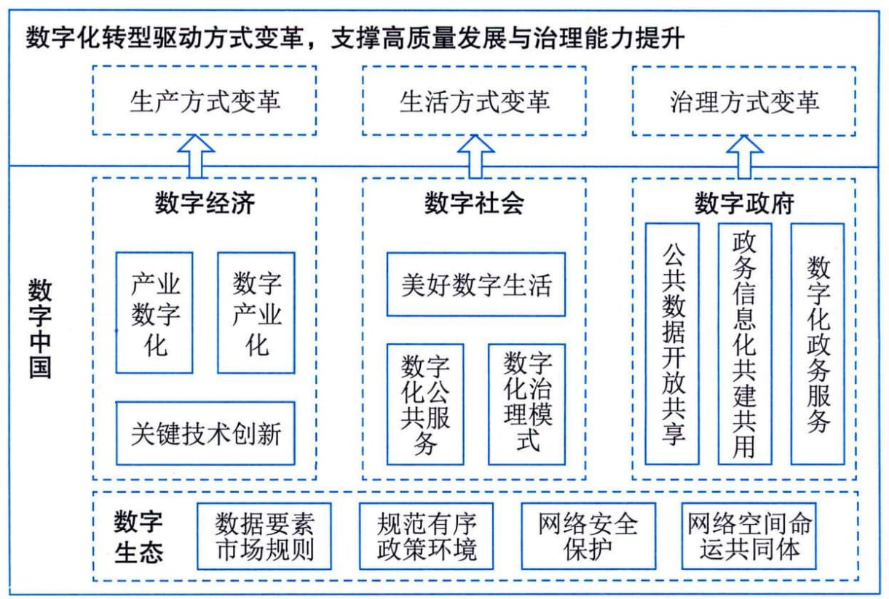

## 1.4 数字中国
习近平总书记在党的十九大报告中指出：加强应用基础研究，拓展实施国家重大科技项目，突出关键共性技术、前沿引领技术、现代工程技术、颠覆性技术创新，为建设数字中国等提供有力支撑。数字中国是新时代国家信息化发展的新战略，是满足人民日益增长的美好生活需要的新举措，是驱动引领经济高质量发展的新动力，涵盖经济、政治、文化、社会、生态等各领域信息化建设，主要包括"宽带中国""互联网＋"大数据、云计算、人工智能、数字经济、电子政务、新型智慧城市、数字乡村等内容。"迎接数字时代，激活数据要素潜能，推进网络强国建设，加快建设数字经济、数字社会、数字政府，以数字化转型整体驱动生产方式、生活方式和治理方式变革"成为了新时代我国信息化发展的主旋律，如图1-7所示。

图1-7 数字中国概览示意图
