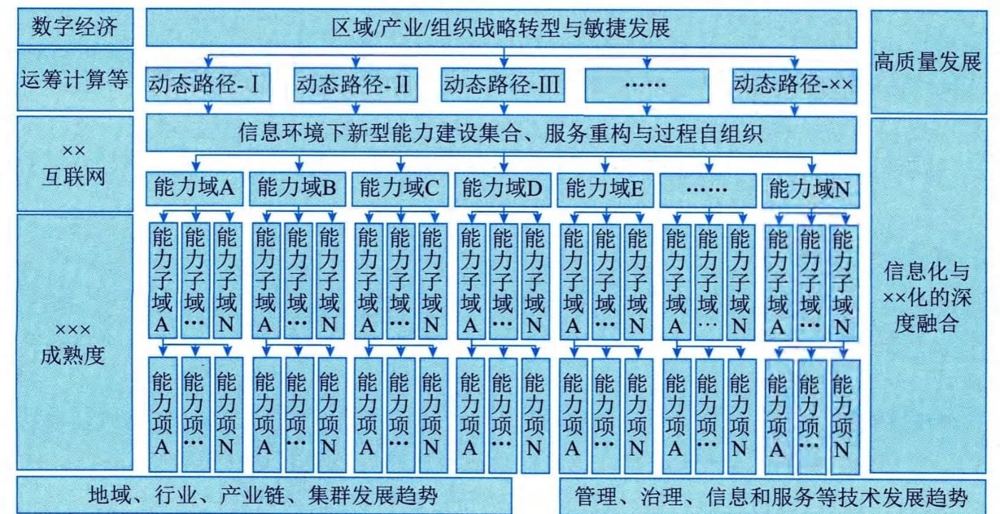
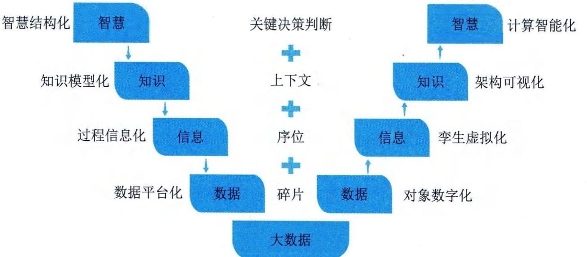
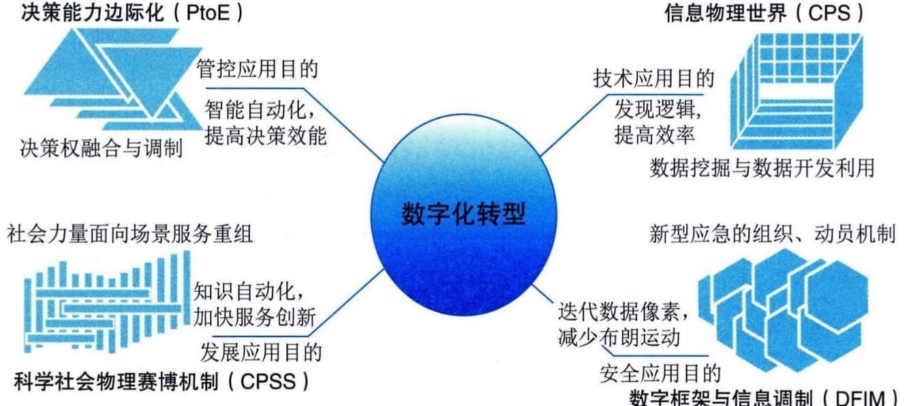

### 1.5.1 数字化转型
数字化转型（Digital
Transformation）是建立在数字化转换、数字化升级基础上，进一步触及组织核心业务，以新建一种业务模式为目标的高层次转型。数字化转型是开发数字化技术及支持能力以新建一个富有活力的数字化商业模式，只有组织对其业务进行系统性、彻底的（或重大和完全的）重新定义，而不仅仅是IT，而是对组织活动、流程、业务模式和员工能力的方方面面进行重新定义的时候，成功才会得以实现。
#### **1．驱动因素**
从全球视角来看，当前国际社会主要矛盾聚焦在发达国家企图垄断市场、资源和技术与发展中国家的发展愿望之间的矛盾。发达国家生产力没有飞跃式发展（第四次科技革命姗姗来迟），世界范围内市场、资源开发程度越来越充分，众多发展中国家想进一步改善人民生活，进一步参与到世界市场和资源的竞争中。纵观历史，无论是国际竞争关系、产业转型升级和新经济发展，还是当前我国社会主要矛盾变化带来的新特征新要求，都有其发展规律和演进范式，即"生产力飞跃、生产要素变化、信息传播效率突破和社会＇智慧主体＇规模扩容的叠加，将会促使人类社会生产关系的创新变革，最终引发经济与民生的深层发展"。这个范式驱动完成了原始经济到农业经济，再到工业经济的转型过程，同样会驱动工业经济向数字经济的转型。
1）生产力飞升：第四次科技革命
科学技术是第一生产力，近代人类发展过程中，已经完成了三次科技革命，正在经历第四次科技革命，每次科技革命都对应一个科学范式，其深刻影响着世界格局的变化，是人类社会发展的根本动力，也是国际社会主要矛盾的发源地。
第一科学范式为经验范式。它偏重于经验事实的描述和明确具体的实用性的科学研究范式。在研究方法上以归纳为主，带有较多盲目性的观测和实验。第二科学范式为理论范式。它主要指偏重理论总结和理性概括，强调较高普遍的理论认识而非直接实用意义的科学研究范式。第三科学范式为模拟范式。它是一个由数据模型构建、定量分析方法以及利用计算机来分析和解决科学问题的研究范式。第四科学范式为数据密集型研究范式。它针对数据密集型科学，是由传统的假设驱动向基于科学数据进行探索的科学方法转变而生成的科学研究范式。其研究方法是基于计算机生产与实践产生的数据，按照驱动理论获得猜想与假设，完成数据自动化的计算和原理探索，即由计算机实施第一、第二、第三科学范式。第四科学范式通过新型信息技术的数据洞察，从大数据中自动化挖掘实践经验、理论原理并自行开展模拟仿真，完成基于数据的自决策和自优化，这将极大地繁荣应用科学技术。
2）生产要素变化：数据要素的诞生
数据是与土地、劳动力、资本和技术并列的主要生产要素，表明数据将会是未来社会数字化、智能化发展的重要基础。数据是一项重要的经济资源，其对经济社会的全面持续发展、经济组织转型和参与个体生活质量非常重要且不可或缺。数据记载信息，信息融合知识，知识孕育智慧，过去人们已经持续了几十年的信息化建设，人们把智慧解构成知识，把知识分解为信息，把信息拆解为数据。随着人工智能、区块链和大数据等技术的出现，过去分散在各个环节的数据，重新归集为显性信息、知识和智慧，数据的经济价值被凸显出来，因此数据对我国高质量发展的作用，与土地、设备、原材料、资本、劳动、技术同等重要，具备了单列为生产要素的现实条件。
3）信息传播效率突破：社会互联网新格局
随着科学技术的发展，各种网络服务随之而来，互联网社交网络就是其中之一。人们的日常生活逐渐从现实社交网络转移到互联网虚拟社交网络中。互联网社交网络下，人们可以跟不在身边的朋友进行面对面的交流，还可以寻找有共同爱好的陌生人。从而形成在线社区，构成了庞大的社交网络平台，为用户提供便捷交流的渠道。
社交网络信息传输具有永生性、无限性、即时性以及方向性的特征。永生性指尽管在传播过程中可以控制信息，但它并不会被破坏或者消灭。比如：收到一条信息且尚未传播该消息，但该消息实实在在地存在，信息的载体还可以继续传播。无限性是指信息可以像病毒一样无限地传播下去。即时性使社交网络信息传播的速度从通信器向接收者传播信息的时间大幅缩短，甚至可以忽略。方向性意味着信息传播具有目的性，某些信息的传播仅是为了传递给特定的人。
随着互联网的发展，在互联网上传播信息已成为信息扩散的主要渠道。互联网的特性是信息可以跨越时间和地理障碍在网络上迅速传播。
4）社会"智慧主体"规模：快速复制与"智能＋"
过去，我们认为的"智慧主体"都是自然人，复制一个"智慧主体"的难度很大，需要教育、培育、培养等众多的手段方法。同时，其周期也较为漫长，培育一个自然人的"智慧主体"，往往需要超过20年的时间。另外，智慧融合也需要经历漫长而复杂的交互环境以及自然环境因素等限制，都制约了社会"智慧主体"规模的扩大与繁荣，从而使互联网的节点容量出现瓶颈，随着社会的进一步演进，这种瓶颈会阻碍人类社会的高质量建设，影响人类社会的进一步发展和演进。
现在，社会的"智慧主体"已经不单纯是自然人，它可以是一个互联网账号、一台自动驾驶的汽车、一部智能手机，或者是工厂中的一套智能机器人。这些新兴"智慧主体"具有不同于自然人的全量社会化活动模式，如消费选择等，但其在数据生产、数据开发利用、劳动力贡献和决策能力等方面，具备了自然人很多关键特征，在不知不觉中已经让这些新主体参与到了人们社会活动的方方面面，乃至与自然人享有同等的社会空间，如未来某一时刻无人驾驶的汽车主体与自然人道路参与主体享有同等的道路权。
新兴的"智慧主体"具备较强的可复制性、自我修炼能力、更加广泛的连接能力和更加标准的交互手段等。新兴"智慧主体"规模和种类的快速扩张，会引发人类社会的深层次变革，改变自然人主体的劳动方式，劳动密集型的社会劳动逐步消退，智力密集型的社会劳动持续强化，自然人"智慧主体"甚至会全面退出生产制造过程领域，让自然人的竞争力聚焦在新兴"智慧主体"不会具备的领域。这个领域是以"服务"为典型代表，因为该领域会面对更加复杂的交互过程、更多的风险融合应对和情感因素管控等。
#### **2．基本原理**
随着经济与社会的持续发展，同领域相关参与者因为数量的持续增多和发展水平趋于一致等，再加上我国处在中高速发展阶段，这些因素共同导致了经济与社会的竞争越来越充分、越来越激烈。随着我国社会主要矛盾从人民日益增长的物质文化需要同落后的社会生产之间的矛盾，转变为人民日益增长的美好生活需要和不平衡、不充分的发展之间的矛盾，以及信息时代带来的信息高效、充分且大规模传播，信息对象过程加速，乃至出现信息淹没等情况，这进一步加剧了经济与社会参与者的竞争，这表现在产品和服务的生命周期迭代越来越快，组织运行决策越来越高效，组织的转型升级周期越来越短，组织的业务发展越来越敏捷等。
传统发展视角下，组织为提升自身的竞争力，往往通过优化组织结构体系（如组织结构扁平化），提升工艺技术与装备（如应用新技术或自动化装备），降低业务成本（如人员容量、材料成本、加工成本等）等方式展开，这种优化与提升从某种程度上实现了对组织竞争力和竞争优势的保持和增强。这种发展模式下，组织通过治理和管理体系强化组织的协同性和创新力，并降低组织风险；通过减少客户个性选择来驱动业务规模化发展，以优化产品生产和服务交付成本。
数字经济时代，经济与社会竞争的进一步加剧，传统发展视角下的竞争力与竞争优势的保持和增强方法，越来越难以支撑组织的发展需求，主要体现在：
 - ·决策瓶颈。以组织架构构建的治理与管理体系决策效率容易遇到瓶颈，并且组织规模越大、行政层级越多、决策效率效能越容易达到瓶颈。
 - ·变革制约。组织变革是一项系统工程，这不仅仅包括新组织、新工艺、新产品、新营销等的策划、规划和设计等，其部署落实也是一组复杂的工作，变革的效能常常受组织文化、人员技能、技术现状等方面的制约，太多的变革一致性无法解决。
 - ·知识资产流失。组织研发或沉淀的各类经验，如有使用传统的知识体系（如用文档资料管理），容易随着人员流动而流失，这是因为传统知识方法需要相关人员全部掌握。
 - ·需求响应延迟。组织为了有效地控制成本，最常用的方法是固化管理、工艺等，通过"简单可复制"的模式，达到一致性和成本最优化，这会导致组织对客户或服务对象的个性化需求延迟满足乃至放弃满足。
组织的数字化转型就是基于组织既有的治理与管理体系、工艺路径和产品技术、服务活动定义等，打造更加高效的决策效率、更灵活的工艺调度、更多元的产品与服务技术应用和更丰富的业务模式等。数字化转型需要组织结合信息技术的开发利用，对组织完成深层次变革，可参考模型如图1-11所示。

图1-11数字组织运行参考框架
1）能力因子定义和数字化"封装"
实施数字化转型，组织需要把各项能力和活动进行清晰的结构化并定义，形成细化的可灵活调度和编排的能力因子，这些能力因子是有层次或可组合的，如能力域、能力子域、能力项、能力分项、能力子项等，对于数字化转型不同成熟度的组织来说，主要体现在能力因子定义颗粒度、学科性和有效性等方面。
能力因子的定义可驱动组织的管理精细化，更重要的是能够实现对这些能力因子的数字化"封装"，这种封装不只是对业务流程、工艺过程和技术内容的"包装"，而是需要向具体活动的人员、技术（含内部控制等）、资源、数据、流程（过程和动作）的模块化"封装"，打造基于数据的标准化输入与输出，形成类似信息化系统中的对象、类、模块等组件。在工业类组织中体现为数字装备、数字化管理单元、数字产品等，目的是实现"智能＋"。
2）基于"互联网＋"的调度和决策
实施数字化转型，组织需要在既有治理与管理体系、工艺体系、服务体系、产品体系的基础上，通过使用"互联网＋"的模式，将组织沉淀的各类知识经验进行数字化提炼，形成数字算法、模型和框架等，满足信息系统能够理解和使用的方式，让调度和决策脱离"自然人"，从而提高调度和决策效率及其科学性。这部分工作是数字化转型中一项持续性工作，其科技含量比较高，也是组织数字化转型中的难点，主要体现在：
 - ·业务融合。将知识经验形成数字化调用模式，需要业务和信息技术的充分融合，需要实施这些工作的业务人员，具备一定的数字技能，或者信息技术人员能够深入理解业务。
 - ·持续坚持。通过数字模式开展决策与调度活动，其开始时的效果、效率、效能并不一定理想，这就需要组织能够持续坚持，通过持续改进活动，提升数据模式的价值。
 - ·文化冲突。调度与决策的科学化、敏捷化，依赖组织的知识沉淀，这就需要组织解决文化冲突，引导组织成员适应数字化带来的各种变化，积极贡献知识经验，消除自我成长顾虑以及驾驭数字的"恐惧"等。
 - ·效果判别。通常情况下，治理和管理更加注重判断和决策的正确性，执行操作关注过程的精确性，而使用数字模式实施决策和调度时，其精确性被凸显出来，对决策和调度的数据及应用过程提出了更高的要求，需要组织投入更多的智力资源。
3）转型控制
数字化转型往往不是指一个结果的表达，而是一个持续的过程，组织需要能够有效地管控转型的过程，无论是服务组织还是工业组织，都不能一蹴而就地完成该项转型升级。组织需要充分借鉴信息化与工业化、信息化与领域现代化等深度融合的最佳实践，结合自身的实际情况，持续建设、优化和改进数字化转型过程。
#### **3．智慧转移**
数字化转型基本原理揭示了个体智慧（知识、技能和经验等）由"自然人"个体，转移到组织智慧（计算机、信息系统等掌握的）的必要性和重要性。这种"智慧转移"也称"智慧移植"，需要经历一系列的过程才能完成，每个组织开展此类活动的模式与方法存在差异，也可以参考图1-12所示的"智慧转移"模型。
图1-12 智慧转移的S8D模型
DIKW模型很好地诠释了数据（Data）、信息（Information）、知识（Knowledge）和智慧（Wisdom）之间的关系，并揭示了他们的转化过程与方法。S8D模型就是基于DIKM模型，构筑了"智慧一数据""数据一智慧"两大过程的8个转化活动。
1）"智慧-数据"过程
该过程通常指信息系统规划、建设、运行过程，也就是传统讲的信息化过程。该过程：①通过智慧结构化明确了业务体系层面方面的内容；②通过知识模型化定义业务活动的逻辑关系；③通过过程信息化（管理和工艺流程化）明确各执行操作系列要求；④通过数据平台化实现了数据的采集、存储和共享等。
2）"数据-智慧"过程
该过程通常指数据的开发利用和资源管理的过程，也就是人们常说的智慧化过程，重点解决基于各类组织组成对象（人员、流程、业务、工艺、装备等）"数字关系"的"脑力替代"。该过程在大数据"筑底"后，多元化数据能够被开发利用：①通过对象数字化实现对各类对象的数字化表达；②通过孪生虚拟化完成物理对象到信息空间的映射；③通过架构可视化实现业务知识模型与经验沉淀的复用和创新；④通过计算智能化实现多元条件下的调度和决策。
数据是筑底构建可计算智慧的关键，通过"智慧一数据"过程将人类智慧形成了数据表达，并通过数据流动，提高了组织业务与工作效能，实现"体力劳动替代"。接下来通过"数据一智慧"工程，在大数据的基础上，逆变数据为计算智能，完成了智慧载体由自然人到计算机和信息系统的转移，其价值不仅仅可实现智慧的在线时效（7x24无休），更可以实现"智慧挤压"（多方法多维度综合判断）和更高级别的"智慧萃取"（新智慧的生成），进一步可以实现智慧的可复制。这一过程也是第四科学范式的基本框架，是第四次科技革命的触发逻辑。
#### **4．持续迭代**
组织数字化转型需要在能力因子不断细化的基础上，针对能力因子的数字化转型实施迭代，可类比为整体数字化转型与局部数字转型的关系。组织每个能力因子数字化"封装"的持续迭代主要包含四项活动，即：信息物理世界（也称数字孪生，CPS）建设、决策能力边际化（Power
to Edge，PtoE）部署、科学社会物理赛博机制（Cyber-Physical-Social
Systems，CPSS）构筑、数字框架与信息调制（Digital Frame and Information
Modulation，DFIM）设计，如图1-13所示。针对能力因子的持续迭代可以从任何一项活动开始实施四项活动，形成持续迭代闭环。

图1-13 组织能力数字化转型及持续迭代参考模型（CPSD模型）
1）信息物理世界建设
针对能力因子中的各类对象，实施数字孪生建设，并在此基础上加入该因子与其他因子之间的配置关系。组织可以通过该项活动实现能力因子相关数据挖掘与数据开发利用，从而发现新的技术和逻辑，提升各项工作效率。
2）决策能力边际化部署
决策能力边际化是指处置执行层面的装置和人员能够基于决策算法模型等，敏捷获得更高的决策能力（权），达到敏捷响应的效果。组织可以通过该项活动实现决策权融合与调制，达到装备智能化和提高决策效能的价值效果。
3）科学物理赛博机制构筑
科学物理赛博机制设计是在CPS的基础上，汇聚组织内能力因子的环境因素力量（或组织维度的外部社会力量），建设高密度数据框架，参照社会运行原理，封装、解构和重构各能力因子协同关系。组织可以通过该项活动实现对各能力因子的灵活组合机制，形成能够面对各类需求的动态调度能力。
4）数字框架与信息调制设计
组织能力因子的数字密度越高，对其可控性就越高，对应的安全可靠性也越高。组织通过优化能力因子的数字框架模型，提升数据采集获取的精准度和及时性，能够有效地提升组织对能力因子的应急与动员能力，从而具备更加可靠的已知风险管控能力和未知风险的应对能力。
