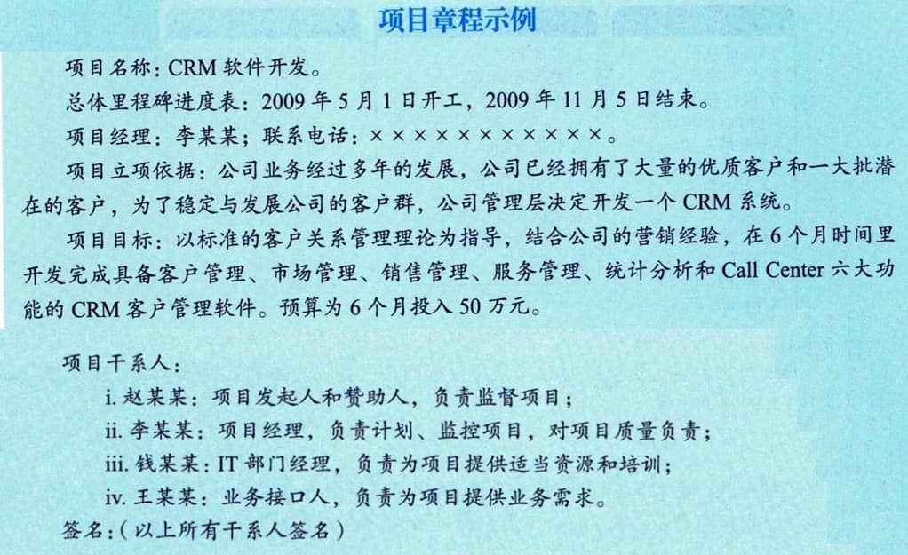

### 10.1.2 主要输出
#### **1．项目章程**
项目章程记录了关于项目和项目预期交付的产品、服务或成果的高层级信息，主要包括：
 - · 项目目的；
 - · 可测量的项目目标和相关的成功标准；
 - · 高层级需求；
高层级项目描述、边界定义以及主要可交付成果；
整体项目风险；
 - · 总体里程碑进度计划；
 - · 预先批准的财务资源；
关键干系人名单；
项目审批要求（例如，评价项目成功的标准，由谁对项目成功下结论，由谁签署项目结束）；
 - · 项目退出标准（例如，在何种条件下才能关闭或取消项目或阶段）；
 - · 委派的项目经理及其职责和职权；
 - · 发起人或其他批准项目章程的人员的姓名和职权等。
项目章程确保干系人在总体上就主要可交付成果、里程碑以及每个项目参与者的角色和职责达成共识。

#### **2．假设日志**
假设日志用于记录整个项目生命周期中的所有假设条件和制约因素。
在项目启动之前进行可行性研究和论证时，就开始识别高层级的战略和运营假设条件与制约因素。这些假设条件与制约因素应纳入项目章程。较低层级的活动和任务假设条件在项目期间随着诸如定义技术规范、估算、进度和风险等项目活动的开展而生成。
