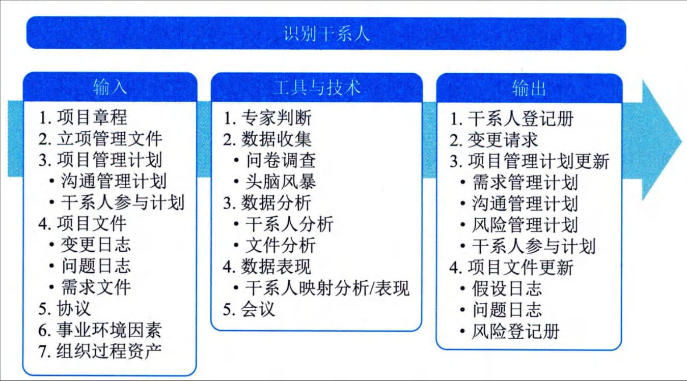
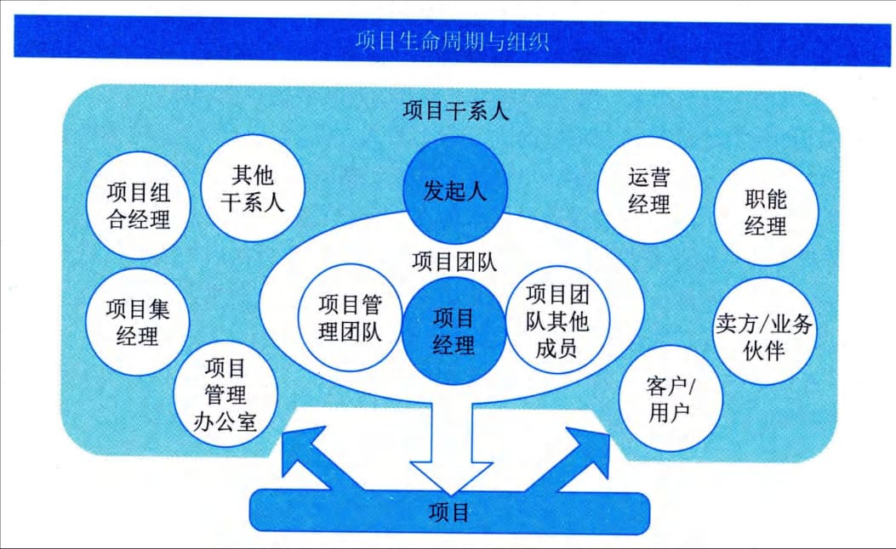

## 10.2 识别干系人
项目干系人（Stakeholder）指参与项目实施活动或在项目完成后其利益会受到项目消极或积极影响的个人或组织。项目干系人也称为"利益干系人"或"利害关系者"，既包括其利益受到项目影响的个人或组织，也包括会对项目执行及其结果施加影响的个人或组织。项目团队应把干系人满意程度作为一个关键的项目目标来进行管理。
识别干系人是定期识别项目干系人，分析和记录他们的利益、参与度、相互依赖性、影响力和对项目成功的潜在影响的过程。本过程的主要作用是使项目团队能够建立对每个干系人或干系人群体的适度关注。本过程应根据需要在整个项目期间定期开展。本过程的输入、工具与技术和输出如图10-4所示。

图10-4 识别干系人过程的输入、工具与技术和输出
识别干系人不是启动阶段一次性的活动，而是在项目过程中根据需要在整个项目期间定期开展。识别干系人管理过程通常在编制和批准项目章程之前或同时首次开展，之后的项目生命周期过程中在必要时重复开展，至少应在每个阶段开始时，以及项目或组织出现重大变化时重复开展。每次重复开展识别干系人管理过程，都应通过查阅项目管理计划组件及项目文件，来识别有关的项目干系人。
项目管理者通过识别项目的干系人，明确干系人需求或其对项目的承诺，对这些需求或承诺进行有效管理，使得项目赢得更多人的支持，从而确保项目取得成功。项目干系人与项目团队、项目的关系如图10-5所示。

图10-5 项目干系人与项目团队、项目的关系
在不同项目中会包含不同的项目干系人，项目干系人的职责和权限也会有所不同。项目管理者需依据项目建设目标、项目建设内容及需求等方面确定对项目存在期望、需求或对项目产生影响的干系人的类别。
在系统集成项目建设过程中，项目干系人的主要类别通常包括项目客户和用户、项目团队及成员、项目发起人、资源或职能部门、供应商，以及其他相关组织或个人等。
 - （1）项目客户和用户。项目客户和用户包括客户方项目负责人、项目管理部门、具体使用用户以及项目监督部门等，他们均可能对项目提出需求或期望，或对项目进展产生影响。
 - （2）项目团队及成员。项目团队是执行项目工作的群体，包括项目管理人员、工程技术人员及相关支持人员等。项目团队由来自不同团队的个人组成，他们拥有执行项目工作所需的专业知识或特定技能。项目团队成员负责实现项目及其他干系人的需要或期望，他们的工作成果对项目的进展产生重要影响。
 - （3）项目发起人。项目发起人指为项目提供资金或资源支持的个人或组织。项目发起人明确项目的建设目标，为项目提供必要的决策支持和资源协调。项目管理者明确发起人的需要，并对发起人进行有效的工作沟通和管理，这对项目的进展往往会产生重要影响。（4）资源或职能部门。在矩阵型组织中，系统集成项目的实施可能需要研发、测试、设计等部门为其提供技术人员，需要人力资源部门为其进行人员招聘，需要采购部门协助项目完成采购工作；同时，市场、销售、PMO、法务或审计等部门可能对项目实施提出需求或期望。项目管理者在干系人识别过程中应全面识别各类干系人，从而全面管理各干系人对项目的期望和承诺。
 - （5）供应商。系统集成项目的实施中如果存在供应商，供应商的工作执行与交付成果将对项目存在显著影响。项目管理者需识别各方供应商作为项目的干系人，通过对供应商的工作进展与承诺进行有效管理，确保项目的成功。
 - （6）其他相关组织或个人。对于其他内部或外部对项目产生影响或依赖的监管部门、巡视与审计部门、上下级单位或上下游组织等对项目有决定权、产生影响、被影响、需要项目信息或为项目提供信息的组织或个人，都应识别为干系人，对其进行管理和监控。
除此之外，系统集成项目还有可能面临各方干系人。例如，一个金融机构的管理信息系统建设，组织的技术部门可能要求遵循统一的技术架构，PMO可能要求将项目成本控制在一定范围之内，运营部门要求项目建设过程遵循国家标准或金融行业规范，营销或市场部门期望项目可以作为全国示范项目进行商业推广，同时项目需满足银保监会的审计要求、法规部门提出的要求等。这些对项目的需求、期望均会对项目产生重要的影响，干系人识别过程中如果遗漏关键干系人，将对项目进展产生重大的影响。
识别干系人过程的主要输入为项目管理计划和项目文件，主要工具与技术为数据收集、数据分析和数据表现，主要输出为干系人登记册。下面进行详细介绍。
