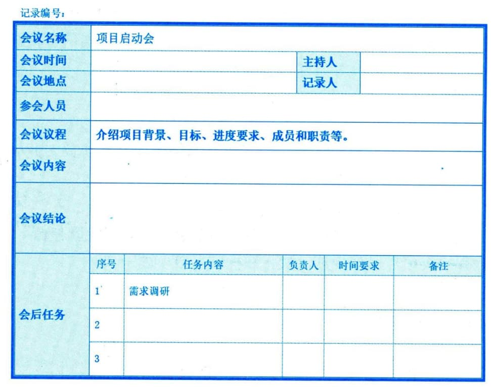

### 10.3.1 项目启动会议
项目启动会议是一个项目正式启动的工作会议，因此对项目的启动工作及后续工作开展非常重要。项目启动会议通常由项目经理负责组织和召开，也标志着对项目经理责权的定义结果的正式公布。
召开项目启动会议的主要目的在于使项目各方干系人明确项目的目标、范围、需求、背景及各自的职责与权限，正式公布项目章程。项目启动会议通常包括如下5个工作步骤：（1）确定会议目标。项目启动会议的具体目标包括建立干系人之间的初始沟通，相互了解，获得支持，对项目建设方案达成共识等。
 - （2）会议准备。包括审阅项目文件，召开启动准备会议，明确关键议题，编制初步计划，编制人员和组织计划，开发团队工作环境，准备会议材料等。
 - （3）识别参会人员。典型的项目启动会议都是由项目经理作为会议主持人，参与的人员包括项目发起人、组织高层领导、客户及用户代表、资源和职能部门负责人等干系人。
 - （4）明确议题。包括采用的项目开发过程、项目产出物、项目资源和进度计划等。
 - （5）进行会议记录。项目启动会议中需对项目的各方干系人职责、承诺事项及会议决议进行书面记录，这些会议记录可以作为档案留存，作为项目需求或承诺跟踪的依据，同时可以在项目收尾阶段进行总结和改进参考。

图10-6 某项目启动会议的会议纪要示例
