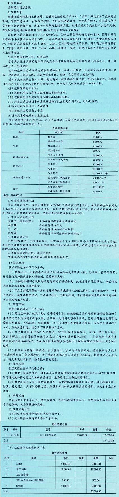

### 11.1.2 主要输出
项目管理计划是说明项目执行、监控和收尾方式的一份文件，它整合并综合了所有知识领域的子管理计划和基准，以及管理项目所需的其他组件信息，项目管理计划的组件取决于项目的具体需求。项目管理计划组件主要包括子管理计划、基准和其他组件等。
 - （1）子管理计划：包括范围管理计划、需求管理计划、进度管理计划、成本管理计划、质量管理计划、资源管理计划、沟通管理计划、风险管理计划、采购管理计划、干系人参与计划。
 - （2）基准：包括范围基准、进度基准和成本基准。
 - （3）其他组件：虽然在项目管理计划过程中生成的组件会因项目而异，但是通常包括变更管理计划、配置管理计划、绩效测量基准、项目生命周期、开发方法、管理审查。
下面给出一个项目管理计划的示例。

