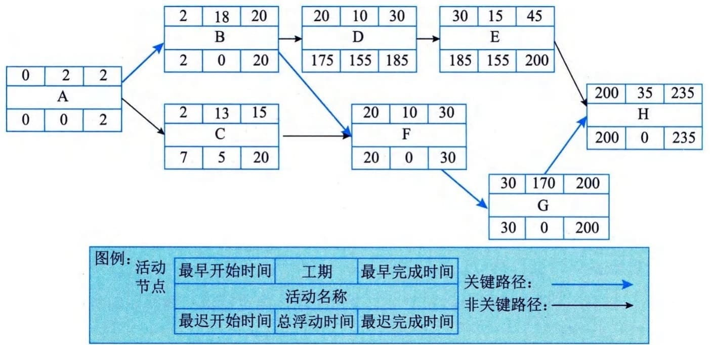
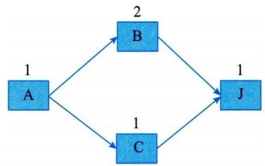
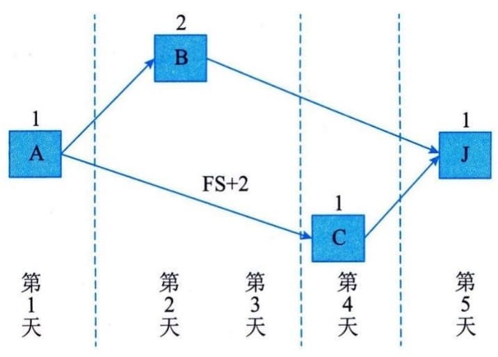
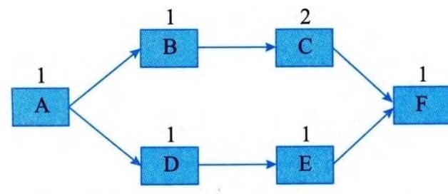
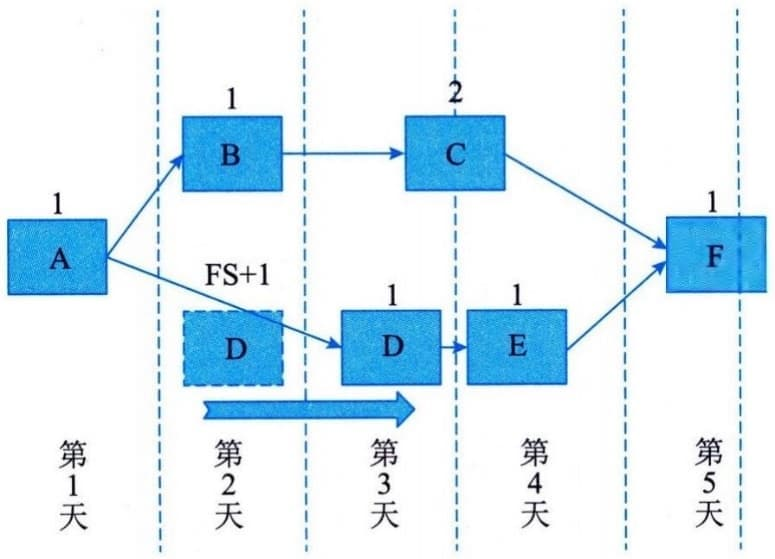
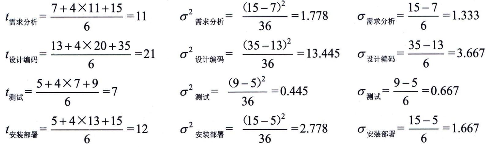
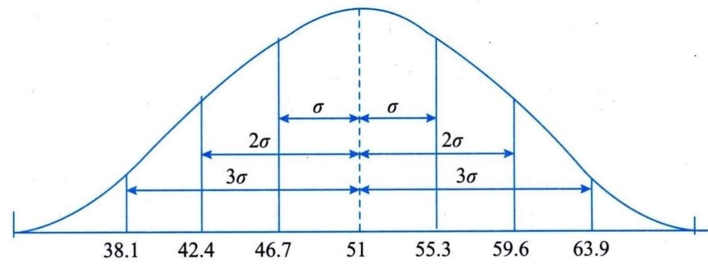
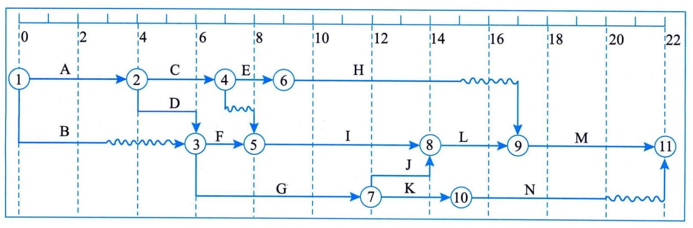
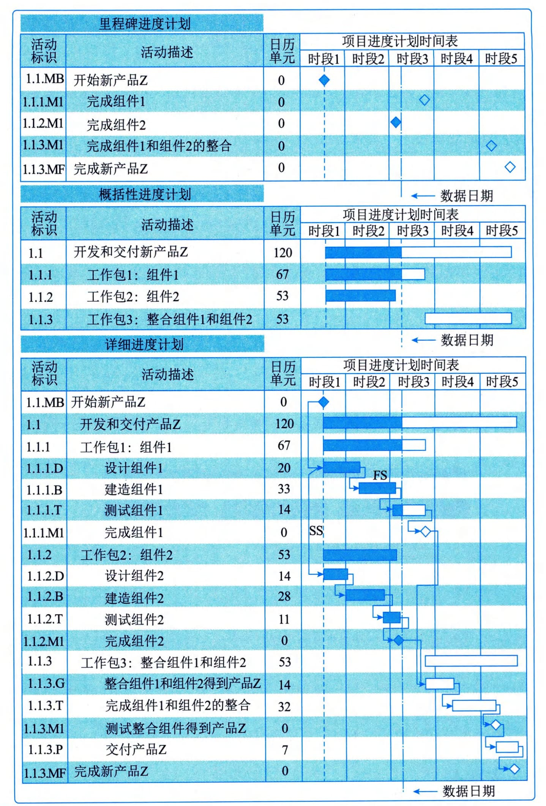

### 11.10.2 主要工具与技术
#### **1．关键路径法**
关键路径法用于在进度模型中估算项目的最短工期，确定逻辑网络路径的进度灵活性。关键路径法有如下2个规则：
 - （1）某项活动的最早开始时间必须相同或晚于直接指向这项活动的最早结束时间中的最晚时间。
 - （2）某项活动的最迟结束时间必须相同或早于该活动直接指向的所有活动的最迟开始时间的最早时间。
根据以上规则，可以计算出工作的最早完工时间。通过正向计算（从第一个活动到最后一个活动）推算出最早完工时间，步骤如下：
 - （1）从网络图始端向终端计算；
 - （2）第一个活动的开始时间为项目开始时间；
 - （3）活动完成时间为开始时间加持续时间；
 - （4）后续活动的开始时间根据前置活动的时间和搭接时间而定；
 - （5）多个前置活动存在时，根据最迟活动时间来定。
通过反向计算（从最后一个活动到第一个活动）推算出最晚开工和完工时间，步骤如下：
 - （1）从网络图终端向始端计算；
 - （2）最后一个活动的完成时间为项目完成时间；
 - （3）活动开始时间为完成时间减持续时间；
 - （4）前置活动的完成时间根据后续活动的时间和搭接时间而定；
 - （5）多个后续活动存在时，根据最早活动时间来定。
关键路径法在不考虑任何资源限制的情况下，按照以上步骤使用正向和反向推算，计算出所有活动的最早开始、最早完成、最晚开始和最晚完成时间，示例如图11-23所示。在这个例子中，最长的路径包括活动A、B、F、G和H，因此，活动序列A-B-F-G-H就是关键路径，关键路径是项目中时间最长的活动顺序，决定着可能的项目最短工期。最长路径的总浮动时间通常为零。由此得到的最早和最晚的开始和完成时间并不一定就是项目进度计划，而只是把既定的参数（活动持续时间、逻辑关系、提前量、滞后量和其他已知的制约因素）输入进度模型后所得到的一种结果，表明活动可以在该时段内实施。关键路径法用来计算进度模型中的关键路径、总浮动时间和自由浮动时间。
图11-23 关键路径法示例
总浮动时间：在任一网络路径上，进度活动可以从最早开始时间推迟或拖延的时间，而不至于延误项目完成日期或违反进度制约因素，这个时间就是总浮动时间。总浮动时间的计算方法为：本活动的最迟完成时间减去本活动的最早完成时间，或本活动的最迟开始时间减去本活动的最早开始时间。
自由浮动时间：自由浮动时间就是指在不延误任何紧后活动最早开始时间或不违反进度制约因素的前提下，某进度活动可以推迟的时间量。其计算方法为：紧后活动最早开始时间的最小值减去本活动的最早完成时间。
例如，在图11-23中，活动D的总浮动时间是155天，自由浮动时间是0天。
进度网络图可能有多条关键路径。为了使网络路径的总浮动时间为零或正值，可能需要调整活动持续时间（可增加资源或缩减范围时）、逻辑关系（针对选择性依赖关系时）、提前量和滞后量，或其他进度制约因素。
#### **2．资源优化**
资源优化是根据资源供需情况来调整进度模型的技术。资源优化用于调整活动的开始和完成日期，以调整计划使用的资源，使其等于或少于可用的资源。资源优化技术包括资源平衡和资源平滑。
#### **1）资源平衡**
为了在资源需求与资源供给之间取得平衡，根据资源制约因素对开始日期和完成日期进行调整的一种技术。如果共享资源或关键资源只在特定时间可用，数量有限，如一个资源在同一时段内被分配至两个或多个活动，就需要进行资源平衡。也可以为保持资源使用量处于均衡水平而进行资源平衡。资源平衡往往导致关键路径改变。可以用浮动时间平衡资源。因此，在项目进度计划期间，关键路径可能发生变化。
例如，在图11-24中，如果活动B和C都只能由工程师小王完成，那么小王在第2天和第3天需要完成B，而第2天同时还需要完成C，此时小王工作会超负荷，需要进行资源平衡，平衡后的工作安排如图11-25所示。

图11-24 资源平衡示例（平衡前） 图11-25 资源平衡示例（平衡后）
项目需要4天完成，做了资源平衡之后需要5天完成，所以资源平衡往往导致关键路径改变，而且通常是延长了关键路径。
2）资源平滑
对进度模型中的活动进行调整，从而使项目资源需求不超过预定的资源限制的一种技术。相对于资源平衡而言，资源平滑不会改变项目的关键路径，完工日期也不会延迟。也就是说，活动只在其自由和总浮动时间内延迟。但资源平滑技术可能无法实现所有资源的优化。
例如，在图11-26中，如果活动B和D都需要小王完成，此时第2天，小王需要同时完成B和D，工作会超出负荷，由于关键路径为A-B-C-F，D不在关键路径上，可以有1天的总浮动时间，所以针对D可以利用资源平滑技术进行调整，调整后的工作安排如图11-27所示。

图11-26 资源平滑示例（调整前） 图11-27 资源平滑示例（调整后）
由于D有1天的总浮动时间，我们可以通过滞后量，把D安排在第3天，避免了小王第2天资源负荷过大的问题，而且不影响整体工期。
#### **3．进度压缩**
进度压缩技术是指在不缩减项目范围的前提下，缩短或加快进度工期，以满足进度制约因素、强制日期或其他进度目标。进度压缩技术包括赶工和快速跟进。
 - （1）赶工。通过增加资源，以最小的成本代价来压缩进度工期的一种技术。赶工的例子包括批准加班、增加额外资源或支付加急费用，据此来加快关键路径上的活动。赶工只适用于那些通过增加资源就能缩短持续时间的，且位于关键路径上的活动。但赶工并非总是切实可行的，因为它可能导致风险和／或成本的增加。
 - （2）快速跟进。快速跟进是一种进度压缩技术，将正常情况下按顺序进行的活动或阶段改为至少部分并行开展。例如，在大楼的建筑图纸尚未全部完成前就开始建地基。快速跟进可能造成返工和风险增加，所以它只适用于能够通过并行活动来缩短关键路径上的项目工期的情况。若进度加快而使用提前量通常会增加相关活动之间的协调工作，并增加质量风险。快速跟进还有可能增加项目成本。
#### **4．计划评审技术**
计划评审技术（Program Evaluation and Review
Technique，PERT），又称为三点估算技术，其理论基础是假设项目持续时间，以及整个项目完成时间是随机的，且服从某种概率分布。PERT可以估计整个项目在某个时间内完成的概率。PERT和CPM在项目进度规划中的应用非常广，下文通过实例来对此技术加以说明。
1）活动的时间估计
PERT对各项目活动的完成时间按照3种不同情况进行估计：
 - · 乐观时间（Optimistic
Time，$T_{O})$：任何事情都顺利的情况下，完成某项工作的时间；
 - · 最可能时间（Most Likely Time，
$T_{M})$：正常情况下，完成某项工作的时间；
 - · 悲观时间（Pessimistic Time，
$T_{P})$：最不利的情况下，完成某项工作的时间。
假定3个估计服从β分布，由此可算出每个活动的期望t：
$$t_{i} = \frac{a_{i} + 4m_{i} + b_{i}}{6}$$
> 其中： $a_{i}$表示第i项活动的乐观时间，
> $m_{i}$表示第i项活动的最可能时间，$b_{i}$表示第i项活动的悲观时间。
根据β分布的方差计算方法，第i项活动的持续时间方差为：
$$\sigma_{i}^{2} = \frac{(b_{i} - a_{i})^{2}}{36}$$
例如，某政府OA系统的建设可分解为需求分析、设计编码、测试、安装部署4个活动，各个活动顺次进行，没有时间上的重叠，活动的完成时间估计如图11-28所示。

图11-28 OA系统工作分解和活动工期估计
各活动的期望工期、方差和标准差如下：

2）项目周期估算
PERT认为整个项目的完成时间是各个活动完成时间之和，且服从正态分布。整个项目完成时间t的数学期望T和方差$\sigma^{2}$分别等于：
$$T = 11 + 21 + 7 + 12 = 51$$
$$\sigma^{2} = 1.778 + 13.445 + 0.445 + 2.778 = 18.446$$
标准差为：
$$\sigma = \sqrt{\sigma^{2}} = \sqrt{18.446} = 4.3天$$
据此，可以得出正态分布曲线图，如图11-29所示。

图11-29 OA系统项目的工期正态分布
因为图11-29是正态曲线，根据正态分布规律，在±σ范围内（即在46.7天与55.3天之间）完成的概率为68％；在±2σ范围内（即在42.4天到59.6天之间）完成的概率为95％；在±3σ范围内（即在38.1天到63.9天之间）完成的概率为99％。如果客户要求在39天内完成，则可完成的概率约为0.5％，几乎为零，也就是说，项目有不可压缩的最小周期，这是客观规律。
通过查标准正态分布表，可得到整个项目在某一时间内完成的概率。例如，如果客户要求在60天内完成，那么可能完成的概率为：
$P(t \leq 60) = \Phi(\frac{60 - T}{\sigma}) = \Phi(\frac{60 - 51}{4.3}) = 0.9817$如果客户要求再提前7天完成，则完成的概率为：
$$P(t \leq 53) = \Phi(\frac{53 - T}{\sigma}) = \Phi(\frac{53 - 51}{4.3}) = 0.6808$$
#### **11.10.3 主要输出**
#### **1．进度基准**
进度基准是经过批准的进度模型，只有通过正式的变更控制程序才能进行变更，用作与实际结果进行比较的依据。经干系人接受和批准，进度基准包含基准开始日期和基准结束日期。在监控过程中，将用实际开始和完成日期与批准的基准日期进行比较，以确定是否存在偏差。进度基准是项目管理计划的组成部分。
#### **2．项目进度计划**
项目进度计划是进度模型的输出，为各个相互关联的活动标注了计划日期、持续时间、里程碑和所需资源等。项目进度计划中至少要包括每个活动的计划开始日期与计划完成日期。即使在早期阶段就进行了资源规划，但在未确认资源分配和计划开始与完成日期之前，项目进度计划都只是初步的。项目进度计划可以是概括的或详细的。虽然项目进度计划可以采用列表形式，但图形方式更直观，可以采用的图形方式包括横道图、里程碑图、项目季度网络图。
 - （1）横道图：也称为甘特图，是展示进度信息的一种图表方式。在横道图中，纵向列表示活动，横向列表示日期，用横条表示活动自开始日期至完成日期的持续时间。横道图相对易读，比较常用。
 - （2）里程碑图：与横道图类似，但仅标示出主要可交付成果和关键外部接口的计划开始或完成时间。
 - （3）项目进度网络图：通常用活动节点法绘制，没有时间刻度，纯粹显示活动及其相互关系。项目进度网络图也可以是包含时间刻度的进度网络图，称为时标图，如图11-30所示。
图11-30 时标图示例
图11.31给出了进度计划的3种形式，包括里程碑进度计划（即里程碑图）、概括性进度计划（即横道图）和详细进度计划（即项目进度网络图），以及这3种不同层次的进度计划之间的关系

图11-31 进度计划的3种形式及其关系示例
#### **3．进度数据**
项目进度模型中的进度数据是用以描述和控制进度计划的信息集合。进度数据至少包括进度里程碑、进度活动、活动属性，以及已知的全部假设条件与制约因素，而所需的其他数据因应用领域的不同而不同。经常可用作支持细节的信息包括：
 - · 按时段列出的资源需求，往往以资源直方图表示；
 - ·备选的进度计划，如最好情况或最坏情况下的进度计划、经资源平衡或未经资源平衡的进度计划、有强制日期或无强制日期的进度计划；
 - · 使用的进度储备等。
进度数据还可以包括资源直方图、现金流预测，以及订购与交付进度安排等其他相关信息。
#### **4．项目日历**
在项目日历中规定可以开展进度活动的可用工作日和工作班次，它把可用于开展进度活动的时间段（按天或更小的时间单位划分）与不可用的时间段区分开来。在一个进度模型中，可能需要采用不止一个项目日历来编制项目进度计划，因为有些活动需要不同的工作时段。因此，可能需要对项目日历进行更新。
