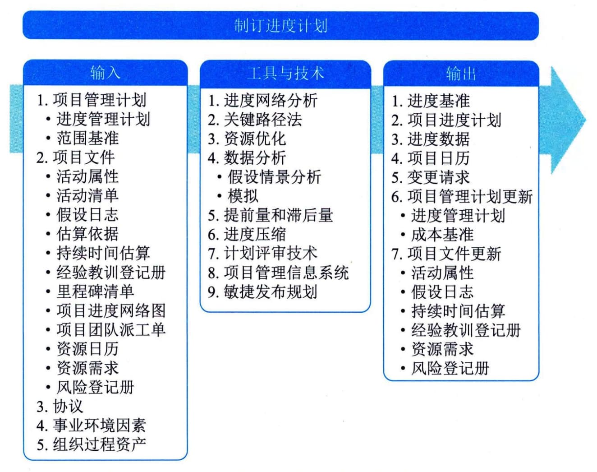

### 11.10 制订进度计划
制订进度计划是分析活动顺序、持续时间、资源需求和进度制约因素，创建进度模型，从而落实项目执行和监控的过程。本过程的主要作用是为完成项目活动而制定具有计划日期的进度模型。本过程需要在整个项目期间开展。图11-22描述了本过程的输入、工具与技术和输出。

图**11-22**制订进度计划过程的输入、工具与技术和输出
制订可行的项目进度计划是一个反复进行的过程。基于获取的最佳信息，使用进度模型来确定各项目活动和里程碑的计划开始日期和计划完成日期。编制进度计划时，需要审查和修正持续时间估算、资源估算和进度储备，以制订项目进度计划，并在经批准后作为基准用于跟踪项目进度。制订进度计划包括以下4个关键步骤：
 - （1）定义项目里程碑、识别活动并排列活动顺序，以及估算活动持续时间，并确定活动的开始和完成日期；
 - （2）由分配至各个活动的项目人员审查其被分配的活动；
 - （3）项目人员确认开始和完成日期与资源日历和其他项目或任务没有冲突，从而确认计划日期的有效性；
 - （4）分析进度计划，确定是否存在逻辑关系冲突，以及在批准进度计划并将其作为基准之前是否需要资源平衡，并同步修订和维护项目进度模型，确保进度计划在整个项目期间一直切实可行。
制订进度计划过程的主要输入为项目管理计划和项目文件，主要工具与技术包括关键路径法、资源优化、进度压缩和计划评审技术，主要输出为进度基准、项目进度计划、进度数据和项目日历。
