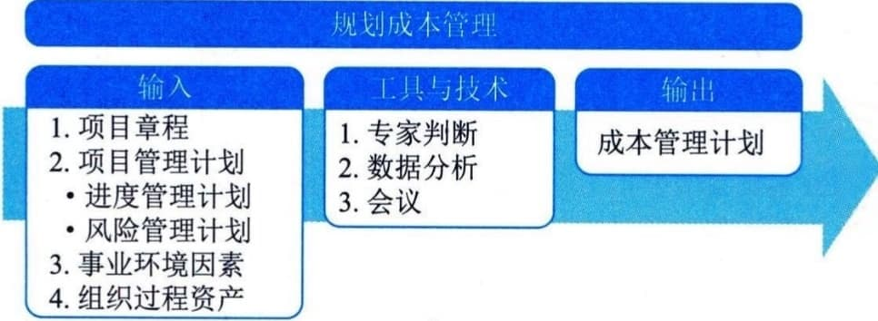

## 11.11_规划成本管理
规划成本管理是确定如何估算、预算、管理、监督和控制项目成本的过程。本过程的主要作用是在整个项目期间为如何管理项目成本提供指南和方向。本过程仅开展一次或仅在项目的预定义点开展。图11-32描述了本过程的输入、工具与技术和输出。

图11-32 规划成本管理过程的输入、工具与技术和输出
应该在项目规划阶段的早期就对成本管理工作进行规划，建立各成本管理过程的基本框架，以确保各过程的有效性及各过程之间的协调性。成本管理计划是项目管理计划的组成部分，其过程及所用工具与技术应记录在成本管理计划中。
规划成本管理过程的主要输入为项目章程和项目管理计划，主要输出为成本管理计划。