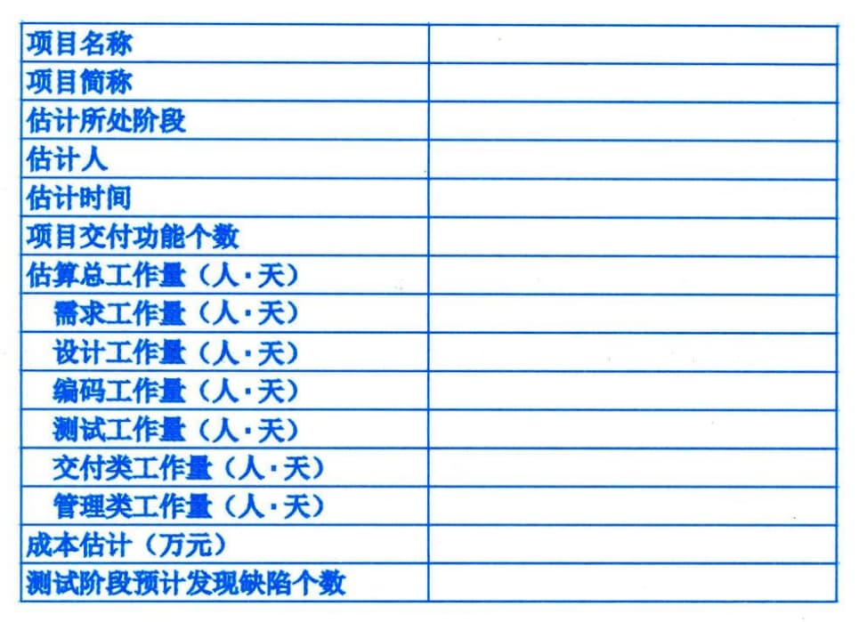

### 11.12.2 主要输出
#### **1．成本估算**
成本估算包括完成项目工作可能需要的成本、应对已识别风险的应急储备。成本估算可以是汇总的或详细分列的。成本估算应覆盖项目所使用的全部资源，包括直接人工、材料、设备、服务、设施、信息技术，以及一些特殊的成本种类，如融资成本（包括利息）、通货膨胀补贴、汇率或成本应急储备。如果间接成本也包含在项目估算中，则可在活动层次或更高层次上计列间接成本。成本估算示例如图11-34所示。

图11-34成本估算示例
#### **2．估算依据**
成本估算所需的支持信息的数量和种类因应用领域而异，不论其详细程度如何，支持性文件都应该清晰、完整地说明成本估算是如何得出的。
成本估算的支持信息可包括：
 - · 关于估算依据的文件（如估算是如何编制的）；
 - · 关于全部假设条件的文件；
 - · 关于各种已知制约因素的文件；
 - · 有关已识别的、在估算成本时应考虑的风险的文件；
 - · 对估算区间的说明（如"10000元±10％"就说明了预期成本的所在区间）；
 - · 对最终估算的置信水平的说明等。
