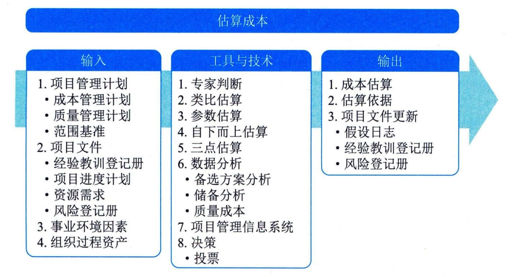

### 11.12 估算成本
估算成本是对完成项目工作所需资金进行近似估算的过程。本过程的主要作用是确定项目所需的资金。本过程应根据需要在整个项目期间定期开展。

图11-33 估算成本过程的输入、工具与技术和输出
成本估算是对完成活动所需资源的可能成本进行的量化评估，是在某特定时点根据已知信息所做出的成本预测。在估算成本时，需要识别和分析可用于启动与完成项目的备选成本方案，需要权衡备选成本方案并考虑风险，如比较自制成本与外购成本、购买成本与租赁成本及多种资源共享方案，以优化项目成本。
通常用某种货币单位进行成本估算，但有时也可采用其他计量单位，如人·时数或人·天数，以消除通货膨胀的影响，便于成本比较。
在项目过程中，应该随着更详细信息的呈现和假设条件的验证，对成本估算进行持续审查和优化。在项目生命周期中，项目估算的准确性亦将随着项目的进展而逐步提高。例如，在启动阶段可得出项目的粗略量级估算，其区间为-25％～＋75％；之后，随着信息越来越详细，确定性估算的区间可缩小至-5％～＋10％。某些组织已经制定出相应的指南，规定何时进行优化，以及每次优化所要达到的置信度或准确度。
进行成本估算，应该考虑针对项目收费的全部资源，一般包括人工、材料、设备、服务、设施，以及一些特殊的成本种类，如通货膨胀补贴、融资成本或应急成本。成本估算可在活动层级呈现，也可以通过汇总形式呈现。
估算成本过程的主要输入为项目管理计划和项目文件，主要输出为成本估算和估算依据。
