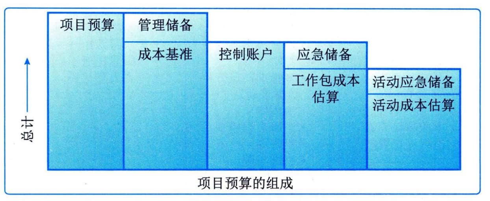
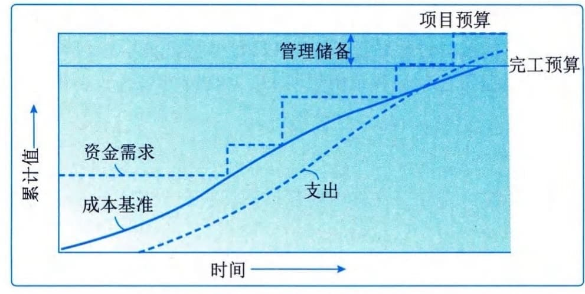

### 11.13.2 主要输出
#### **1．成本基准**
成本基准是经过批准的、按时间段分配的项目预算，不包括任何管理储备，只有通过正式的变更控制程序才能变更，用作与实际结果进行比较的依据，成本基准是不同进度活动经批准的预算的总和。
项目预算和成本基准的各个组成部分如图11-36所示。先汇总各项目活动的成本估算及其应急储备，得到相关工作包的成本；然后汇总各工作包的成本估算及其应急储备，得到控制账户的成本；接着再汇总各控制账户的成本，得到成本基准；最后，在成本基准之上增加管理储备，得到项目预算。当出现有必要动用管理储备的变更时，则应该在获得变更控制过程的批准之后，把适量的管理储备移入成本基准中。
由于成本基准中的成本估算与进度活动直接关联，因此可按时间段分配成本基准，得到一条S曲线，如图11-37所示。对于使用挣值管理的项目，成本基准指的是绩效测量基准。

图11-36项目预算的组成

图11-37 成本基准、支出与资金需求
#### **2．项目资金需求**
根据成本基准，确定总资金需求和阶段性（如季度或年度）资金需求。成本基准中包括预计支出及预计债务。项目资金通常以增量的方式投入，并且可能是非均衡的，呈现出如图11-37所示的阶梯状。如果有管理储备，则总资金需求等于成本基准加管理储备。在资金需求文件中，也可说明资金来源。
