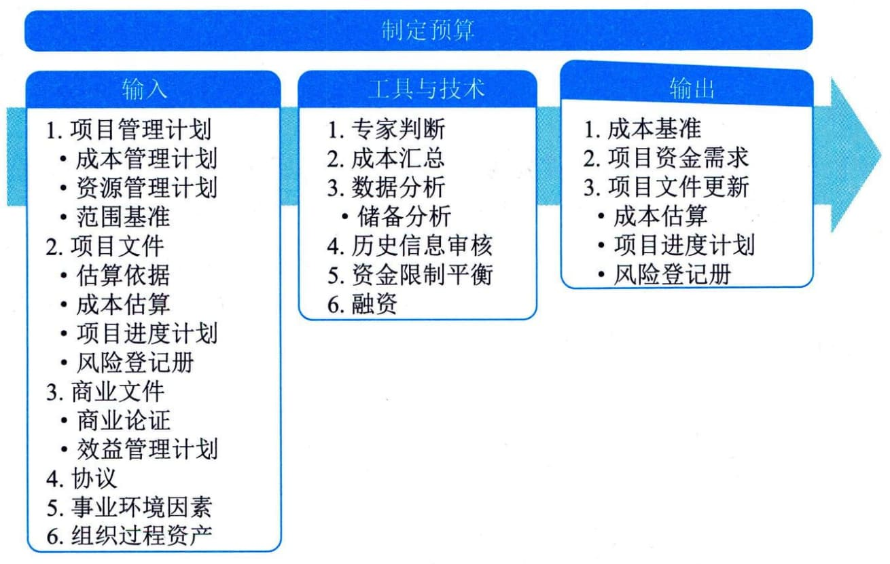

## 11.13 制定预算
制定预算是汇总所有单个活动或工作包的估算成本，建立一个经批准的成本基准的过程。本过程的主要作用是确定可据以监督和控制项目绩效的成本基准。本过程仅开展一次或仅在项目的预定义点开展。图11-35描述了本过程的输入、工具与技术和输出。

图11-35 制定预算过程的输入、工具与技术和输出
制定预算过程的主要输入为项目管理计划和项目文件，主要输出为成本基准和项目资金需求。
