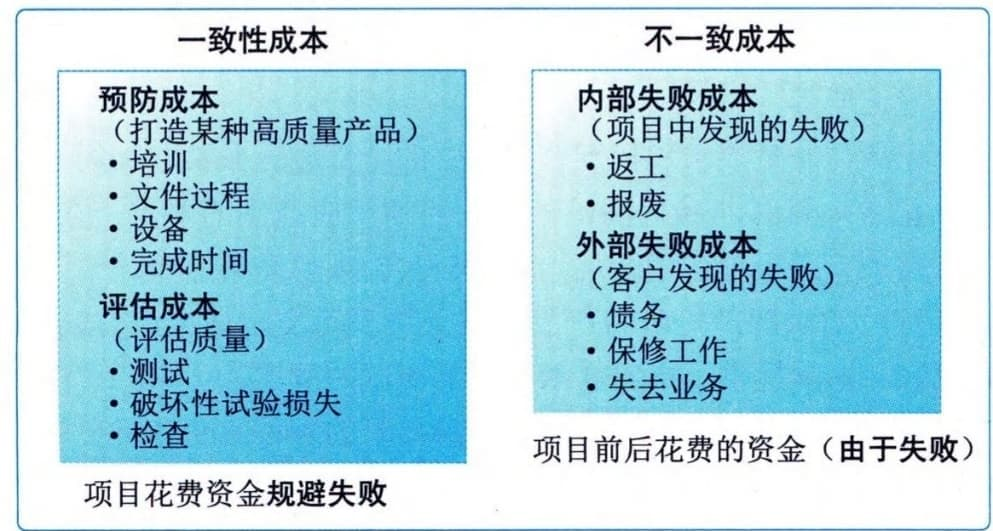
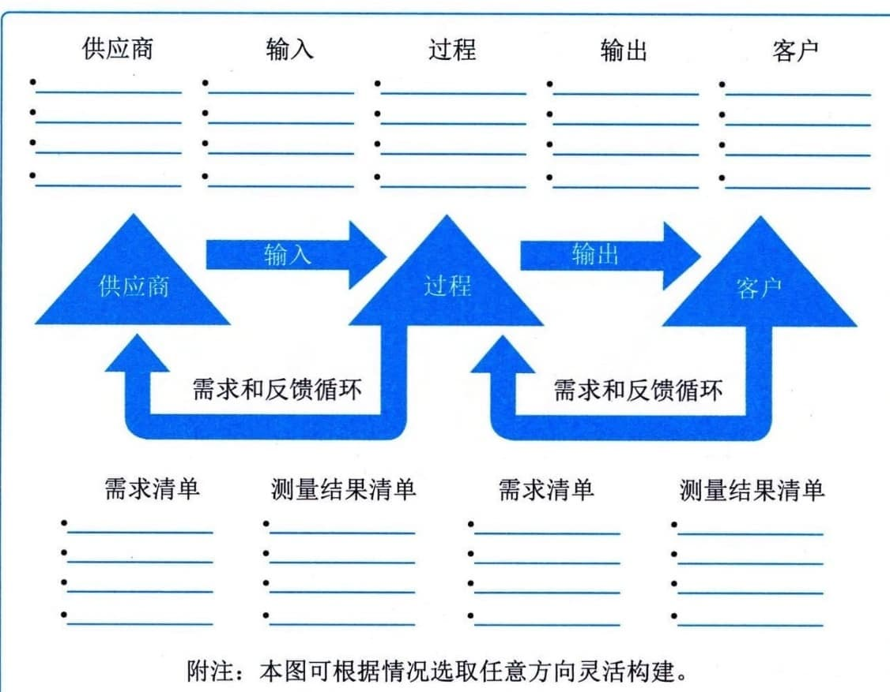

### 11.14.2 主要工具与技术
#### **1．数据收集**
适用于规划质量管理过程的数据收集技术包括标杆对照、头脑风暴和访谈等。（1）标杆对照。标杆对照是将实际或计划的项目实践或项目的质量标准与可比项目的实践进行比较，以便识别最佳实践，形成改进意见，并为绩效考核提供依据。作为标杆的项目可以来自执行组织内部或外部，或者来自同一应用领域或其他应用领域。标杆对照也允许用不同应用领域或行业的项目做类比。
 - （2）头脑风暴。通过头脑风暴可以向团队成员或主题专家收集数据，以制订最适合新项目的质量管理计划。
 - （3）访谈。访谈有经验的项目参与者、干系人和主题专家有助于了解他们对项目和产品质量的隐性和显性、正式和非正式的需求和期望。应在信任和保密的环境下开展访谈，以获得真实可信、不带偏见的反馈。
#### **2．数据分析**
适用于规划质量管理过程的数据分析技术包括成本效益分析和质量成本等。
 - （1）成本效益分析。成本效益分析是用来估算备选方案优势和劣势的财务分析工具，以确定可以创造最佳效益的备选方案。成本效益分析可帮助项目经理确定规划的质量活动是否有效利用了成本。达到质量要求的主要效益包括减少返工、提高生产率、降低成本、提升干系人满意度及提升盈利能力。对每个质量活动进行成本效益分析，就是要比较其可能成本与预期效益。
 - （2）质量成本。与项目有关的质量成本（COQ）包含以下一种或多种成本（图11-39提供了各组成本的例子）：
 - · 预防成本：预防特定项目的产品、可交付成果或服务质量低劣所带来的成本；
 - · 评估成本：评估、测量、审计和测试特定项目的产品、可交付成果或服务所带来的成本；
 - ·失败成本（内部／外部）：因产品、可交付成果或服务与干系人需求或期望不一致而导致的成本。最优COQ能够在预防成本和评估成本之间找到恰当的投资平衡点，用于规避失败成本。

图11-39 质量成本示例
#### **3．决策技术**
多标准决策分析是适用于规划质量管理过程的一种决策技术，多标准决策分析工具（如优先矩阵）可用于识别关键事项和合适的备选方案，并通过一系列决策排列出备选方案的优先顺序。先对标准排序和加权，再应用于所有备选方案，计算出各个备选方案的数学得分，然后根据得分对备选方案排序。在本过程中，它有助于排定质量测量指标的优先顺序。
#### **4．数据表现**
适用于规划质量管理过程的数据表现技术包括流程图、逻辑数据模型、矩阵图和思维导图等。
 - （1）流程图。流程图也称过程图，用来显示在一个或多个输入转化成一个或多个输出的过程中，所需的步骤顺序和可能分支。它通过映射水平价值链的过程细节来显示活动、决策点、分支循环、并行路径及整体处理顺序。图11-40展示了其中一个版本的价值链，即SIPOC（供应商、输入、过程、输出和客户）模型。流程图有助于了解和估算一个过程的质量成本，通过工作流的逻辑分支及其相对频率来估算质量成本，这些逻辑分支细分为完成符合要求的输出而需要开展的一致性工作和非一致性工作。用于展示过程步骤时，流程图有时又被称为"过程流程图"或"过程流向图"，可帮助改进过程并识别可能出现质量缺陷或可以纳入质量检查的地方。

图11-40 SIPOC模型
 - （2）逻辑数据模型。逻辑数据模型把组织数据可视化，用业务语言加以描述，不依赖任何特定技术。逻辑数据模型可用于识别会出现数据完整性或其他问题的地方。
 - （3）矩阵图。矩阵图在行列交叉的位置展示因素、原因和目标之间的关系强弱。根据可用来比较因素的数量，项目经理可使用不同形状的矩阵图，如L型、T型、Y型、X型、C型和屋顶型矩阵。在规划质量管理过程中，矩阵图有助于识别对项目成功至关重要的质量测量指标。
 - （4）思维导图。思维导图是一种用于可视化组织信息的绘图法。质量思维导图通常是基于单个质量概念创建的，是绘制在空白页面中央的图像，之后再增加以图像、词汇或词条形式表现的想法。思维导图技术有助于快速收集项目质量要求、制约因素、依赖关系和联系。
#### **5．测试与检查的规划**
在规划阶段，项目经理和项目团队决定如何测试或检查产品、可交付成果或服务，以满足干系人的需求和期望，以及如何满足产品的绩效和可靠性目标。不同行业有不同的测试与检查，可能包括软件项目的a测试和β测试、建筑项目的强度测试、制造和实地测试的检查，以及工程的无损伤测试。
