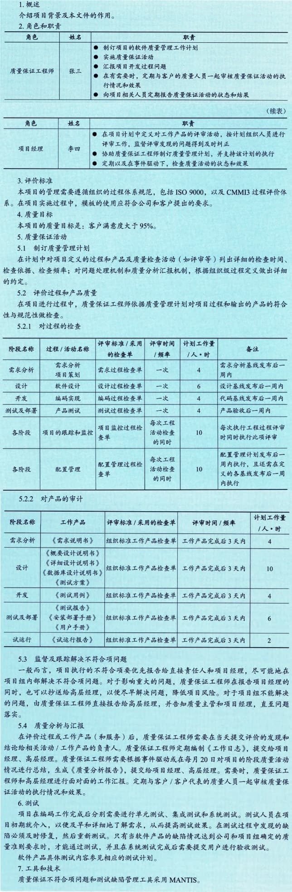
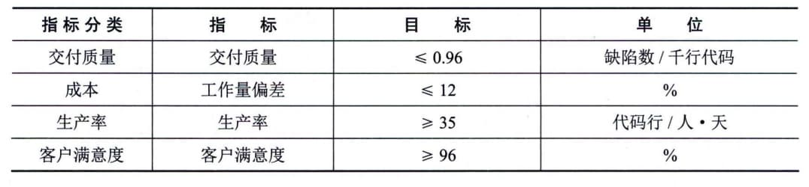

### 11.14.3 主要输出
#### **1．质量管理计划**
质量管理计划是项目管理计划的组成部分，描述如何实施适用的政策、程序和指南以实现质量目标。它描述了项目管理团队为实现一系列项目质量目标所需的活动和资源。质量管理计划可以是正式或非正式的，非常详细或高度概括的，其风格与详细程度取决于项目的具体需要。应该在项目早期就对质量管理计划进行评审，以确保决策是基于准确信息的。这样做的好处是，更加关注项目的价值定位，降低因返工而造成的成本超支金额和进度延误次数。
质量管理计划的内容一般包括：
 - · 项目采用的质量标准；
 - · 项目的质量目标；
 - · 质量角色与职责；
 - · 需要质量审查的项目可交付成果和过程；
 - · 为项目规划的质量控制和质量管理活动；
 - · 项目使用的质量工具；·与项目有关的主要程序，例如处理不符合要求的情况、纠正措施程序，以及持续改进程序等。
下面列举一个质量管理计划的示例。

#### **2．质量测量指标**
质量测量指标专用于描述项目或产品属性，以及控制质量过程将如何验证符合程度。质量测量指标的例子包括按时完成的任务的百分比、以CPI测量的成本绩效、故障率、识别的日缺陷数量、每月总停机时间、每个代码行的错误、客户满意度分数，以及测试计划所涵盖的需求的百分比（即测试覆盖度）。质量测量指标示例如表11-1所示。
**表11-1
质量测量指标示例**
