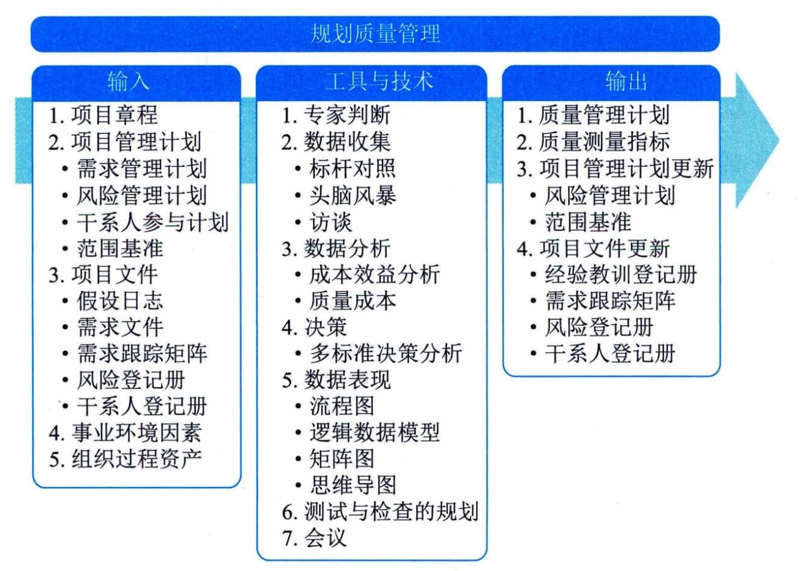

## 11.14 规划质量管理
规划质量管理是识别项目及其可交付成果的质量要求和（或）标准，并书面描述项目将如何证明符合质量要求和（或）标准的过程。本过程的主要作用是在整个项目期间为如何管理和核实质量提供指南和方向。本过程仅开展一次或仅在项目的预定义点开展。图11-38描述了本过程的输入、工具与技术和输出。

图11-38 规划质量管理过程的输入、工具与技术和输出
质量规划应与其他知识领域规划过程并行开展。例如，为满足既定的质量标准而对可交付成果提出变更，可能需要调整成本或进度计划，并就该变更对相关计划的影响进行详细风险分析。
规划质量管理过程的主要输入为项目管理计划和项目文件，主要工具与技术包括数据收集、数据分析、决策技术、数据表现、测试与检查的规划，主要输出为质量管理计划和质量测量指标。
