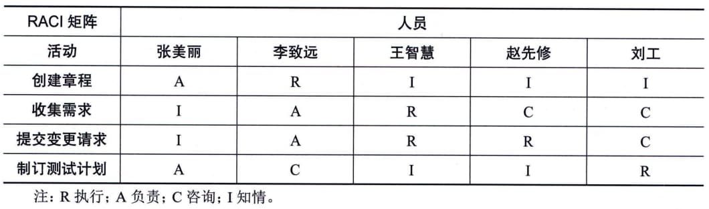

### 11.15.2 主要工具与技术
数据表现有多种格式来记录和阐明团队成员的角色与职责，大多数格式属于层级型、矩阵型或文本型。有些项目人员安排可以在子计划（如风险、质量或沟通管理计划）中列出，无论使用什么方法来记录团队成员的角色，目的都是确保每个工作包都有明确的责任人，确保全体团队成员都清楚地理解其角色和职责。一般来说，层级型可用于表示高层级角色，而文本型则更适合用于记录详细职责。
#### **1．层级型**
可以采用传统的组织结构图，自上而下地显示各种职位及其相互关系。
 - ·工作分解结构（WBS）：WBS用来显示如何把项目可交付成果分解为工作包，有助于明确高层级的职责；

 - ·组织分解结构（OBS）：WBS显示项目可交付成果的分解，而OBS则按照组织现有的部门、单元或团队排列，并在每个部门下列出项目活动或工作包，运营部门只需要找到其所在的OBS位置，就能看到自己的全部项目职责；
 - · 资源分解结构：资源分解结构是按资源类别和类型，对团队和实物资源的层级列表，用于规划、管理和控制项目工作，每向下一个层次都代表对资源的更详细描述，直到信息细到可以与工作分解结构（WBS）相结合，用来规划和监控项目工作。
#### **2．矩阵型**
矩阵型展示项目资源在各个工作包中的任务分配。矩阵型图表的一个例子是职责分配矩阵（RAM），它显示了分配给每个工作包的项目资源，用于说明工作包或活动与项目团队成员之间的关系。在大型项目中，可以制定多个层次的RAM，例如，高层次的RAM可定义项目团队、小组或部门负责WBS中的哪部分工作，而低层次的RAM则可在各小组内为具体活动分配角色、职责和职权。矩阵图能反映与每个人相关的所有活动，以及与每项活动相关的所有人员，它也可确保任何一项任务都只有一个人负责，从而避免职权不清。RAM的一个例子是
RACI
 - （执行、负责、咨询和知情）矩阵，如图11-42所示。图中最左边的一列表示待完成的工作（活动），分配给每项工作的资源可以是个人或小组，项目经理也可根据项目需要，选择"领导"或"资源"等适用词汇来分配项目责任。如果团队由内部和外部人员组成，RACI矩阵对明确划分角色和职责特别有用。

图11-42 RACI矩阵示例
#### **3．文本型**
如果需要详细描述团队成员的职责，就可以采用文本型，文本型文件通常以概述的形式，提供诸如职责、职权、能力和资格等方面的信息，这种文件有多种名称，如职位描述、角色一职责一职权表，该文件可作为未来项目的模板，特别是在根据当前项目的经验教训对其内容进行更新之后。
