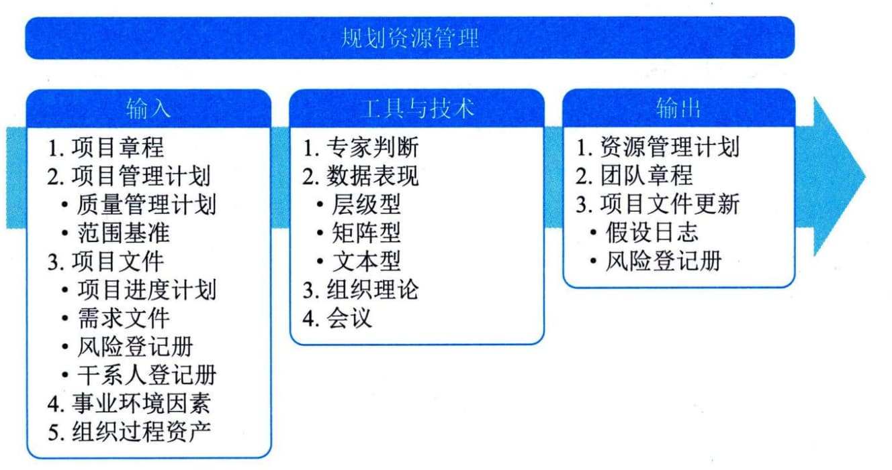

## 11.15 规划资源管理
规划资源管理是定义如何估算、获取、建设、管理和控制实物以及团队资源的过程。本过程的主要作用是根据项目类型和复杂程度确定适用于项目资源的管理方法和管理程度。本过程仅开展一次或仅在项目的预定义点开展。图11-41描述了本过程的输入、工具与技术和输出。

图11-41 规划资源管理过程的输入、工具与技术和输出
资源规划用于识别和确定一种方法，以确保有足够的资源能够成功完成项目。项目资源可能包括团队成员、用品、材料、设备、服务和设施。有效的资源规划还需要考虑稀缺资源的可用性和竞争方面的问题，并编制相应的计划。
这些资源可以从组织内部资产获得，或者通过采购过程从组织外部获取。其他项目可能会在同一时间和地点竞争项目所需的相同资源，从而对项目成本、进度、风险、质量和其他项目领域造成显著影响。规划资源管理过程的主要输入为项目管理计划和项目文件，主要工具与技术为数据表现，主要输出为资源管理计划和团队章程。
