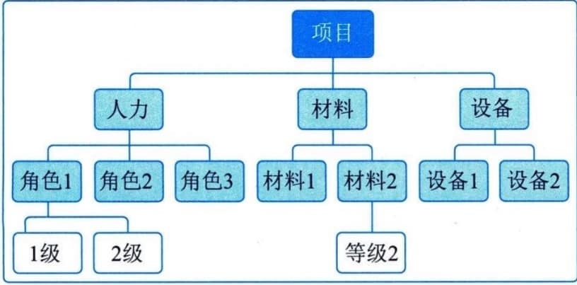

### 11.16.2 主要输出
#### **1．资源需求**
资源需求识别了各个工作包或工作包中每个活动所需的资源类型和数量，可以汇总这些需求，以估算每个工作包、每个WBS分支以及整个项目所需的资源。资源需求描述的细节数量与具体程度因应用领域而异，而资源需求文件也可包含为确定所用资源的类型、可用性和所需数量所做的假设。
#### **2．资源分解结构**
资源分解结构是资源依类别和类型的层级展现，如图11-44所示。资源类别包括（但不限于）人力、材料、设备和用品，资源类型则包括技能水平、要求证书、等级水平或适用于项目的其他类型。在估算活动资源过程中，资源分解结构用于指导项目的分类活动。在这一过程中，资源分解结构是一份完整的文件，用于获取和监督资源。

图11-44 资源分解结构示例
#### **3．估算依据**
资源估算所需的支持信息的数量和种类因应用领域而异。但不论其详细程度如何，支持性文件都应该清晰、完整地说明资源估算是如何得出的。
资源估算的支持信息包括：估算方法；用于估算的资源，如以往类似项目的信息；与估算有关的假设条件；已知的制约因素；估算范围；估算的置信水平；有关影响估算的已识别风险的文件等。
