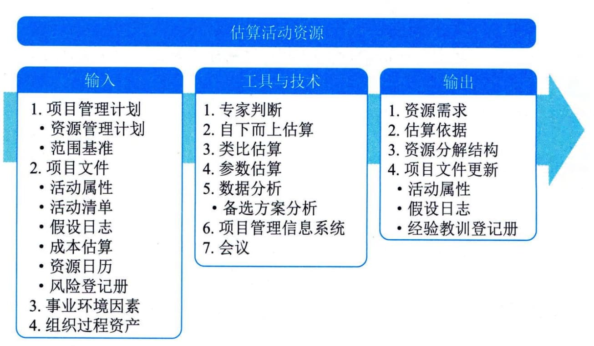

## 11.16 估算活动资源
估算活动资源是估算执行项目所需的团队资源、设施、设备、材料、用品和其他资源的类型和数量的过程。本过程的主要作用是明确完成项目所需的资源种类、数量和特性。本过程应根据需要在整个项目期间定期开展。图11-43描述了本过程的输入、工具与技术和输出。

图11-43 估算活动资源过程的输入、工具与技术和输出
估算活动资源过程与其他过程紧密相关（如估算成本过程）。例如，设计团队需要熟悉最新的系统设计技术，这些必要的知识可以通过聘请顾问、派设计人员参加技术研讨会等方式来获取。
估算活动资源过程的主要输入为项目管理计划和项目文件，主要输出为资源需求、估算依据和资源分解结构。
