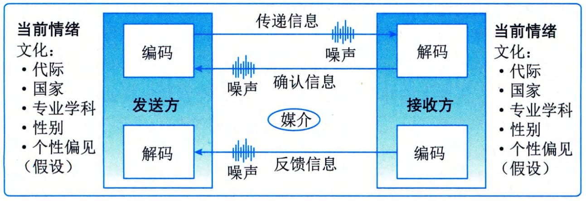

### 11.17.2 主要工具与技术
#### **1．沟通模型**
沟通模型可以是最基本的线性（发送方和接收方）沟通过程，也可以是增加了反馈元素（发送方、接收方和反馈）、更具互动性的沟通形式，甚至可以是融合了发送方或接收方的人性因素、试图考虑沟通复杂性的更加复杂的沟通模型。
作为沟通过程的一部分，发送方负责信息的传递，确保信息的清晰性和完整性，并确认信息已被正确理解；接收方负责确保完整地接收信息，正确地理解信息，并需要告知已收到或做出适当的回应。在发送方和接收方所处的环境中，都可能存在干扰有效沟通的各种噪音和其他障碍。
在跨文化沟通中，确保信息能被正确理解具有一定挑战。沟通风格的差异可能源于工作方法、年龄、国籍、专业学科、民族、种族或性别差异。不同文化的人们会以不同的语言（如技术设计文档、不同的风格）沟通，并喜欢采用不同的沟通过程和礼节。
图11-46所示的沟通模型展示了发送方的当前情绪、知识、背景、个性、文化和偏见会如何影响信息本身及其传递方式。类似地，接收方的当前情绪、知识、背景、个性、文化和偏见也会影响信息的接收和解读方式，导致沟通中的障碍或噪音。
此沟通模型及其强化版有助于制订人对人或小组对小组的沟通策略和计划，但不能用于制订采用其他沟通成果（如电子邮件、广播信息或社交媒体）的沟通策略和计划。

图11-46 适用于跨文化沟通的沟通模型
#### **2．沟通方法**
项目干系人之间用于分享信息的沟通方法主要包括：
 - （1）互动沟通。在两方或多方之间进行的实时多向信息交换。它使用诸如会议、电话、即时信息、社交媒体和视频会议等沟通方式。
 - （2）推式沟通。向需要接收信息的特定接收方发送或发布信息。这种方法可以确保信息的发送，但不能确保信息送达目标受众或被目标受众理解。在推式沟通中，可以用于沟通的有信件、备忘录、报告、电子邮件、传真、语音邮件、博客、新闻稿。
 - （3）拉式沟通。适用于大量复杂信息或大量信息受众的情况。它要求接收方在遵守有关安全规定的前提之下自行访问相关内容。这种方法包括门户网站、组织内网、电子在线课程、经验教训数据库或知识库。可以采用如下不同方法来实现沟通管理计划所规定的主要的沟通需求：
 - · 人际沟通：个人之间交换信息，通常以面对面的方式进行；
 - · 小组沟通：在3～6名人员的小组内部开展；
 - · 公众沟通：单个演讲者面向一群人；
 - ·大众传播：信息发送人员或小组与大量目标受众（有时为匿名）之间只有最低程度的联系；
 - · 网络和社交工具沟通：借助社交工具和媒体，开展多对多的沟通。
可用于沟通的方法或成果主要包括：公告板，新闻通讯、内部杂志、电子杂志，致员工或志愿者的信件，新闻稿，年度报告，电子邮件和内部局域网，门户网站和其他信息库（适用于拉式沟通），电话交流，演示，团队简述或小组会议，焦点小组，干系人之间的正式或非正式的面对面会议，咨询小组或员工论坛，社交工具和媒体等。
