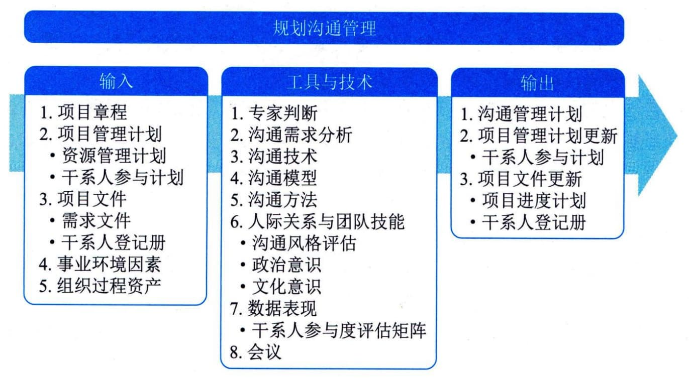

## 11.17 规划沟通管理
规划沟通管理是基于每个干系人或干系人群体的信息需求、可用的组织资产，以及具体项目的需求，为项目沟通活动制订恰当的方法和计划的过程。本过程的主要作用是为及时向干系人提供相关信息、引导干系人有效参与项目而编制书面沟通计划。本过程应根据需要在整个项目期间定期开展。图11-45描述了本过程的输入、工具与技术和输出。

图11-45 规划沟通管理过程的输入、工具与技术和输出
项目经理需在项目生命周期的早期，针对项目干系人多样性的信息需求，制订有效的沟通管理计划。应该在整个项目期间，定期审查本过程的成果并做必要修改，以确保其持续适用。例如，在干系人发生变化或每个新项目阶段开始时。
在大多数项目中，需要及早开展沟通的规划工作，例如在识别干系人及制订项目管理计划期间。虽然所有项目都需要进行信息沟通，但是各项目的信息需求和信息发布方式可能差别很大。此外，在本过程中，需要考虑并合理记录用来存储、检索和最终处置项目信息的方法。
规划沟通管理过程的主要输入为项目管理计划和项目文件，主要工具与技术为沟通模型和沟通方法，主要输出为沟通管理计划。
