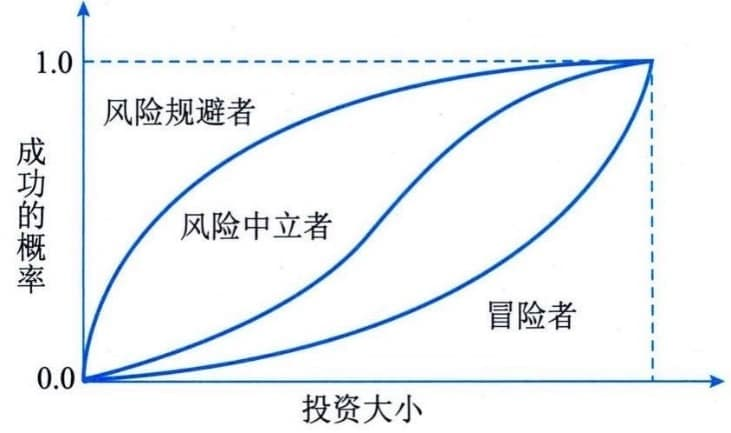

### 11.18.1 风险基本概念
项目是具有不同复杂程度的独特性工作，整个实施过程充满了风险，不仅要面对各种制约因素和假设条件，而且还要面对各干系人相互间可能的冲突和不断变化的期望。组织应有目的地、以可控方式去面对项目风险，平衡项目风险和回报，创造最好的项目价值。
每个项目都在两个层面上存在风险：一是每个项目都有会影响项目达成目标的单个风险；二是由单个风险和不确定性的其他来源联合导致的整体项目风险。项目风险管理过程同时兼顾这两个层面的风险。
项目风险会对项目目标产生负面或正面的影响，也就是威胁与机会。项目风险管理旨在利用或强化正面风险（机会），规避或减轻负面风险（威胁），负面风险可能会引发各种问题，如工期延误、成本超支、绩效不佳或声誉受损等。
#### **1．风险的属性**
风险具有以下几方面属性：
 - （1）风险事件的随机性。风险事件的发生及其后果都具有偶然性，包括风险事件是否发生，何时发生，发生之后会造成什么样的后果等。许多事件的发生都遵循一定的统计规律，这种性质叫随机性。风险事件具有随机性。
 - （2）风险的相对性。风险总是相对项目活动主体而言的。同样的风险对于不同的主体有不同的影响。人们对于风险事件都有一定的承受能力，但是这种能力因活动、人和时间而异。对于项目风险，影响人们的风险承受能力的因素主要包括：
 - ·收益的大小：收益总是伴随着损失的可能性。损失的可能性和数额越大，人们希望为弥补损失而得到的收益也越大。反过来，收益越大，人们愿意承担的风险也就越大。

 - ·投入的大小：项目活动投入得越多，人们对成功所抱的希望也越大，愿意冒的风险也就越小。投入与愿意接受的风险大小之间的关系如图11-48所示。一般人（风险中立者）希望活动获得成功的概率随着投入的增加呈S曲线规律增加。当投入少时，人们可以接受较大的风险，即获得成功的概率不高也能接受；当投入逐渐增加时，人们就开始变得谨慎起来，希望活动获得成功的概率提高了，最好达到百分之百。图11-48还表示了另外两种人（风险规避者和冒险者）对待风险的态度。

 - ·项目活动主体的地位和拥有的资源：级别高的管理人员比级别低的管理人员能够承担的风险相对要大。同一风险，不同的个人或组织的承受能力也不同。个人或组织拥有的资源越多，其风险承受能力也越大。

图11-48 不同的投资者对风险的态度
#### **2．风险的可变性**
辩证唯物主义认为，任何事情和矛盾都可以在一定条件下向自己的反面转化。这里的条件指活动涉及的一切风险因素。当这些条件发生变化时，必然会引起风险的变化。风险的可变性含义包括：风险性质的变化、风险后果的变化、出现新风险。
 - （1）风险性质的变化。例如，10年前熟悉项目进度管理软件的人不多，出了问题，常常使人手足无措。那个时候使用计算机管理进度风险很大。而现在，熟悉的人多了起来，使用计算机管理进度不再是大的风险。
 - （2）风险后果的变化。风险后果包括后果发生的频率、收益或损失的大小。随着科学技术的发展和生产力的提高，人们认识和抵御风险事件的能力也逐渐增强，能够在一定程度上降低风险事件发生的频率并减少损失或损害。在项目管理中，加强项目班子建设，增强责任感，提高管理技能，就能避免一些风险。此外，由于信息传播技术、预测理论、方法和手段的不断完善和发展，某些项目风险现在可以较准确地预测和估计了，因而大大减少了项目的不确定性。
 - （3）出现新风险。随着项目或其他活动的开展，会有新的风险出现。特别是在活动主体为回避某些风险而采取行动时，另外的风险就会出现。例如，为了避免项目进度拖延而增加资源投入时，就有可能造成成本超支。有些建设项目，为了早日完成，采取边设计、边施工或者在设计中免除校核手续的办法。这样做虽然可以加快进度，但是会产生增加设计变更、降低施工质量和提高造价的风险。
#### **3．风险的分类**
为了深入、全面地认识项目风险，并有针对性地进行管理，有必要将风险分类。分类可以从不同的角度、根据不同的标准进行。1）按照风险后果划分
按照后果的不同，风险可划分为纯粹风险和投机风险。
 - ·纯粹风险：不能带来机会、无获得利益可能的风险，叫纯粹风险。纯粹风险只有两种可能的后果：造成损失和不造成损失。纯粹风险造成的损失是绝对的损失。活动主体蒙受了损失，全社会也跟着受损失。例如，某建设项目空气压缩机房在施工过程中失火，蒙受了损失。该损失不但是这个工程的，也是全社会的。没有人从中获得好处。纯粹风险总是和威胁、损失、不幸相联系。

 - ·投机风险：既可能带来机会、获得利益，又隐含威胁、造成损失的风险，叫投机风险。投机风险有3种可能的后果：造成损失、不造成损失和获得利益。投机风险如果使活动主体蒙受了损失，但全社会不一定也跟着受损失。相反，其他人有可能因此而获得利益。例如，私人投资的房地产开发项目如果失败，投资者要蒙受损失。但是发放贷款的银行却可将抵押的土地和房屋收回，等待时机转手高价卖出，不但可收回贷款，而且还有可能获得高额利润。
纯粹风险和投机风险在一定条件下可以相互转化。项目管理人员必须避免投机风险转化为纯粹风险。风险不是零和游戏。在许多情况下，涉及风险的各有关方面都要蒙受损失，无一幸免。
2）按照风险来源划分
按照风险来源或损失产生的原因可将风险划分为自然风险和人为风险。
 - ·自然风险：由于自然力的作用，造成财产损毁或人员伤亡的风险属于自然风险。例如，水利工程施工过程中因发生洪水或地震而造成的工程损害、材料和器材损失。

 - ·人为风险：指由于人的活动而带来的风险。人为风险又可以细分为行为、经济、技术、政策和组织风险等。
3）按照风险是否可管理划分
可管理的风险是指可以预测，并可采取相应措施加以控制的风险。反之，则为不可管理的风险。风险能否管理，取决于风险不确定性是否可以消除，以及活动主体的管理水平。要消除风险的不确定性，就必须掌握有关的数据、资料和其他信息。随着数据、资料和其他信息的增加以及管理水平的提高，有些不可管理的风险可以变为可管理的风险。
4）按照风险影响范围划分
风险按影响范围划分，可以分为局部风险和总体风险。局部风险影响的范围小，而总体风险影响范围大。局部风险和总体风险也是相对的。项目管理团队特别要注意总体风险。例如，项目所有的活动都有拖延的风险，但是处在关键路线上的活动一旦延误，就要推迟整个项目的完成日期，形成总体风险。而非关键路线上活动的延误在许多情况下是局部风险。
5）按照风险后果的承担者划分
项目风险，若按其后果的承担者来划分则有项目业主风险、政府风险、承包商风险、投资方风险、设计单位风险、监理单位风险、供应商风险、担保方风险和保险公司风险等。这样划分有助于合理分配风险，提高项目对风险的承受能力。6）按照风险的可预测性划分
按风险的可预测性划分，风险可以分为已知风险、可预测风险和不可预测风险。
 - ·已知风险：是在认真、严格地分析项目及其计划之后就能够明确的那些经常发生的，而且其后果亦可预见的风险。已知风险发生概率高，但一般后果轻微，不严重。项目管理中已知风险的例子有项目目标不明确，过分乐观的进度计划，设计或施工变更，材料价格波动等。

 - ·可预测风险：是根据经验，可以预见其发生，但不可预见其后果的风险。这类风险的后果有时可能相当严重。项目管理中的例子有业主不能及时审查批准，分包商不能及时交工，施工机械出现故障，不可预见的地质条件等。

 - ·不可预测风险：是有可能发生，但其发生的可能性即使最有经验的人亦不能预见的风险。不可预测风险有时也称为未知风险或未识别的风险。它们是新的、以前未观察到或很晚才显现出来的风险。这些风险一般是外部因素作用的结果。例如，地震、百年不遇的暴雨、通货膨胀、政策变化等。
