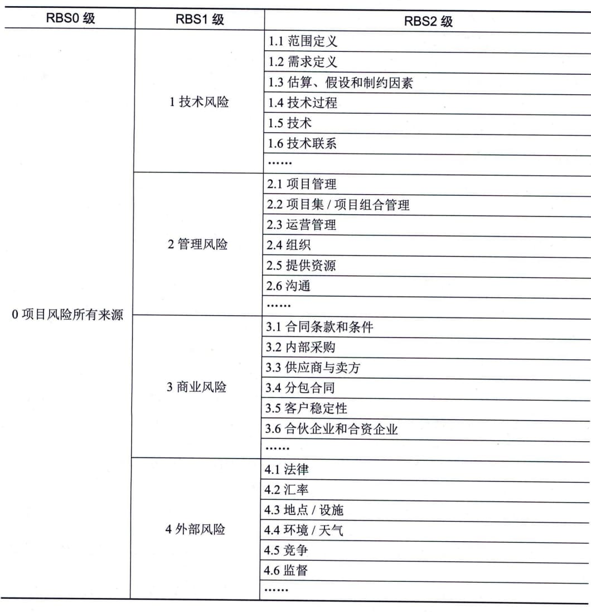
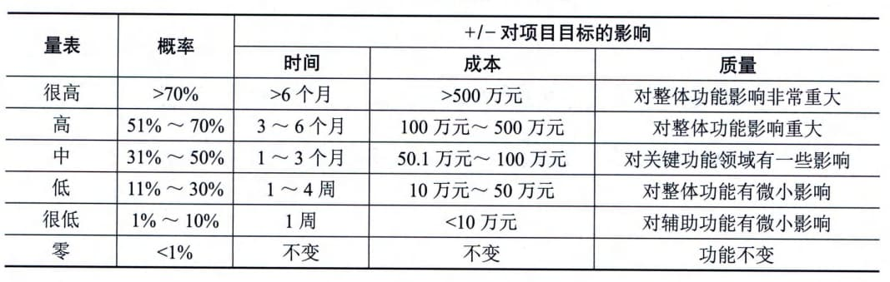
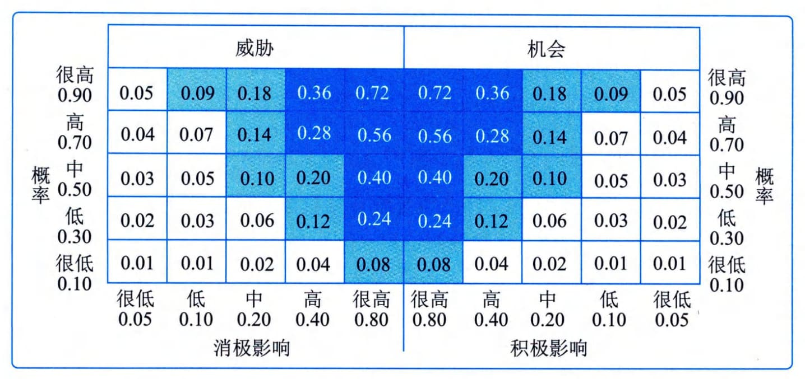

### 11.18.3 主要输出
风险管理计划是项目管理计划的组成部分，描述如何安排与实施风险管理活动。风险管理计划的内容主要包括：风险管理策略、方法论、角色与职责、资金、时间安排、风险类别、干系人风险偏好、风险概率和影响、概率和影响矩阵、报告格式、跟踪等。
 - （1）风险管理策略。风险管理策略描述了用于管理本项目风险的一般方法。
 - （2）方法论。方法论指确定用于开展本项目风险管理的具体方法、工具及数据来源。
 - （3）角色与职责。角色与职责指确定每项风险管理活动的领导者、支持者和团队成员，并明确职责。
 - （4）资金。资金指确定开展项目风险管理活动所需的资金，并制定应急储备和管理储备的使用方案。
 - （5）时间安排。时间安排指确定在项目生命周期中实施项目风险管理过程的时间和频率，确定风险管理活动并将其纳入项目进度计划。
 - （6）风险类别。风险类别指确定对项目风险进行分类的方式。通常借助风险分解结构（RBS）来构建风险类别。风险分解结构是潜在风险来源的层级展现，如表11-2所示。风险分解结构有助于项目团队考虑单个项目风险的全部可能来源，对识别风险或归类已识别风险特别有用。组织可能有适用于所有项目的通用风险分解结构，也可能针对不同类型项目使用几种不同的风险分解结构框架，或者允许项目量身定制专用的风险分解结构。如果未使用风险分解结构，组织则可能采用某种常见的风险分类框架，既可以是简单的类别清单，也可以是基于项目目标的某种类别结构。
**表11-2
风险分解结构（RBS）示例**
 - （7）干系人风险偏好。应在风险管理计划中记录项目关键干系人的风险偏好。他们的风险偏好会影响规划风险管理过程的细节。特别是，应该针对每个项目目标，把干系人的风险偏好表述成可测量的风险临界值。这些临界值不仅将联合决定可接受的整体项目风险忍受水平，而且也用于制定概率和影响定义。以后将根据概率和影响定义，对单个项目风险进行评估和排序。
 - （8）风险概率和影响。根据具体的项目环境，组织和关键干系人的风险偏好和临界值，来制定风险概率和影响。项目可能自行制定关于概率和影响级别的具体定义，或者用组织提供的通用定义作为基础来制定。应根据拟开展项目风险管理过程的详细程度，来确定概率和影响级别的数量，更多级别（通常为5级）对应于更详细的风险管理方法，更少级别（通常为3级）对应于更简单的方法。表11-3针对3个项目目标提供了概率和影响定义的示例。
**表11-3
概率和影响定义示例**
通过将影响定义为负面威胁（工期延误、成本增加和绩效不佳）和正面机会（工期缩短、成本节约和绩效改善），上表所示的量表可同时用于评估威胁和机会。
 - （9）概率和影响矩阵。组织可在项目开始前确定优先级排序规则，并将其纳入组织过程资产，或者也可为具体项目量身定制优先级排序规则。在常见的概率和影响矩阵中，会同时列出机会和威胁，以正面影响定义机会，以负面影响定义威胁。概率和影响可以用描述性术语（如很高、高、中、低和很低）或数值来表达。如果使用数值，就可以把两个数值相乘，得出每个风险的概率-影响分值，以便据此在每个优先级组别之内排列单个风险的相对优先级。图11-49是概率和影响矩阵的示例，其中也有数值风险评分的方法。

图**11-49**概率和影响矩阵示例（有数值风险评分方法）
 - （10）报告格式。确定将如何记录、分析和沟通项目风险管理过程的结果。在这一部分，描述风险登记册、风险报告以及项目风险管理过程的其他输出的内容和格式。
 - （11）跟踪。确定将如何记录风险活动，以及如何审计风险的管理过程。
