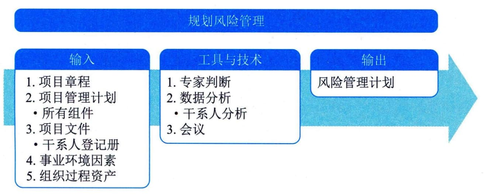

## 11.18 规划风险管理
规划风险管理是定义如何实施项目风险管理活动的过程。本过程的主要作用是确保风险管理的水平、方法和可见度与项目风险程度，以及项目对组织和其他干系人的重要程度相匹配。本过程仅开展一次或仅在项目的预定义点开展。图11-47描述了本过程的输入、工具与技术和输出。

图11-47 规划风险管理过程的输入、工具与技术和输出
规划风险管理过程的主要输入为项目管理计划和项目文件，主要输出为风险管理计划。
