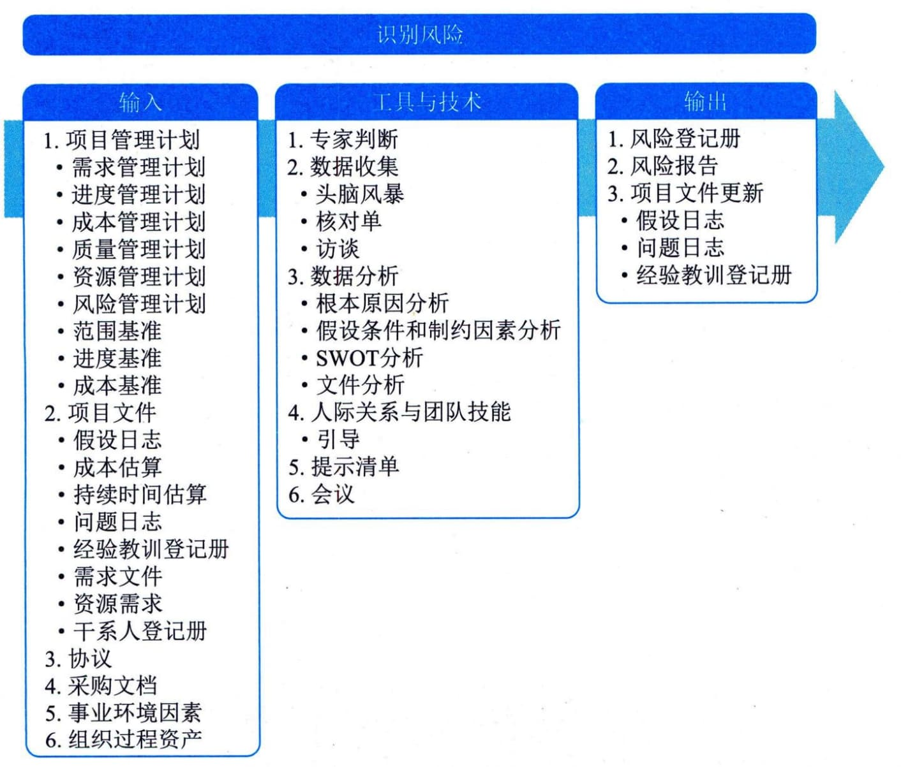

## 11.19 识别风险
识别风险是识别单个项目风险及整体项目风险的来源，并记录风险特征的过程。本过程的主要作用是记录现有的单个项目风险及整体项目风险的来源。本过程还汇集相关信息，以便项目团队能够恰当应对已识别风险。本过程需要在整个项目期间开展。图11-50描述了本过程的输入、工具与技术和输出。

图11-50 识别风险过程的输入、工具与技术和输出
在识别风险时，要同时考虑单个项目风险及整体项目风险的来源。风险识别活动的参与者可能包括项目经理、项目团队成员、项目风险专家（若已指定）、客户、项目团队外部的主题专家、最终用户、其他项目经理、运营经理、干系人和组织内的风险管理专家。虽然这些人员通常是风险识别活动的关键参与者，但是还应鼓励所有项目干系人参与项目风险的识别工作。项目团队的参与尤其重要，以便培养和保持他们对已识别的单个项目风险、整体项目风险级别和相关风险应对措施的主人翁意识和责任感。应采用统一的风险描述格式来描述和记录项目风险，以确保每一项风险都被清楚、明确地理解，从而为有效地分析和风险应对措施的制定提供支持。在整个项目生命周期中，单个项目风险可能随项目进展而不断变化，整体项目风险的级别也会发生变化。因此，识别风险是一个迭代的过程。迭代的频率和每次迭代所需的参与程度因情况而异，应在风险管理计划中做出相应规定。
识别风险过程的主要输入为项目管理计划和项目文件，主要工具与技术为数据收集和数据分析，主要输出为风险登记册和风险报告。
