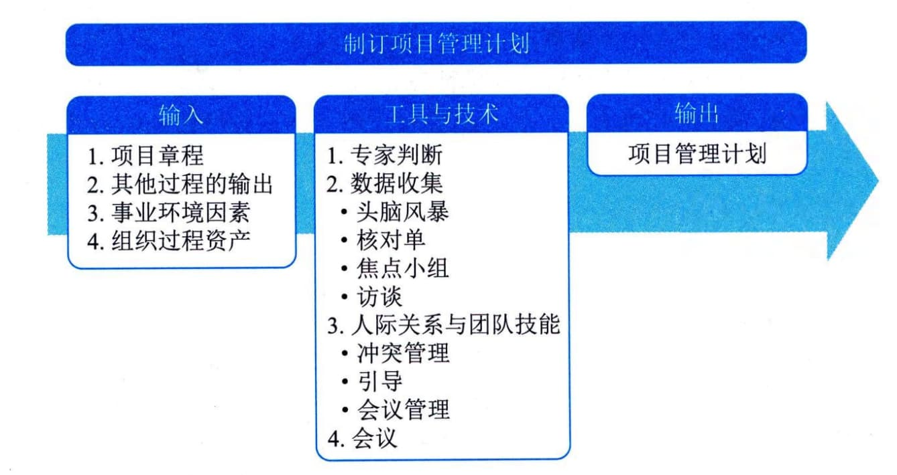

## 11.1 制订项目管理计划
制订项目管理计划是定义、准备和协调项目计划的所有组成部分，并把它们整合为一份综合项目管理计划的过程。本过程的主要作用是生成一份综合文件，用于确定所有项目工作的基础及其执行方式。本过程仅开展一次或仅在项目的预定义点开展。图11-2描述了本过程的输入、工具与技术和输出。

图11-2 制订项目管理计划过程的输入、工具与技术和输出
项目管理计划确定项目的执行、监控和收尾方式，其内容会根据项目所在的应用领域和复杂程度的不同而不同。项目管理计划可以是概括的或详细的，每个组成部分的详细程度取决于具体项目的要求。项目管理计划应基准化，即至少应规定项目的范围、时间和成本方面的基准，以便据此考核项目执行情况和管理项目绩效。在确定基准之前，可能要对项目管理计划进行多次更新，且这些更新无须遵循正式的流程。但是，一旦确定了基准，就只能通过提出变更请求、实施整体变更控制过程进行更新。在项目收尾之前，项目管理计划需要通过不断更新来渐进明细，并且这些更新需要得到控制和批准。
制订项目管理计划过程的主要输入为项目章程、其他过程的输出、事业环境因素和组织过程资产，主要输出为项目管理计划。
