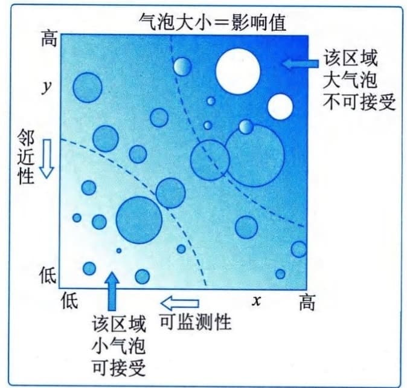

### 11.20.2 主要工具与技术
#### **1．数据分析**
适用于实施定性风险分析过程的数据分析技术主要包括以下几种。
 - （1）风险数据质量评估。风险数据是开展定性风险分析的基础。风险数据质量评估旨在评价关于单个项目风险的数据的准确性和可靠性。使用低质量的风险数据，可能导致定性风险分析对项目来说基本没用。如果数据质量不可接受，就可能需要收集更好的数据。可以开展问卷调查，了解项目干系人对数据质量各方面的评价，包括数据的完整性、客观性、相关性和及时性，进而对风险数据的质量进行综合评估。可以计算这些方面的加权平均数，将其作为数据质量的总体分数。
 - （2）风险概率和影响评估。风险概率评估考虑的是特定风险发生的可能性，而风险影响评估考虑的是风险对一项或多项项目目标的潜在影响，如进度、成本、质量或绩效。威胁将产生负面的影响，机会将产生正面的影响。要对每个已识别的单个项目风险进行概率和影响评估。风险评估可以采用访谈或会议的形式，参加者将依照他们对风险登记册中所记录的风险类型的熟悉程度而定。项目团队成员和项目外部资深人员应该参加访谈或会议。在访谈或会议期间，评估每个风险的概率水平及其对每项目标的影响级别。如果干系人对概率水平和影响级别的感知存在差异，则应对差异进行探讨。此外，还应记录相应的说明性细节，例如，确定概率水平或影响级别所依据的假设条件。应该采用风险管理计划中的概率和影响定义，来评估风险的概率和影响。低概率和影响的风险将被列入风险登记册中的观察清单，以供未来监控。
 - （3）其他风险参数评估。为了方便未来分析和行动，在对单个项目风险进行优先级排序时，项目团队还可能考虑（除概率和影响以外的）的其他风险特征包括如下几方面。
 - · 紧迫性：为有效应对风险而必须采取应对措施的时间段。时间短就说明紧迫性高。
 - · 邻近性：风险在多长时间后会影响一项或多项项目目标。时间短就说明邻近性高。
 - · 潜伏期：从风险发生到影响显现之间可能的时间段。时间短就说明潜伏期短。
 - ·可管理性：风险责任人（或责任组织）管理风险发生或影响的容易程度。如果容易管理，可管理性就高。

 - ·可控性：风险责任人（或责任组织）能够控制风险后果的程度。如果后果很容易控制，可控性就高。

 - ·可监测性：对风险发生或即将发生进行监测的容易程度。如果风险发生很容易监测，可监测性就高。

 - ·连通性：风险与其他单个项目风险存在关联的程度大小。如果风险与多个其他风险存在关联，连通性就高。

 - ·战略影响力：风险对组织战略目标潜在的正面或负面影响。如果风险对战略目标有重大影响，战略影响力就大。

 - ·密切度：风险被一名或多名干系人认为要紧的程度。被认为很要紧的风险，密切度就高。
考虑上述某些特征有助于进行更稳健的风险优先级排序。
#### **2．风险分类**
项目风险可依据风险来源、受影响的项目领域，以及其他实用类别（如项目阶段、项目预算、角色和职责）来分类，确定哪些项目领域最容易被不确定性影响；风险还可以根据共同根本原因进行分类。应该在风险管理计划中规定可用于项目的风险分类方法。
对风险进行分类，有助于把注意力和精力集中到风险最可能发生的领域，或针对一组相关的风险制定通用的风险应对措施，从而有利于更有效地开展风险应对。
#### **3．数据表现**
适用于实施定性风险分析过程的数据表现技术主要包括概率和影响矩阵、层级图等。
 - （1）概率和影响矩阵。概率和影响矩阵是把每个风险发生的概率和一旦发生对项目目标的影响映射起来的表格。此矩阵将概率和影响进行组合，以便于把单个项目风险划分到不同的优先级组别。基于风险的概率和影响，对风险进行优先级排序，以便未来进一步分析并制定应对措施。采用风险管理计划中规定的风险概率和影响定义，逐一对单个项目风险的发生概率及其对一项或多项项目目标的影响（若发生）进行评估。然后，基于所得到的概率和影响的组合，使用概率和影响矩阵，来为单个项目风险分配优先级别。组织可针对每个项目目标（如成本、时间和范围）制定单独的概率和影响矩阵，并用它们来评估风险针对每个目标的优先级别。组织也可以用不同的方法为每个风险确定一个总体优先级别。既可综合针对不同目标的评估结果，也可采用最高优先级别（无论针对哪个目标）作为风险的总体优先级别。
 - （2）层级图。如果使用了两个以上的参数对风险进行分类，那就不能使用概率和影响矩阵，而需要使用其他图形。例如，气泡图能显示三维数据。在气泡图中，把每个风险都绘制成一个气泡，并用x轴值、y轴值和气泡大小来表示风险的3个参数。气泡图的示例如图11-52所示，其中，x轴代表可监测性，y轴代表邻近性，影响值则以气泡大小表示。

图11-52 列出可监测性、邻近性和影响值的气泡图示例
