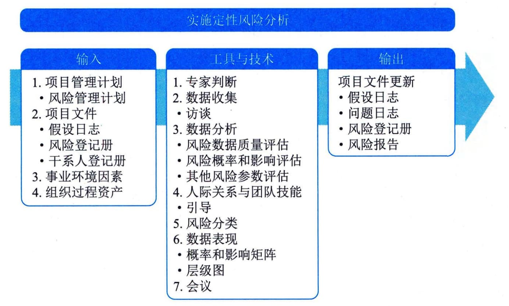

## 11.20 实施定性风险分析
实施定性风险分析是通过评估单个项目风险发生的概率和影响以及其他特征，对风险进行优先级排序，从而为后续分析或行动提供基础的过程。本过程的主要作用是重点关注高优先级的风险。本过程需要在整个项目期间开展。图11-51描述了本过程的输入、工具与技术和输出。

图11-51 实施定性风险分析过程的输入、工具与技术和输出
实施定性风险分析，使用项目风险的发生概率、风险发生时对项目目标的相应影响以及其他因素，来评估已识别的单个项目风险的优先级。这种评估基于项目团队和其他干系人对风险的感知程度，因此具有主观性。所以，为了实现有效评估，就需要认清和管理本过程的关键参与者对风险所持的态度。风险主观意识会导致评估已识别风险时出现偏见，所以应该注意找出偏见并加以纠正。如果由引导者来引导本过程的开展，那么找出并纠正偏见就是该引导者的一项重要工作。同时，评估单个项目风险的现有信息的质量，也有助于澄清每个风险对项目的重要性的评估。
实施定性风险分析能为规划风险应对过程确定单个项目风险的相对优先级。本过程会为每个风险识别出责任人，以便由他们负责规划风险应对措施，并确保应对措施的实施。如果需要开展实施定量风险分析过程，那么实施定性风险分析也能为其奠定基础。根据风险管理计划的规定，在整个项目生命周期中要定期开展实施定性风险分析过程。在敏捷或适应型开发环境中，实施定性风险分析过程通常要在每次迭代开始前进行。
实施定性风险分析过程的主要输入为项目管理计划和项目文件，主要工具与技术包括数据分析、风险分类和数据表现，主要输出为更新后的风险登记册和风险报告。
