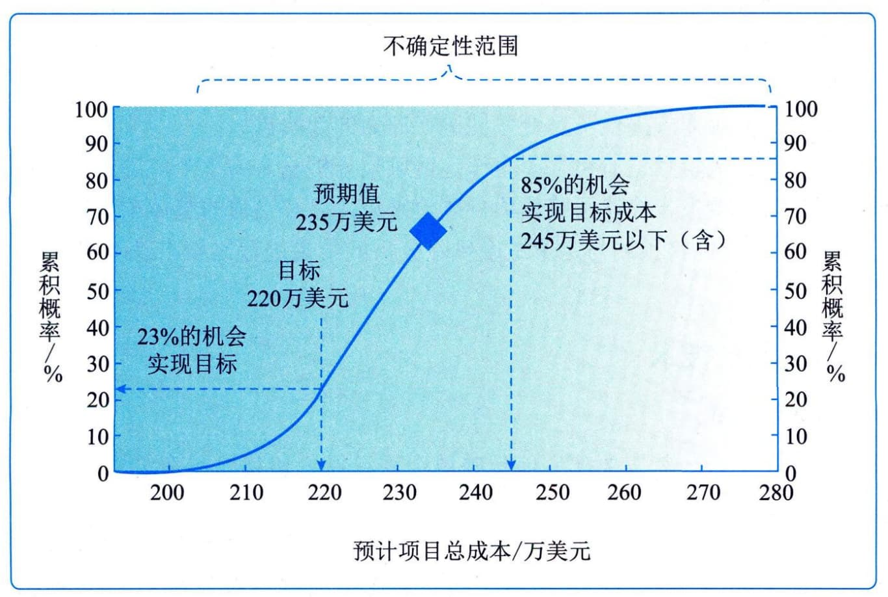
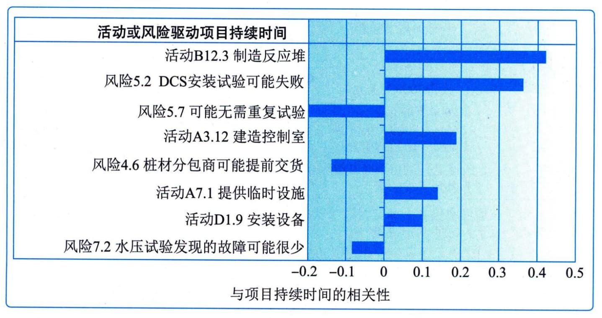
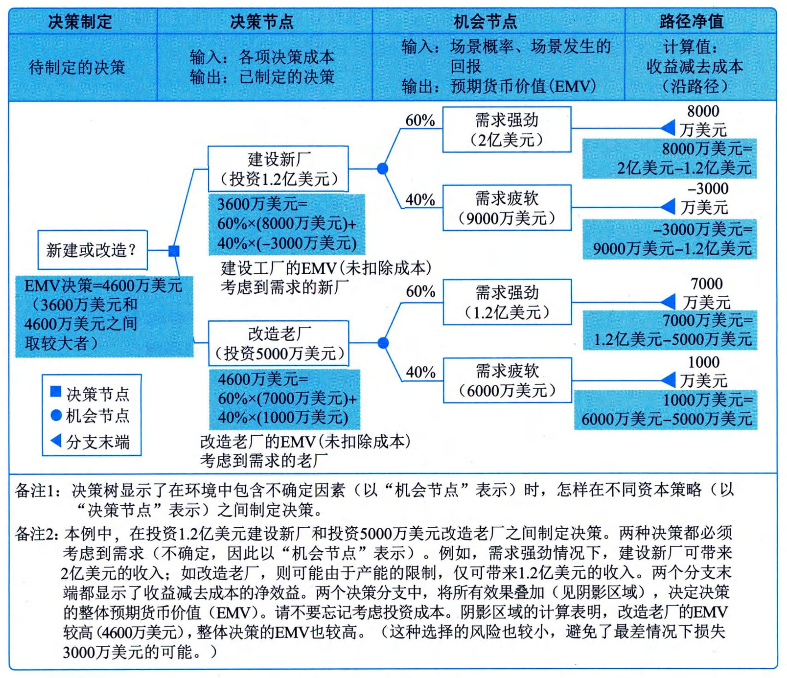

### 11.21.2 主要工具与技术
#### **1．不确定性表现方式**
要开展定量风险分析，就需要建立能反映单个项目风险和其他不确定性来源的定量风险分析模型，并为之提供输入。
如果活动的持续时间、成本或资源需求是不确定的，就可以在模型中用概率分布来表示其数值的可能区间。概率分布可能有多种形式，最常用的有三角分布、正态分布、对数正态分布、贝塔分布、均匀分布或离散分布。应该谨慎选择用于表示活动数值的可能区间的概率分布形式。
单个项目风险可以用概率分布图表示，也可以作为概率分支包括在定量分析模型中，在概率分支上添加风险发生的时间和（或）成本影响。如果风险的发生与任何计划活动都没有关系，就最适合将其作为概率分支。如果风险之间存在相关性，例如有某个共同原因或逻辑依赖关系，那么应该在模型中考虑这种相关性。其他不确定性来源也可用概率分支来表示，以描述贯穿项目的其他路径。
#### **2．数据分析**
适用于实施定量风险分析过程的数据分析技术主要包括模拟、敏感性分析、决策树分析、影响图等。
1）模拟
在定量风险分析中，使用模型来模拟单个项目风险和其他不确定性来源的综合影响，以评估它们对项目目标的潜在影响。模拟通常采用蒙特卡洛分析。
对成本风险进行蒙特卡洛分析时，使用项目成本估算作为模拟的输入；对进度风险进行蒙特卡洛分析时，使用进度网络图和持续时间估算作为模拟的输入。开展定量成本和进度综合风险分析时，同时使用这两种输入，其输出就是定量风险分析模型。
用计算机软件数千次迭代运行定量风险分析模型。每次运行，都要随机选择输入值（如成本估算、持续时间估算或概率分支发生频率）。这些运行的输出构成了项目可能结果（如项目结束日期、项目完工成本）的区间。典型的输出包括表示模拟得到特定结果的次数的直方图，或表示获得等于或小于特定数值的结果的累积概率分布曲线（S曲线）。蒙特卡洛成本风险分析所得到的S曲线示例如图11-54所示。

图11-54 蒙特卡洛成本风险分析所得到的S曲线示例
在定量进度风险分析中，还可以执行关键性分析，以确定风险模型的哪些活动对项目关键路径的影响最大。对风险模型中的每一项活动计算关键性指标，即在全部模拟中，该活动出现在关键路径上的频率，通常以百分比表示。通过关键性分析，项目团队就能够重点针对那些对项目整体进度绩效存在最大潜在影响的活动，进行规划风险应对措施。
#### **2）敏感性分析**
敏感性分析有助于确定哪些单个项目风险或不确定性来源对项目结果具有最大的潜在影响。它在项目结果变化与定量风险分析模型中的要素变化之间建立联系。敏感性分析的结果通常用龙卷风图来表示，图中标出定量风险分析模型中的每项要素与其能影响的项目结果之间的关联系数，这些要素可包括单个项目风险、易变的项目活动，或具体的不明确性来源。每个要素按关联强度降序排列，形成典型的龙卷风形状，如图11-55所示。

图11-55 龙卷风图示例
#### **3）决策树分析**
用决策树在若干备选行动方案中选择一个最佳方案。在决策树中，用不同的分支代表不同的决策或事件，即项目的备选路径。每个决策或事件都有相关的成本和单个项目风险（包括威胁和机会）。决策树分支的终点表示沿特定路径发展的最后结果，可以是负面或正面的结果。在决策树分析中，通过计算每条分支的预期货币价值，就可以选出最优的路径。决策树示例如图11-56所示。
4）影响图
影响图是在不确定条件下进行决策的图形辅助工具。它将一个项目或项目中的一种情境表现为一系列实体、结果和影响，以及它们之间的关系和相互影响。如果因为存在单个项目风险或不确定性来源而影响图中的某些要素的不确定性，就在影响图中以区间或概率分布的形式表示这些要素；然后，借助模拟技术（如蒙特卡洛分析）来分析哪些要素对重要结果具有最大的影响。影响图分析可以得出类似于其他定量风险分析的结果，如S曲线图和龙卷风图。

11-56 决策树示例
