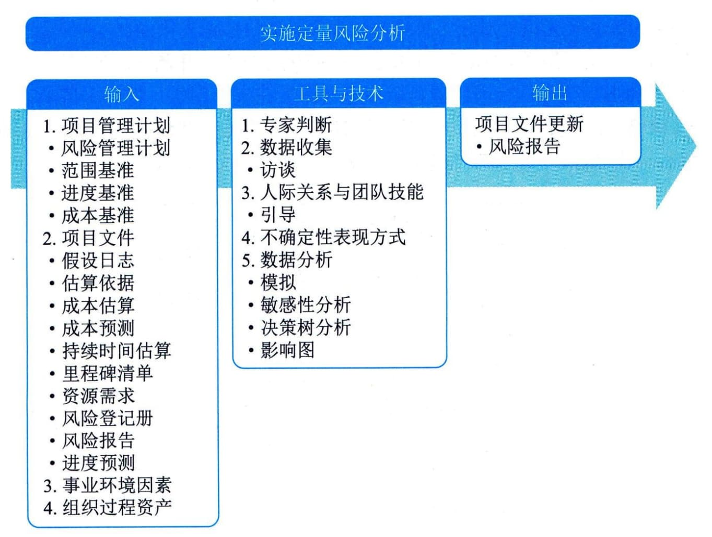

## 11.21 实施定量风险分析
实施定量风险分析是就已识别的单个项目风险和不确定性的其他来源对整体项目目标的影响进行定量分析的过程。本过程的主要作用是量化整体项目风险，并提供额外的定量风险信息，以支持风险应对规划。本过程需要在整个项目期间开展。图11-53描述了本过程的输入、工具与技术和输出。

图11-53 实施定量风险分析过程的输入、工具与技术和输出
并非所有项目都需要实施定量风险分析。项目风险管理计划会规定是否需要使用定量风险分析，定量分析适用于大型或复杂的项目、具有战略重要性的项目、合同要求进行定量分析的项目，或主要干系人要求进行定量分析的项目。能否开展稳健的定量分析取决于是否有关于单个项目风险和其他不确定性来源的高质量数据，以及与范围、进度和成本相关的扎实的项目基线。定量风险分析通常需要运用专门的风险分析软件，以及编制和解释风险模式的专业知识，还需要额外的时间和成本投入。
在实施定量风险分析过程中，要使用被定性风险分析过程评估为对项目目标存在重大潜在影响的单个项目风险的信息。实施定量风险分析过程的输出，则要用作规划风险应对过程的输入，特别是要据此为整体项目风险和关键单个项目风险推荐应对措施。定量风险分析也可以在规划风险应对过程之后开展，以分析已规划的应对措施对降低整体项目风险最大可能的有效性。
实施定量风险分析过程的主要输入为项目管理计划和项目文件，主要工具与技术包括不确定性表现方式和数据分析，主要输出为更新后的风险报告。
