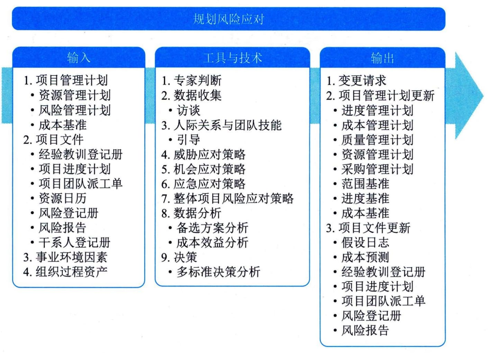

## 11.22 规划风险应对
规划风险应对是为处理整体项目风险敞口，以及应对单个项目风险而制定可选方案、选择应对策略并商定应对行动的过程。本过程的主要作用是制定应对整体项目风险和单个项目风险的适当方法。本过程还将分配资源，并根据需要将相关活动添加进项目文件和项目管理计划。本过程需要在整个项目期间开展。图11-57描述了本过程的输入、工具与技术和输出。

图11-57 规划风险应对过程的输入、工具与技术和输出
针对项目团队认为足够重要的每项单个的项目风险，这些风险会对项目目标的实现造成威胁或提供机会。有效和适当的风险应对可以最小化威胁、最大化机会，并降低整体项目风险发生的可能性；不恰当的风险应对则会适得其反。项目经理也应该思考如何针对整体项目风险的当前级别做出适当的应对。
风险应对方案应该与风险的重要性相匹配，并且能够经济、有效地应对挑战，同时在当前项目背景下现实可行，获得全体干系人的同意，并由一名责任人具体负责。在项目过程中，往往需要从几套可选方案中选出最优的风险应对方案，为每个风险选择最可能有效的策略或策略组合。可用结构化的决策技术来选择最适当的应对策略。对于大型或复杂项目，可能需要以数学优化模型或实际方案分析为基础，进行备选风险应对策略经济分析。
要为实施商定的风险应对策略制定具体的应对行动。如果选定的策略并不完全有效，或者发生了已接受的风险，就需要制订应急计划。同时，也需要识别次生风险。次生风险是实施风险应对措施而直接导致的风险。
规划风险应对过程的主要输入为项目管理计划和项目文件，主要工具与技术包括威胁应对策略、机会应对策略、整体项目风险应对策略，主要输出为更新后的风险登记册和风险报告。
