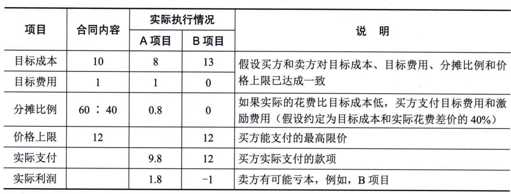
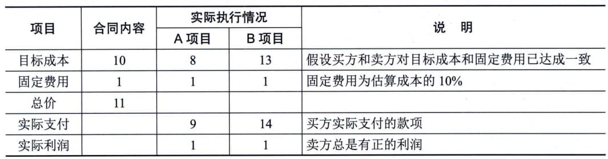

### 11.23.3 合同类型
以项目范围为标准进行划分，可以将合同分为项目总承包合同、项目单项承包合同和项目分包合同3类。以项目付款方式为标准进行划分，通常可将合同分为两大类，即总价合同和成本补偿合同。另外，常用的合同类型还有混合型的工料合同。
#### **1．项目总承包合同**
买方将项目的全过程作为一个整体发包给同一个卖方的合同。需要特别注意的是，总承包合同要求只与同一个卖方订立承包合同，但并不意味着只订立一个总合同。可以采用订立一个总合同的形式，也可以采用订立若干合同的形式。例如，在一个典型的IT项目中，买方与同一个卖方分别就项目的咨询论证、方案设计、硬件建设、软件开发、实施及运行维护等订立不同的合同。采用总承包合同的方式一般适用于经验丰富、技术实力雄厚且组织管理协调能力强的卖方，这样有利于发挥卖方的专业优势，保证项目的质量和进度，提高投资效益。采用这种方式，买方只需要与一个卖方沟通，容易管理与协调。
#### **2．项目单项承包合同**
一个卖方只承包项目中的某一项或某几项内容，买方分别与不同的卖方订立项目单项承包合同。采用项目单项承包合同的方式有利于吸引更多的卖方参与投标竞争，使买方可以选择在某一单项上实力强的卖方。同时也有利于卖方专注于自身经验丰富且技术实力雄厚的部分的建设。但这种方式对于买方的组织管理协调能力提出了较高的要求。
#### **3．项目分包合同**
经合同约定和买方认可，卖方将其承包项目的某一部分或某几部分（非项目的主体结构）再发包给具有相应资质条件的分包方，与分包方订立的合同称为项目分包合同。需要说明的是，订立项目分包合同必须同时满足以下5个条件：
 - · 经过买方认可；
 - · 分包的部分必须是项目非主体工作；
 - · 只能分包部分项目，而不能转包整个项目；
 - · 分包方必须具备相应的资质条件；
 - · 分包方不能再次分包。
分包合同涉及两种合同关系，即买方与卖方的承包合同关系，以及卖方与分包方的分包合同关系。卖方在原承包合同范围内向买方负责，而分包方与卖方在分包合同范围内向买方承担连带责任。如果分包的项目出现问题，买方既可以要求卖方承担责任，也可以直接要求分包方承担责任。
#### **4．总价合同**
总价合同（Fixed Price
Contract）为既定产品或服务的采购设定一个总价。总价合同也可以为达到或超过项目目标（例如，进度交付日期、成本和技术绩效，或其他可量化、可测量的目标）而规定财务奖励条款。卖方必须依法履行总价合同，否则，就要承担相应的违约赔偿责任。采用总价合同，买方必须准确定义要采购的产品或服务。虽然允许范围变更，但范围变更通常会导致合同价格提高。从付款的类型上来划分，总价合同又可以分为以下几种。
1）固定总价合同
固定总价（Firm Fixed
Price，FFP）合同是最常用的合同类型。大多数买方都喜欢这种合同，因为采购的价格在一开始就被确定，并且不允许改变（除非工作范围发生变更）。因合同履行不好而导致的任何成本增加都由卖方承担。
2）总价加激励费用合同
总价加激励费用（Fixed Price Incentive
Fee，FPIF）合同为买方和卖方都提供了一定的灵活性，它允许有一定的绩效偏差，并对实现既定目标给予财务奖励。奖励的计算方法可以有多种，但都与卖方的成本、进度或技术绩效有关。例如，规定目标工期以及提前完工的奖金。绩效目标一开始就要制定好，而最终的合同价格要待全部工作结束后根据卖方绩效加以确定。在FPIF
合同中，要设置一个价格上限（最高限价、天花板价格），卖方必须完成工作，并且要承担高于上限的全部成本，也就是说，买方付款的总数不得超过最高限价。例如，表11-4是一个总价加激励费用合同的示例。
**表11-4
总价加激励费用合同示例（金额单位：万元）**
3）总价加经济价格调整合同
如果卖方履约要跨越相当长的周期（数年），就应该使用总价加经济价格调整（Fixed
Price with Economic Price
Adjustment，FPEPA）合同。如果买方和卖方之间要维持多种长期关系，也可以采用这种合同类型。它是一种特殊的总价合同，允许根据条件变化（例如，通货膨胀、某些特殊商品的成本增加或降低等），以事先确定的方式对合同价格进行最终调整。FPEPA合同可以保护买方和卖方免受外界不可控情况的影响，FPEPA合同条款必须规定用于准确调整最终价格的、可靠的财务指数。
#### **4）订购单**
在实际工作中，还有另外一种形式的总价合同，就是订购单。当非大量采购标准化产品时，通常可以由买方直接填写卖方提供的订购单，卖方照此供货。由于订购单通常不需要谈判，所以又称为单边合同。
#### **5．成本补偿合同**
成本补偿合同（Cost-Reimbursable
Contract）向卖方支付为完成工作而发生的全部合法实际成本（可报销成本），外加一笔费用作为卖方的利润。成本补偿合同也可为卖方超过或低于预定目标而规定财务奖励条款。
成本补偿合同以卖方从事项目工作的实际成本作为付款的基础，即成本实报实销。在这种合同下，买方的成本风险最大。这种合同适用于买方仅知道要一个什么产品，但不知道具体工作范围的情况，也就是工作范围很不清楚的项目。当然，成本补偿合同也适用于买方特别信得过的卖方，想要与卖方全面合作的情况。
1）成本加固定费用合同
成本加固定费用（Cost Plus Fixed
Fee，CPFF）合同为卖方报销履行合同工作所发生的一切合法成本（即成本实报实销），并向卖方支付一笔固定费用作为利润，该费用以项目初始估算成本（目标成本）的某一百分比计算。费用只能针对已完成的工作来支付，并且不因卖方的绩效而变化。除非项目范围发生变更，费用金额维持不变。这是最常用的成本补偿合同，对卖方有一定的制约作用。表11-5是一个成本加固定费用合同的示例。
**表11-5 成本加固定费用合同示例（金额单位：万元）**
  --------------------------------------------------------------------------------------------
  项目       合同内容   实际执行情况            说明
  ---------- ---------- -------------- -------- ----------------------------------------------
                        A项目          B项目    
  目标成本   10         8              13       假设买方和卖方对目标成本和固定费用已达成一致
  固定费用   1          1              1        固定费用为估算成本的10％
  总价       11                                 
  实际支付              9              14       买方实际支付的款项
  实际利润              1              1        卖方总是有正的利润
  --------------------------------------------------------------------------------------------
2）成本加激励费用合同
成本加激励费用（Cost Plus Incentive
Fee，CPIF）合同为卖方报销履行合同工作所发生的一切合法成本（即成本实报实销），并在卖方达到合同规定的绩效目标时，向卖方支付预先确定的激励费用。
在CPIF合同下，如果卖方的实际成本低于目标成本，节余部分由双方按一定比例分成（例如，基于卖方的实际成本，按照80／20的比例分成，即买方80％，卖方20％）；如果卖方的实际成本高于目标成本，超过目标成本的部分由双方按比例分担（例如，基于卖方的实际成本，按照20／80的比例分担，即买方20％，卖方80％）。
在CPIF合同下，如果实际成本大于目标成本，卖方可以得到的付款总数为"目标成本＋目标费用＋买方应负担的成本超支"；如果实际成本小于目标成本，则卖方可以得到的付款总数为"目标成本＋目标费用-买方应享受的成本节约"。表11-6是一个成本加激励费用合同的示例。
**表11-6
成本加激励费用合同示例（金额单位：万元）**
3）成本加奖励费用合同
成本加奖励费用（Cost Plus Award
Fee，CPAF）合同为卖方报销履行合同工作所发生的一切合法成本（即成本实报实销），买方再凭自己的主观感觉给卖方支付一笔利润，完全由买方根据自己对卖方绩效的主观判断来决定奖励费用，并且卖方通常无权申诉。
#### **6．工料合同**
工料合同（Time and
Material，T＆M）是指按项目工作所花费的实际工时数和材料数，按事先确定的单位工时费用标准和单位材料费用标准进行付款。这类合同适用于工作性质清楚，工作范围比较明确，但具体的工作量无法确定的项目。在这种合同下，买方承担中等程度的成本风险，即承担工作量变动的风险；而卖方则承担单价风险。因此，工料合同在金额小、工期短、不复杂的项目上可以有效使用，但在金额大、工期长的复杂项目上不适用。
工料合同是兼具成本补偿合同和总价合同的某些特点的混合型合同。在不能很快编写出准确工作说明书的情况下，经常使用工料合同来增加人员、聘请专家以及寻求其他外部支持。这类合同与成本补偿合同的相似之处在于，它们都是开口合同，合同价因成本增加而变化。在授予合同时，买方可能并未确定合同的总价值和采购的准确数量。因此，如同成本补偿合同一样，工料合同的合同价值可以增加。
很多组织会在工料合同中规定最高价格和时间限制，以防止成本无限增加。另一方面，由于合同中确定了一些参数，工料合同又与固定单价合同相似。当买卖双方就特定资源类别的价格（例如，高级工程师的小时费率或某种材料的单位费率）取得一致意见时，买方和卖方就预先设定了单位人力或材料费率（包含卖方利润）。
#### **7．合同类型的选择**
在项目工作中，要根据项目的实际情况和外界条件的约束来选择合同类型，具体原则为：
 - · 如果工作范围很明确，且项目的设计已具备详细的细节，则使用总价合同。
 - ·如果工作性质清楚，但工作量不是很清楚，而且工作不复杂，又需要快速签订合同，则使用工料合同。
 - · 如果工作范围尚不清楚，则使用成本补偿合同。
 - ·如果双方分担风险，则使用工料合同；如果买方承担成本风险，则使用成本补偿合同；如果卖方承担成本风险，则使用总价合同。
 - · 如果是购买标准产品，且数量不大，则使用单边合同等。
