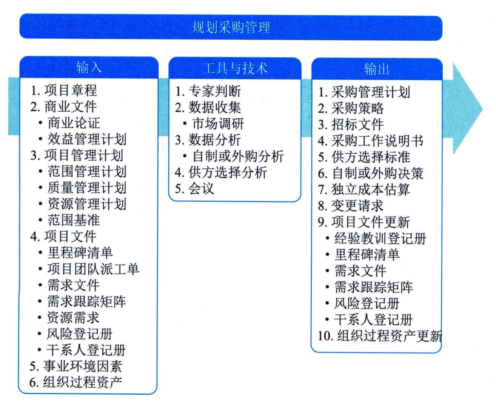

## 11.23规划采购管理
规划采购管理是记录项目采购决策，明确采购方法，识别潜在卖方的过程。本过程的主要作用是确定是否从项目外部获取货物和服务，如果是，则还要确定将在什么时间、以什么方式获取什么货物和服务。货物和服务可从执行组织的其他部门采购，或者从外部渠道采购。本过程仅开展一次或仅在项目的预定义点开展。图11-58描述了本过程的输入、工具与技术和输出。

图11-58 规划采购管理的输入、工具与技术和输出
应该在规划采购管理过程的早期，确定与采购有关的角色和职责。项目经理应确保在项目团队中配备具有所需采购专业知识的人员。采购过程的参与者可能包括购买部或采购部的人员，以及法务部的人员。这些人员的职责也应记录在采购管理计划中。
一般的采购步骤包括：
 - · 准备采购工作说明书（SOW）或工作大纲（TOR）；
 - · 准备高层级的成本估算，制定预算；
 - · 发布招标广告；
 - · 确定合格卖方的名单；
 - · 准备并发布招标文件；
 - · 由卖方准备并提交建议书；
 - · 对建议书开展技术（包括质量）评估；
 - · 对建议书开展成本评估；
 - · 准备最终的综合评估报告（包括质量及成本），选出中标建议书；
 - · 结束谈判，买方和卖方签署合同。
项目进度计划对规划采购管理过程中的采购策略制定有重要影响。在制定采购管理计划时所做出的决定也会影响项目进度计划。在开展制订进度计划过程、估算活动资源过程以及自制或外购决策制定时，都需要考虑这些决定。
规划采购管理过程的主要输入为项目管理计划和项目文件，主要输出为采购管理计划、采购策略、采购工作说明书和招标文件。
