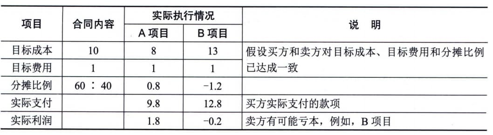

### 11.24.2 主要工具与技术
干系人参与度评估矩阵用于将干系人当前参与水平与期望参与水平进行比较，它是对干系人参与水平进行分类的方式之一，如表11-7所示。干系人参与水平可分为如下几种：
 - · 不了解型：不知道项目及其潜在影响；
 - ·抵制型：知道项目及其潜在影响，但抵制项目工作或成果可能引发的任何变更，此类干系人不会支持项目工作或项目成果；
 - · 中立型：了解项目，但既不支持，也不反对；
 - · 支持型：了解项目及其潜在影响，并且会支持项目工作及其成果；·领导型：了解项目及其潜在影响，而且积极参与，以确保项目取得成功。
**表11-7
干系人参与度评估矩阵**
在表11-7中，C代表每个干系人的当前参与水平，而D是项目团队评估出来的、为确保项目成功所必不可少的参与水平（期望的）。应根据每个干系人的当前与期望参与水平的差距，开展必要的沟通，有效引导干系人参与项目。弥合当前与期望参与水平的差距是监督干系人参与的一项基本工作。
