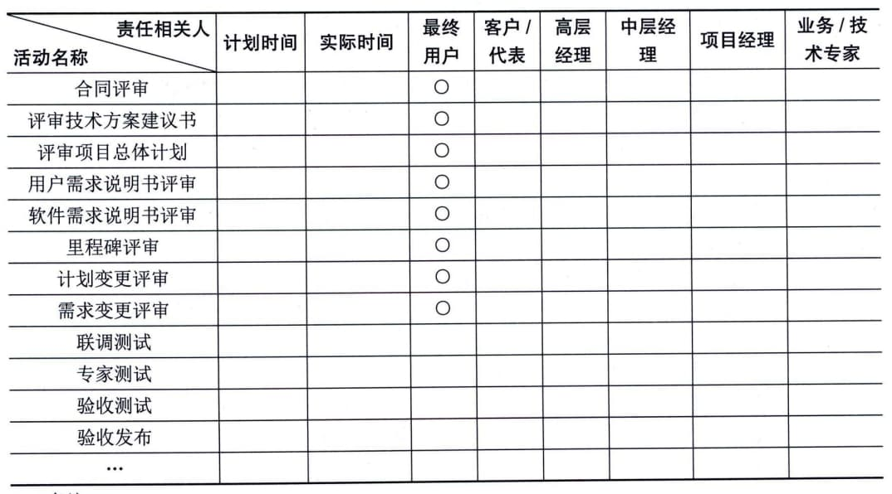

### 11.24.3 主要输出
干系人参与计划是项目管理计划的组成部分。该计划制定了干系人有效参与和执行项目决策的策略和行动。干系人参与计划可以是正式或非正式的，非常详细或高度概括的，这个基于项目的需要和干系人的期望。
干系人参与计划可主要包括调动干系人个人或群体参与的特定策略或方法。
干系人参与计划示例如表11-8所示。
**表11-8
干系人参与计划示例**
备注：
1．编制计划时，确定相关角色的人员以及参加时间，以"O"标识所参加的活动。
2．进行活动时，填写实际参加时间，以"·"标识所参加的活动或者评审会议。
