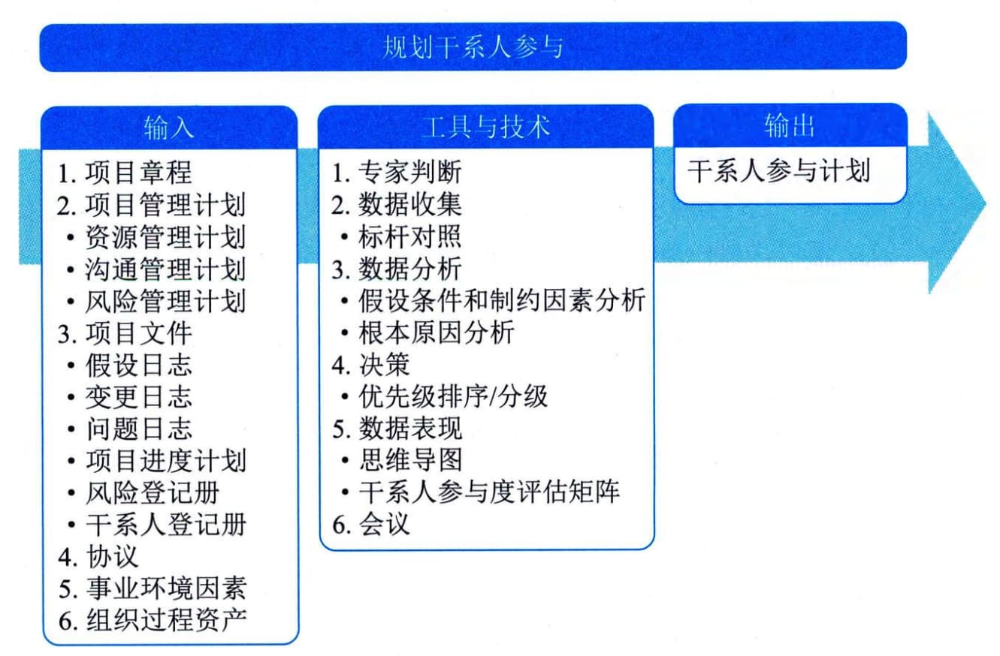

## 11.24 规划干系人参与
规划干系人参与是根据干系人的需求、期望、利益和对项目的潜在影响，制定项目干系人参与项目的方法的过程。本过程的主要作用是提供与干系人进行有效互动的可行计划。本过程应根据需要在整个项目期间定期开展。图11-59描述了本过程的输入、工具与技术和输出。

图11-59 规划干系人参与过程的输入、工具与技术和输出
为满足项目干系人的多样性信息需求，应在项目生命周期的早期制订一份有效的计划；然后，随着干系人群体的变化，定期审查和更新该计划。在通过识别干系人过程明确最初的干系人群体之后，就应该编制第一版的干系人参与计划，然后定期更新干系人参与计划，以反映干系人群体的变化。会触发该计划更新的情况主要包括：
 - · 项目新阶段开始；
 - · 组织结构或行业内部发生变化；
 - ·新的个人或群体成为干系人，现有干系人不再是干系人群体的成员，或特定干系人对项目成功的重要性发生变化；·当其他项目过程（如变更管理、风险管理或问题管理）的输出导致需要重新审查干系人参与策略等。
上述情况都可能导致已识别干系人的相对重要性发生变化。
规划干系人参与过程的主要输入为项目管理计划和项目文件，主要工具与技术是干系人参与度评估矩阵这一数据表现技术，主要输出为干系人参与计划。
