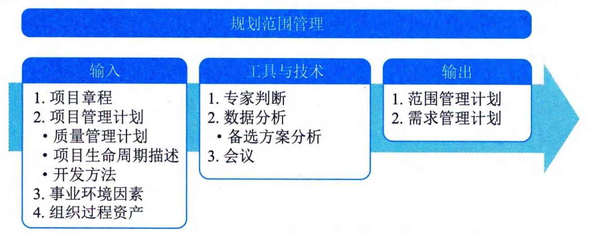

## 11.2 规划范围管理
规划范围管理是为记录如何定义、确认和控制项目范围及产品范围而创建范围管理计划的过程。本过程的主要作用是在整个项目期间对如何管理范围提供指南和方向。本过程仅开展一次或仅在项目的预定义点开展。图11-3描述了本过程的输入、工具与技术和输出。

图11-3 规划范围管理过程的输入、工具与技术和输出
规划范围管理过程的主要输入为项目管理计划，主要输出为范围管理计划和需求管理计划。
