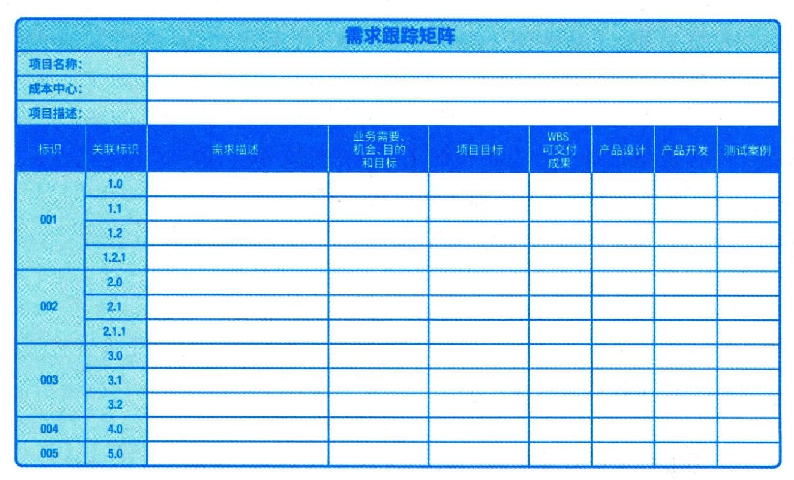

### 11.3.3 主要输出
#### **1．需求文件**
需求文件描述各种单一需求将如何满足项目相关的业务需求。一开始可能只有高层级的需求，然后随着有关需求信息的增加而逐步细化。只有明确的（可测量和可测试的）、可跟踪的、完整的、相互协调的，且主要干系人愿意认可的需求，才能作为基准。需求文件的格式多种多样，既可以是一份按干系人和优先级分类列出全部需求的简单文件，也可以是一份包括内容提要、细节描述和附件等的详细文件。许多组织把需求分为不同的种类，如业务解决方案和技术解决方案。前者是干系人的需要，后者是指如何实现这些干系人需要的方案。把需求分成不同的类别，有利于对需求进行进一步完善和细化。需求的类别一般包括业务需求、干系人需求、解决方案需求、过渡和就绪需求、项目需求和质量需求等。
 - （1）业务需求。整个组织的高层级需要，例如，解决业务问题或抓住业务机会，以及实施项目的原因。
 - （2）干系人需求。干系人的需要。
 - （3）解决方案需求。为满足业务需求和干系人需求，产品、服务或成果必须具备的特性、功能和特征。解决方案需求又可以进一步分为功能需求和非功能需求。功能需求描述产品应具备的功能，例如，产品应该执行的行动、流程、数据和交互；非功能需求是对功能需求的补充，是产品正常运行所需的环境条件或质量要求，例如，可靠性、保密性、性能、安全性、服务水平、可支持性、保留或清除等。
 - （4）过渡和就绪需求。如数据转换和培训需求。这些需求描述了从"当前状态"过渡到"将来状态"所需的临时能力。
 - （5）项目需求。项目需要满足的行动、过程或其他条件，例如里程碑日期、合同责任、制约因素等。
 - （6）质量需求。用于确认项目可交付成果的成功完成或其他项目需求的实现的任何条件或标准，例如，测试、认证、确认等。
#### **2．需求跟踪矩阵**
需求跟踪矩阵是把产品需求从其来源连接到能满足需求的可交付成果的一种表格。使用需求跟踪矩阵，把每个需求与业务目标或项目目标联系起来，有助于确保每个需求都具有业务价值。需求跟踪矩阵提供了在整个项目生命周期中跟踪需求的一种方法，有助于确保需求文件中被批准的每项需求在项目结束的时候都能实现并交付。最后，需求跟踪矩阵还为管理产品范围变更提供了框架。跟踪需求的内容包括：
 - · 业务需要、机会、目的和目标；
 - · 项目目标；
 - · 项目范围和WBS可交付成果；
 - · 产品设计；·产品开发；
 - · 测试策略和测试场景；
 - · 高层级需求到详细需求等。
应在需求跟踪矩阵中记录每个需求的相关属性，这些属性有助于明确每个需求的关键信息。需求跟踪矩阵中记录的典型属性包括唯一标识、需求的文字描述、收录该需求的理由、所有者、来源、优先级别、版本、当前状态和状态日期。为确保干系人满意，可能需要增加一些补充属性，如稳定性、复杂性和验收标准。需求跟踪矩阵示例如图11-5所示。

图11-5 需求跟踪矩阵示例
