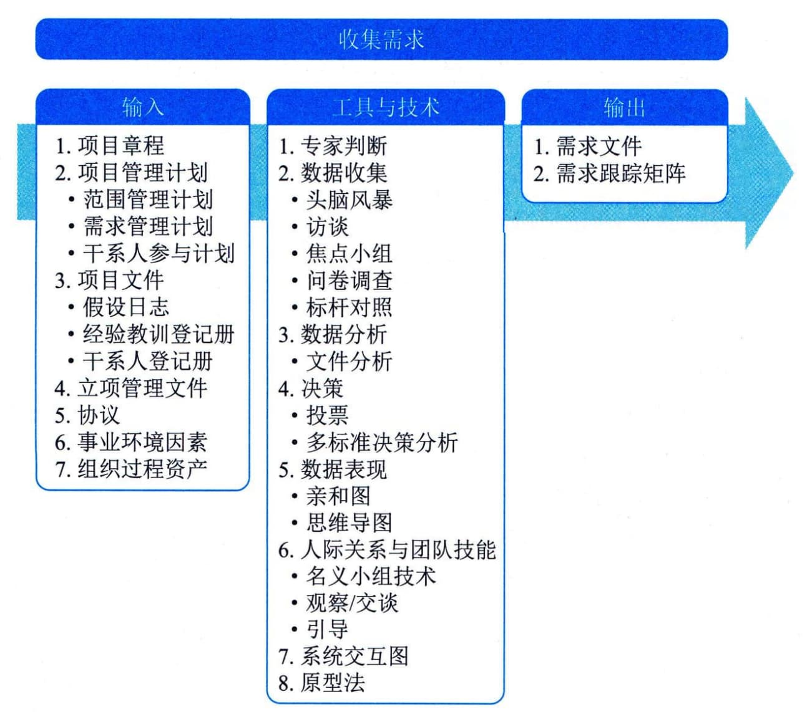

## 11.3 收集需求
收集需求是为实现目标而确定、记录并管理干系人的需要和需求的过程。本过程的主要作用是为定义产品范围和项目范围奠定基础。本过程仅开展一次或仅在项目的预定义点开展。图11-4描述了本过程的输入、工具与技术和输出。
让干系人积极参与需求的探索和分解工作（分解成项目和产品需求），并仔细确定、记录和管理对产品、服务或成果的需求，能直接促进项目成功。需求是指根据特定协议或其他强制性规范，产品、服务或成果必须具备的条件或能力。它包括发起人、客户和其他干系人的已量化且书面记录的需要和期望。应该足够详细地挖掘、分析和记录这些需求，并将其包含在范围基准中，在项目执行开始后对其进行测量。需求将作为后续工作分解结构（WBS）的基础，也将作为成本、进度、质量和采购规划的基础。

图11-4 收集需求过程的输入、工具与技术和输出
收集需求过程的主要输入为项目管理计划和项目文件，主要工具与技术为数据收集、数据分析、决策、数据表现、人际关系与团队技能、系统交互图和原型法，主要输出为需求文件和需求跟踪矩阵。
