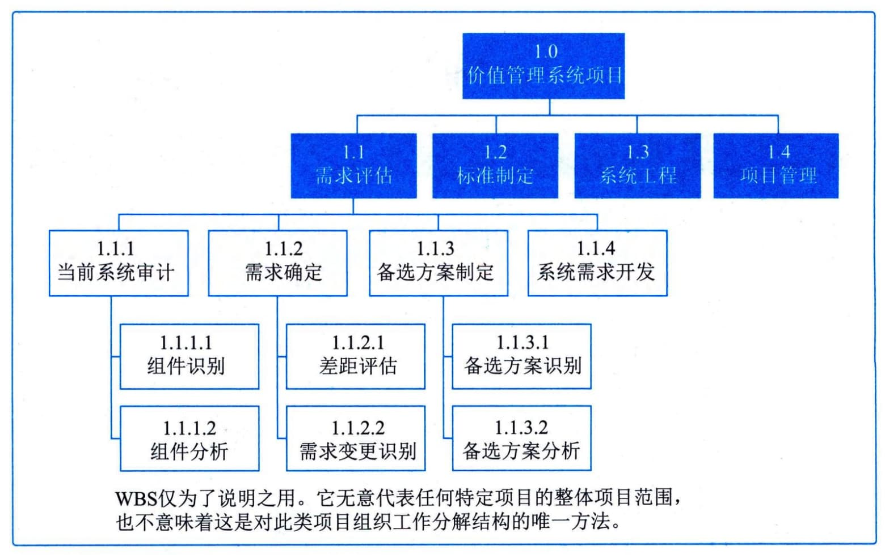
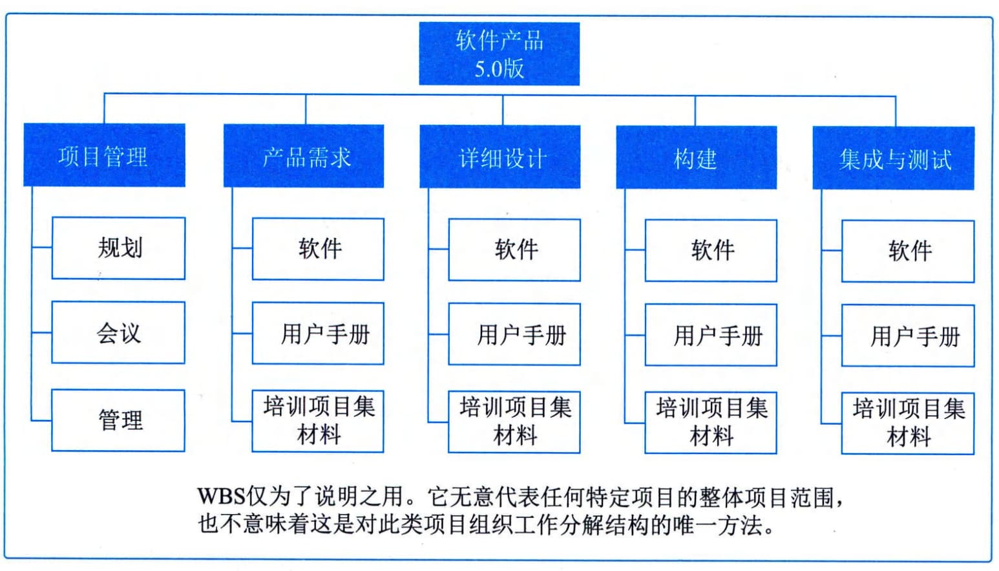
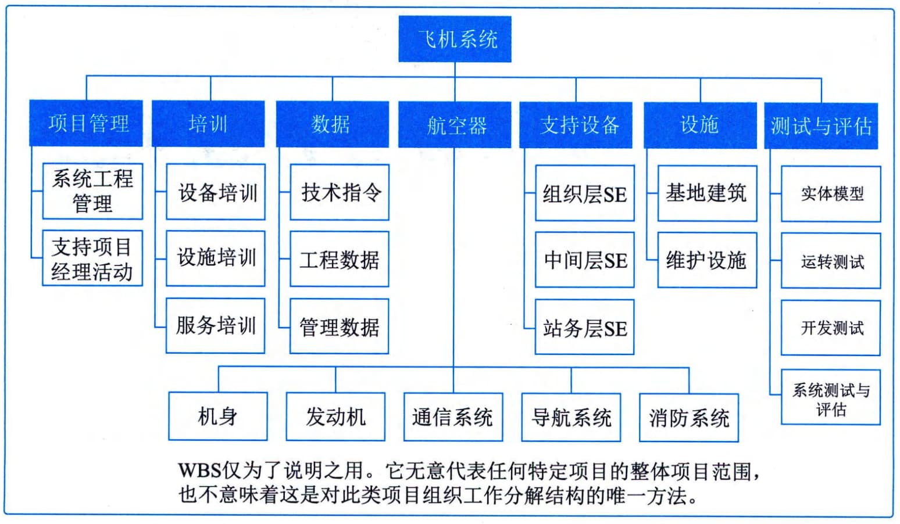

### 11.5.2 主要工具与技术
分解是一种把项目范围和项目可交付成果逐步划分为更小、更便于管理的组成部分的技术。工作包是WBS最底层的工作，可对其成本和持续时间进行估算和管理。分解的程度取决于所需的控制程度，以实现对项目的高效管理；工作包的详细程度则因项目规模和复杂程度而异。创建WBS的方法多种多样，常用的方法包括自上而下的方法、使用组织特定的指南和使用WBS
模板。自下而上的方法可用于归并较低层次组件。
#### **1．分解活动**
要把整个项目工作分解为工作包，通常需要开展如下活动：
 - · 识别和分析可交付成果及相关工作；
 - · 确定WBS的结构和编排方法；
 - · 自上而下逐层细化分解；
 - · 为WBS组成部分制定和分配标识编码；
 - · 核实可交付成果分解的程度是否恰当。
如图11-8所示为某工作分解结构的一部分，若干分支已经向下分解到工作包层次。

图11-8 分解到工作包的WBS示例
#### **2．WBS结构**
WBS的结构可以采用多种形式。以项目生命周期的各阶段作为分解的第二层，把产品和项目可交付成果放在第三层，这种形式的WBS如图11-9所示。以主要可交付成果作为分解的第二层，这种形式的WBS如图11-10所示。将其纳入由项目团队以外的组织开发的各种较低层次组件（如外包工作）。随后，作为外包工作的一部分，卖方须制定相应的合同WBS。

图11-9 以项目生命周期的各阶段作为第二层的WBS示例

图11-10 以主要可交付成果作为第二层的WBS示例
对WBS较高层组件进行分解，就是要把每个可交付成果或组件分解为最基本的组成部分，即可核实的产品、服务或成果。如果采用敏捷或适应型方法，可以将长篇故事分解成用户故事。WBS
可以采用提纲式、组织结构图或能说明层级结构的其他形式。通过确认WBS较低层组件是完成上层相应可交付成果的必要且充分的工作，来核实分解的正确性。不同的可交付成果可以分解到不同的层次。某些可交付成果只需分解到下一层，即可到达工作包的层次，而有些则需分解更多层。工作分解得越细致，对工作的规划、管理和控制就越有力。但是，过细的分解会造成管理工作的无效耗费、资源使用效率低下、工作实施效率降低，同时造成WBS各层级的数据汇总困难。
要在未来远期才完成的可交付成果或组件，当前可能无法分解。因而项目管理团队通常需要等待对该可交付成果或组成部分达成一致意见，才能够制定出WBS中的相应细节。这种技术又称为滚动式规划。
#### **3．注意事项**
在分解的过程中，应该注意以下8个方面：
 - （1）WBS必须是面向可交付成果的。项目的目标是提供产品或服务，WBS中的各项工作是为提供可交付的成果服务的。WBS并没有明确地要求重复循环的工作，但为了达到里程碑，有些工作可能要进行多次。最明显的例子是软件测试，软件必须经过多次测试后才能作为可交付成果。
 - （2）WBS必须符合项目的范围。WBS必须包括，也仅包括为了完成项目的可交付成果的活动。100％原则（包含原则）认为，在WBS中，所有下一级的元素之和必须100％代表上一级元素。如果WBS没有覆盖全部的项目可交付成果，那么最后提交的产品或服务是无法让用户满意的。
 - （3）WBS的底层应该支持计划和控制。WBS是项目管理计划和项目范围之间的桥梁，WBS的底层不但要支持项目管理计划，而且要让管理层能够监视和控制项目的进度和预算。
 - （4）WBS中的元素必须有人负责，而且只由一个人负责。如果存在没有人负责的内容，那么WBS发布后，项目团队成员将很少能够意识到自己和其中内容上的联系。WBS和责任人可以使用工作责任矩阵来描述。在一些参考文献中，这个规定又称为独立责任原则。
 - （5）WBS应控制在4～6层。如果项目规模比较大，以至于WBS要超过6层，此时可以使用项目分解结构将大项目分解成子项目，然后针对子项目来做WBS。每个级别的WBS将上一级的一个元素分为4～7个新的元素，同一级的元素的大小应该相似。一个工作单元只能从属于某个上层单元，避免交叉从属。
 - （6）WBS应包括项目管理工作（因为管理是项目具体工作的一部分），也要包括分包出去的工作。
 - （7）WBS的编制需要所有（主要）项目干系人的参与。各项目干系人站在自己的立场上，对同一个项目可能编制出差别较大的WBS。项目经理应该组织他们进行讨论，以便编制出一份大家都能接受的WBS。
 - （8）WBS并非一成不变的。在完成WBS之后的工作中，仍然有可能需要对WBS进行修改。如果没有合理的范围控制，仅仅依靠WBS会使得后面的工作僵化。
