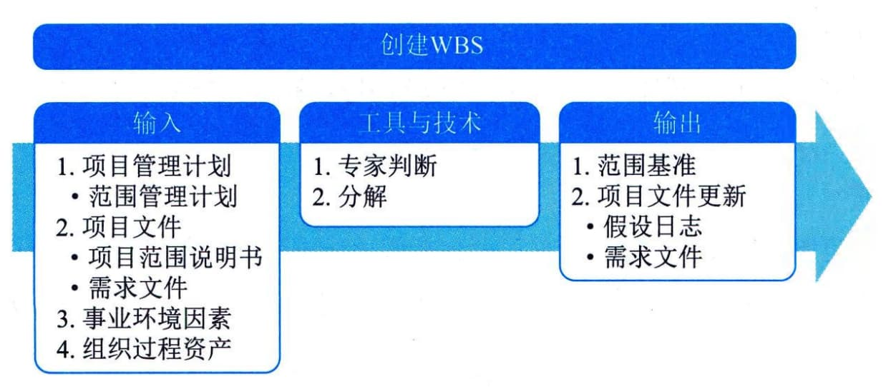

## 11.5 创建WBS
创建工作分解结构（WBS）是把项目可交付成果和项目工作分解为较小的、更易于管理的组件的过程。本过程的主要作用是为所要交付的内容提供架构。本过程仅开展一次或仅在项目的预定义点开展。图11-7描述了本过程的输入、工具与技术和输出。

图11-7 创建WBS过程的输入、工具与技术和输出
WBS是对项目团队为实现项目目标、创建所需可交付成果而需要实施的全部工作范围的层级分解。WBS组织并定义了项目的总范围，代表着经批准的当前项目范围说明书中所规定的工作。
WBS最底层的组成部分称为工作包，其中包括计划的工作。工作包对相关活动进行归类，以便对工作安排进度、进行估算、开展监督与控制。在"工作分解结构"这个词语中，"工作"是指作为活动结果的工作产品或可交付成果，而不是活动本身。
创建WBS过程的主要输入为项目管理计划和项目文件，主要工具与技术为分解技术，主要输出为范围基准。
