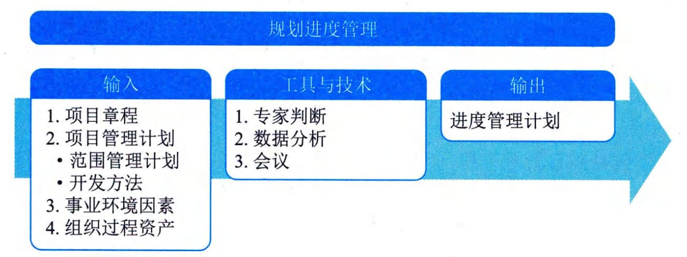

## 11.6 规划进度管理
规划进度管理是为规划、编制、管理、执行和控制项目进度而制定政策、程序和文档的过程。本过程的主要作用是为如何在整个项目期间管理项目进度提供指南和方向。本过程仅开展一次或仅在项目的预定义点开展。图11-11描述了本过程的输入、工具与技术和输出。

图11-11 规划进度管理过程的输入、工具与技术和输出
规划进度管理过程的主要输入为项目管理计划，主要输出为进度管理计划。
