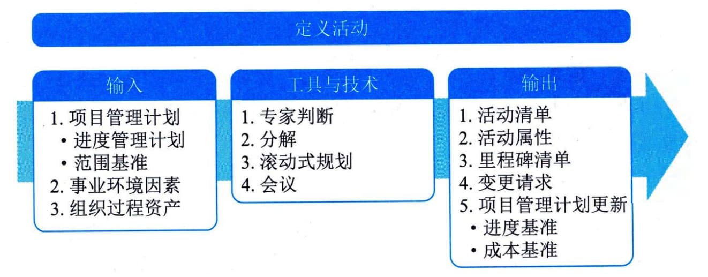

## 11.7 定义活动
定义活动是识别和记录为完成项目可交付成果而须采取的具体行动的过程。本过程的主要作用是将工作包分解为进度活动，作为对项目工作进行进度估算、规划、执行、监督和控制的基础。本过程需要在整个项目期间开展。图11-12描述了本过程的输入、工具与技术和输出。

图11-12
定义活动过程的输入、工具与技术和输出定义活动过程的主要输入为项目管理计划，主要工具与技术为分解和滚动式规划，主要输出为活动清单、活动属性和里程碑清单。
