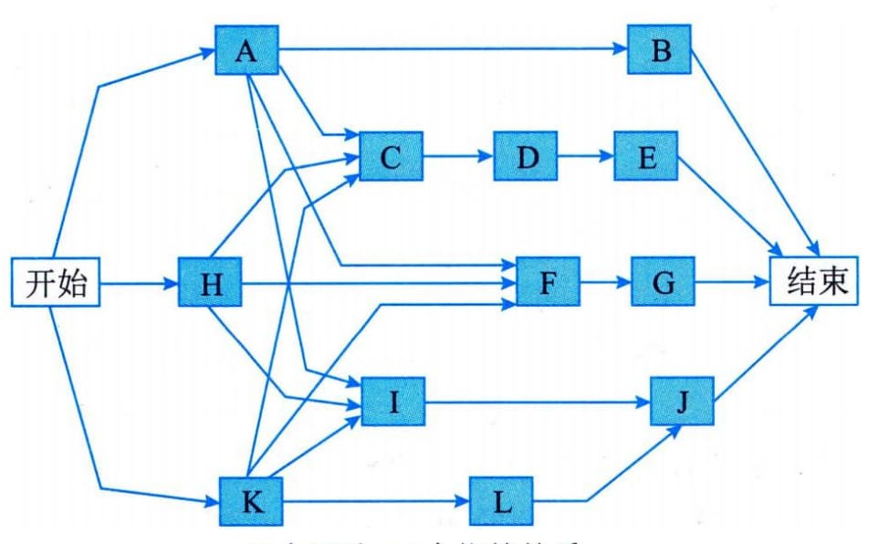
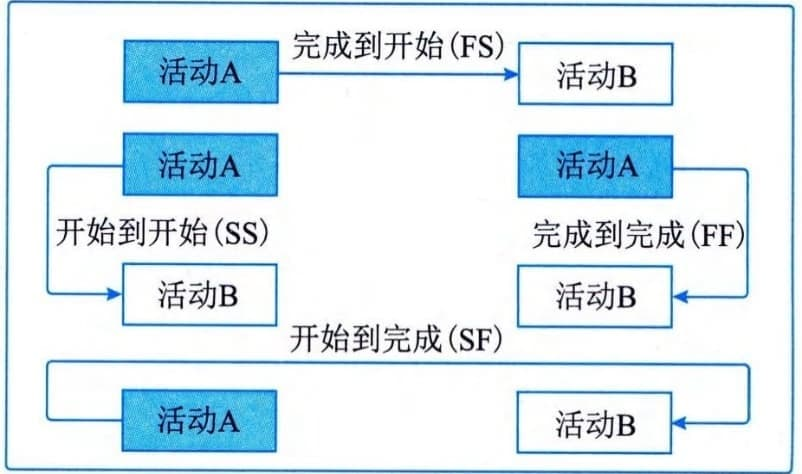
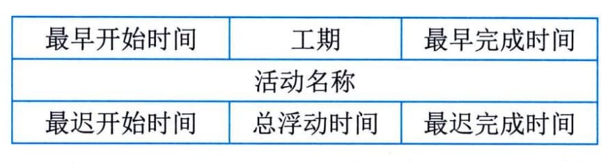
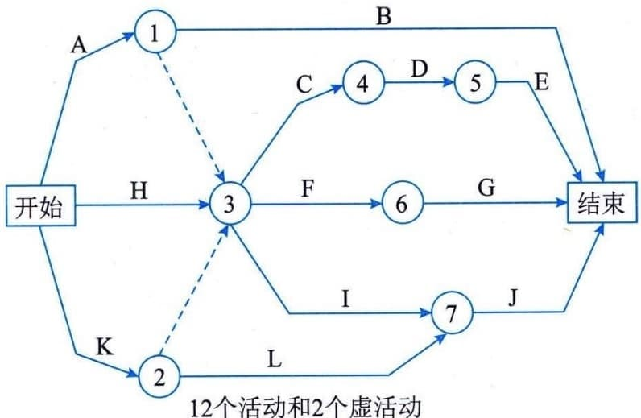
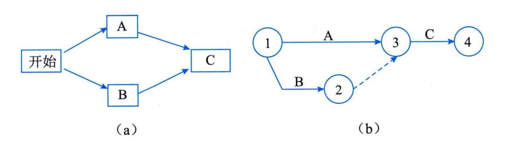
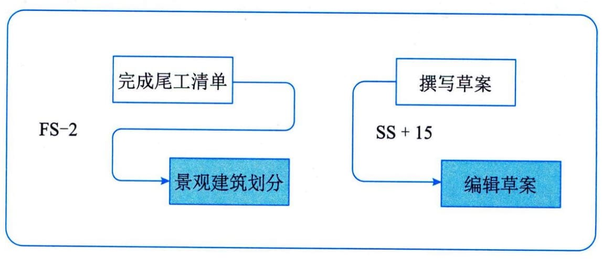

### 11.8.2 主要工具与技术
#### **1．紧前关系绘图法**
紧前关系绘图法（Precedence Diagramming
Method，PDM），又称前导图法，是创建进度模型的一种技术，它使用方框或者长方形（被称作节点）代表活动，节点之间用箭头连接，以显示节点之间的逻辑关系。这种网络图也被称作单代号网络图（只有节点需要编号）或活动节点图（Active
On Node，AON），如图11-14所示。

图11-14 前导图法（单代号网络图）
> PDM中的活动关系类型有4种，如图11-15所示。紧前活动是在进度计划的逻辑路径中，排在某个活动前面的活动。紧后活动是在进度计划的逻辑路径中，排在某个活动后面的活动。这4种活动关系类型的定义为：·完成到开始（FS）：只有紧前活动完成，紧后活动才能开始的逻辑关系。例如，只有完成装配PC硬件（紧前活动），才能开始在PC上安装操作系统（紧后活动）。

 - ·完成到完成（FF）：只有紧前活动完成，紧后活动才能完成的逻辑关系。例如，只有完成文件的编写（紧前活动），才能完成文件的编辑（紧后活动）。

 - ·开始到开始（SS）：只有紧前活动开始，紧后活动才能开始的逻辑关系。例如，只有开始地基浇灌（紧前活动），才能开始混凝土的找平（紧后活动）。

 - ·开始到完成（SF）：只有紧前活动开始，紧后活动才能完成的逻辑关系。例如，只有启动新的应付账款系统（紧前活动），才能关闭旧的应付账款系统（紧后活动）。

图11-15 紧前关系绘图法（PDM）中的活动关系类型
在PDM图中，FS是最常用的逻辑关系类型，SF关系则很少使用。
在前导图法中，每项活动有唯一的活动号，每项活动都注明了预计工期（活动的持续时间）。通常，每个节点的活动会有如下几个时间：
 - · 最早开始时间（Earliest Start time，ES）：某项活动能够开始的最早时间；
 - · 最早完成时间（Earliest Finish
time，EF）：某项活动能够完成的最早时间，$EF = ES + 工$期；
 - ·最迟开始时间（Latest Start
> time，LS）：为了使项目按时完成，某项活动必须开始的最迟时间；

 - ·最迟完成时间（Latest Finish
> time，LF）：为了使项目按时完成，某项活动必须完成的最迟时间，LS＝LF-工期。
这几个时间通常作为每个节点的组成部分，如图11-16所示。

图11-16 PDM图中的节点表示
虽然两个活动之间可能同时存在两种逻辑关系（例如SS和FF），但不建议相同的活动之间存在多种关系。因此，必须做出影响最大的逻辑关系的决定。此外也不建议采用闭环的逻辑关系。
#### **2．箭线图法**
箭线图法（Arrow Diagramming
Method，ADM）是用箭线表示活动、用节点表示事件的一种网络图绘制方法，如图11-17所示。这种网络图也被称作双代号网络图（节点和箭线都要编号）或活动箭线图（Active
On the Arrow，AOA）。

图11-17 箭线图法（双代号网络图）
在箭线图法中，有如下3个基本原则：
 - （1）网络图中的每一项活动和每一个事件都必须有唯一的代号，即网络图中不会有相同的代号；
 - （2）任两项活动的紧前事件和紧后事件代号至少有一个不相同，节点代号沿箭线方向越来越大；
 - （3）流入（流出）同一节点的活动，均有共同的紧后活动（或紧前活动）。
为了绘图方便，在箭线图中又人为引入了一种额外的、特殊的活动，叫作虚活动（Dummy
Activity），在网络图中由虚箭线表示。虚活动不消耗时间，也不消耗资源，只是为了弥补箭线图在表达活动依赖关系方面的不足。借助虚活动，我们可以更好地、更清楚地表达活动之间的关系，如图11-18所示。

图11-18 虚活动
注：活动A和B可以同时进行；只有活动A和B都完成后，活动C才能开始。
#### **3．提前量和滞后量**
提前量是相对于紧前活动，紧后活动可以提前的时间量，提前量一般用负值表示。滞后量是相对于紧前活动，紧后活动需要推迟的时间量，滞后量一般用正值表示。例如，在新办公大楼建设项目中，景观建筑划分可以在尾工清单编制完成前2周开始；对于一个大型技术文档，编写小组可以在编写工作开始后15天，开始编辑文档草案，如图11-19所示。

图11-19 提前量和滞后量示例
项目管理团队应该明确哪些依赖关系中需要加入提前量或滞后量，以便准确地表示活动之间的逻辑关系。
